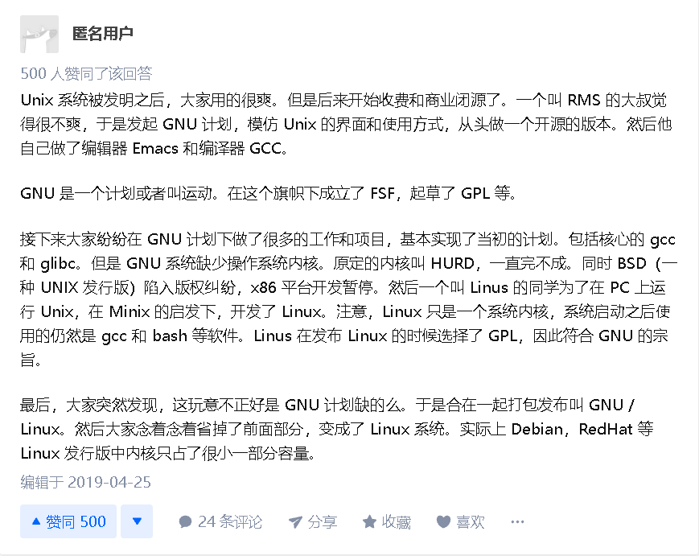
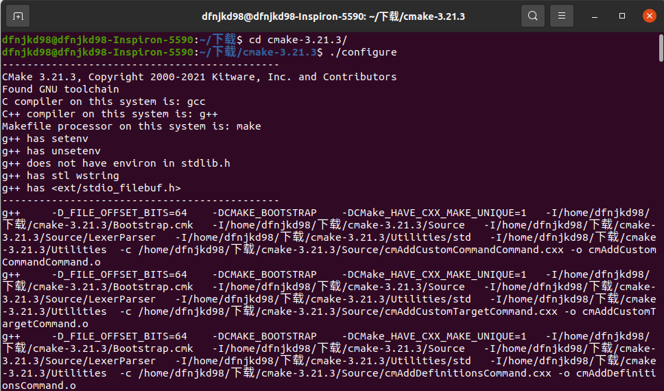
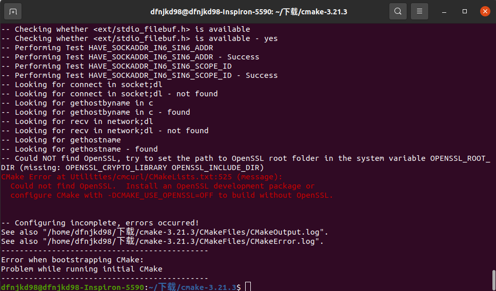
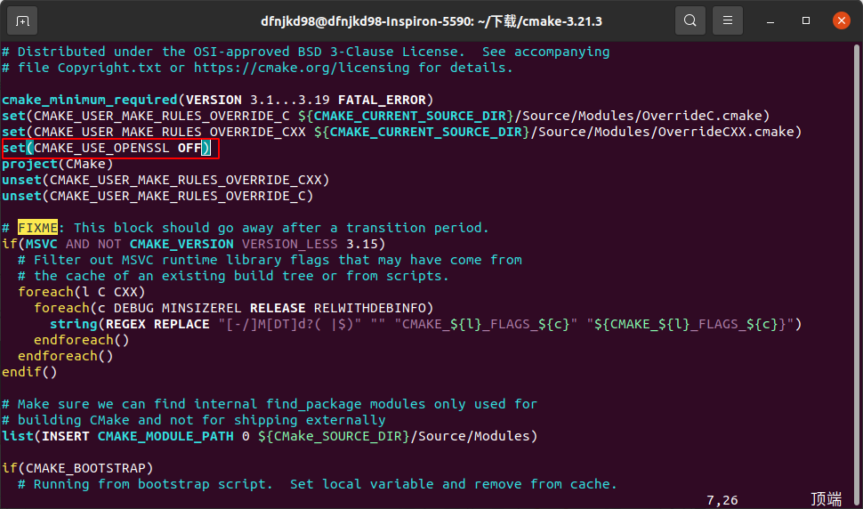
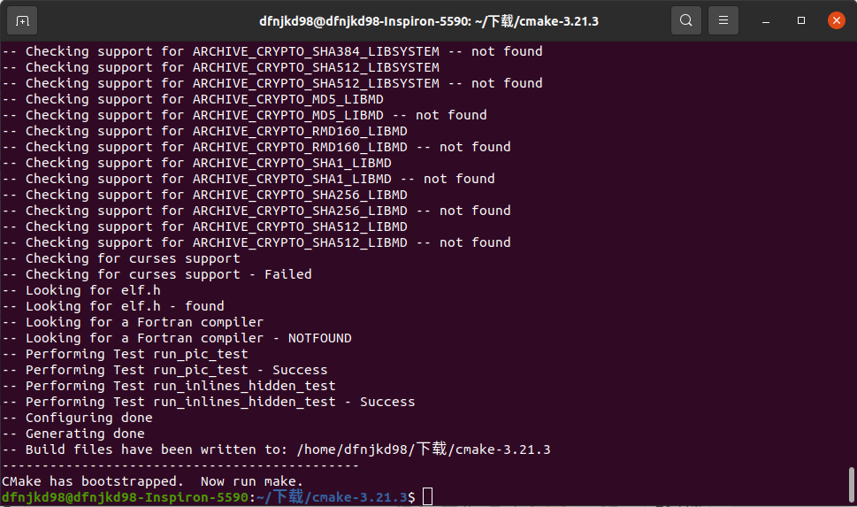
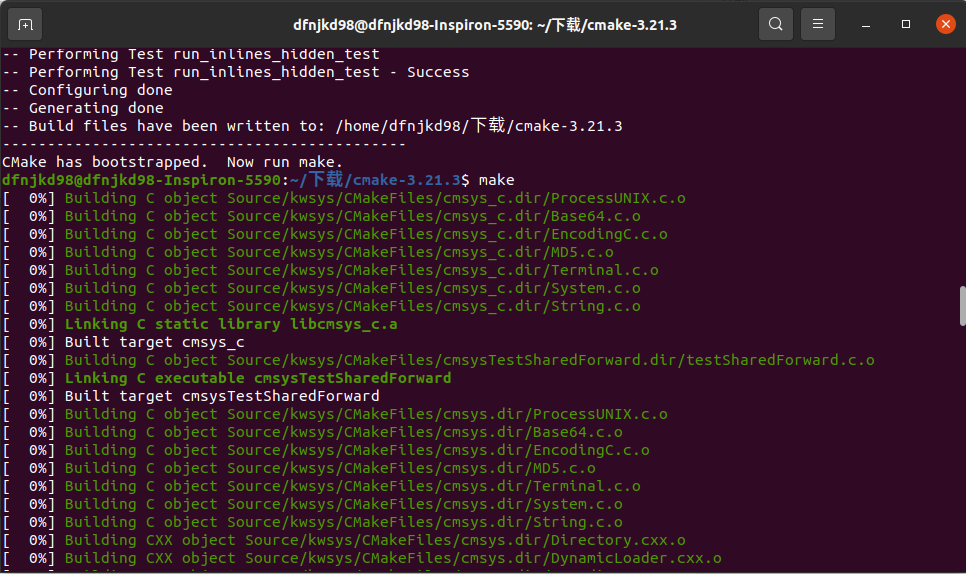
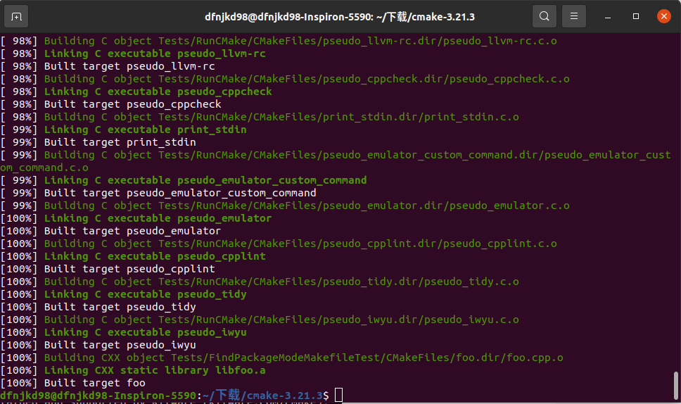
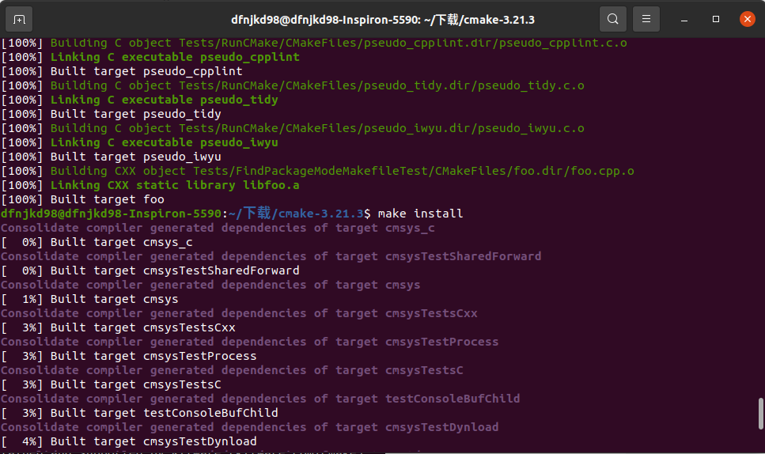
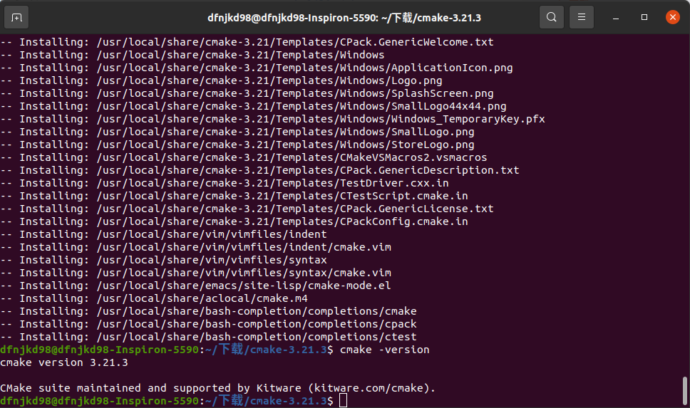

## 历史知识

### GNU是什么，和LInux是什么关系



### [gcc、make、makefile、cmake、qmake](https://www.zhihu.com/question/27455963)


## 配置深色主题

  - setting -> 外观 -> dark
  - 使用GNOME扩展安装Yaru深色shell主题
    ```shell
    sudo apt install chrome-gnome-shell
    ```
  - 进入扩展页面启用扩展
  - 安装GNOME调整工具
    ```shell
    sudo apt install gnome-tweaks
    ```
  - 打开GNOME调整工具，进入外观部分，切换Shell主题

## 安装软件

> 大多数现代类 Unix 操作系统都提供了一个集中的软件包管理机制，以帮助用户搜索、安装和管理软件。而**软件通常以「包」的形式存储在仓库「repository」中**，对软件包的使用和管理被称为包管理。而 Linux 包的基本组成部分通常有：共享库、应用程序、服务和文档。
>
> 包管理通常不仅限于软件的一次性安装，还包括了对已安装软件包进行升级的工具。「包仓库」有助于确保代码已经在你使用的系统上进行了审核，并由软件开发者或包维护者进行管理。
>
> 大多数包管理系统是建立在包文件上的集合，包文件通常包含编译好的二进制文件和其它资源组成的：软件、安装脚本、元数据及其所需的依赖列表。

### [包管理工具](https://www.sysgeek.cn/linux-package-management/)

|  系统  | 格式 |             工具              |
| :----: | :--: | :---------------------------: |
| Debian | .deb | apt, apt-cache、apt-get、dpkg |
| Ubuntu | .deb | apt、apt-cache、apt-get、dpkg |
| CentOS | .rpm |              yum              |
| Fedora | .rpm |              dnf              |

- Debian 及其衍生产品如：Ubuntu、Linux Mint 和 Raspbian 的包格式为.deb文件，APT 是最常见包操作命令，可：搜索库、安装包及其依赖和管理升级。而要**直接安装现成.deb包时需要使用dpkg命令**。
- CentOS、Fedora 及 Red Hat 系列 Linux 使用RPM包文件，并使用yum命令管理包文件及与软件库交互。
- 在最新的 Fedora 版本中，yum命令已被dnf取代进行包管理。

### [apt、apt-get、apt-cache](https://www.sysgeek.cn/apt-vs-apt-get/)

  - Advanced Packaging Tool（apt）是Linux下的一款安装包管理工具

  - APT由几个名字以“apt-”打头的程序组成。apt-get、apt-cache 和apt-cdrom是处理软件包的命令行工具。

  - 作为操作的一部分，APT使用一个文件列出可获得软件包的镜像站点地址，这个文件就是/etc/apt/sources.list

  - 虽然 apt 与 apt-get 有一些类似的命令选项，但它并不能完全向下兼容 apt-get 命令。也就是说，可以用 apt 替换部分 apt-get 系列命令，但不是全部。

### [apt和dpkg](https://blog.csdn.net/dgreh/article/details/83655658)

> 最初只有.tar.gz的打包文件，用户必须编译每个他想在GNU/Linux上运行的软件。用户们普遍认为系统很有必要提供一种方法来**管理这些安装在机器上的软件包，当Debian诞生时，这样一个管理工具也就应运而生，它被命名为dpkg**。从而著名的“package”概念第一次出现在GNU/Linux系统中，稍后Red Hat才决定开发自己的“rpm”包管理系统。
>
> 很快一个新的问题难倒了GNU/Linux制作者，他们需要一个快速、实用、高效的方法来安装软件包，当软件包更新时，这个工具应该能自动管理关联文件和维护已有配置文件。Debian再次率先解决了这个问题，APT(Advanced Packaging Tool）作为dpkg的前端诞生了。APT后来还被Conectiva改造用来管理rpm，并被其它Linux发行版本采用为它们的软件包管理工具。
>
> 虽然我们在使用dpkg时，已经解决掉了 软件安装过程中的大量问题，但是**当依赖关系不满足时，仍然需要手动解决，而apt这个工具解决了这样的问题**
>
> Linux命令—apt，也是其它用户前台程序的后端，如dselect 和aptitude。

|     apt 命令     |              命令的功能              |
| :--------------: | :----------------------------------: |
|   apt install    |              安装软件包              |
|    apt remove    |              移除软件包              |
|     apt pur      |         移除软件包及配置文件         |
|    apt update    |            刷新存储库索引            |
|   apt upgrade    |        升级所有可升级的软件包        |
|  apt autoremove  |          自动删除不需要的包          |
| apt full-upgrade |    在升级软件包时自动处理依赖关系    |
|    apt search    |             搜索应用程序             |
|     apt show     |              显示装细节              |
|     apt list     | 列出包含条件的包（已安装，可升级等） |
| apt edit-sources |              编辑源列表              |

| dpkg命令                             | 命令的功能                                   |
| ------------------------------------ | -------------------------------------------- |
| dpkg -i package-name.deb             | 安装软件包，必须是deb包的完整名称            |
| dpkg - -unpack package-name.deb      | 解包：解开软件包到系统目录但不配置           |
| dpkg - -configure package-name.deb   | 配置：配置软件包                             |
| dpkg -c package-name.deb             | 列出deb包的内容                              |
| dpkg -r package-name // - -remove    | 移除软件包，但保留其配置文件                 |
| dpkg -P package-name // - -purge     | 清除软件包的所有文件                         |
| dpkg -l package-name // - -list      | 查看系统中package-name软件包                 |
| dpkg -L package-name // - -listfiles | 查看package-name对应的软件包安装的文件及目录 |
| dpkg -s package-name // - -status    | 查看package-name对应的软件包信息             |
| dpkg -S filename // - -search        | 查询系统中某个文件属于哪个软件包             |
| dpkg --info package-name.deb         | 列出软件包解包后的包名称                     |

### [APT工作原理](https://blog.csdn.net/dgreh/article/details/83655658)

> APT是一个客户/服务器系统。在服务器上先复制所有DEB包（DEB是Debian软件包格式的文件扩展名），然后用APT的分析工具（genbasedir）根据每个DEB 包的包头（Header）信息对所有的DEB包进行分析，并将该分析结果记录在一个文件中，这个文件称为DEB 索引清单，APT服务器的DEB索引清单置于base文件夹内。一旦APT 服务器内的DEB有所变动，一定要使用genbasedir产生新的DEB索引清单。客户端在进行安装或升级时先要查询DEB索引清单，从而可以获知所有具有依赖关系的软件包，并一同下载到客户端以便安装。
>
> 当客户端需要安装、升级或删除某个软件包时，客户端计算机取得DEB索引清单压缩文件后，会将其解压置放于/var/state/apt/lists/，而客户端使用apt-get install或apt-get upgrade命令的时候，就会将这个文件夹内的数据和客户端计算机内的DEB数据库比对，知道哪些DEB已安装、未安装或是可以升级的
>
> 例：apt-get的更新过程
> 1）执行apt-get update 
> 2）程序分析/etc/apt/sources.list 
> 3）自动连网寻找list中对应的Packages/Sources/Release列表文件，如果有更新则下载之，存入/var/lib/apt/lists/目录 
> 4）然后 apt-get install 相应的包 ，下载并安装。

### apt相关文件

- `var/lib/dpkg/available` 文件的内容是软件包的描述信息, 该软件包括当前系统所使用的Debian 安装源中的所有软件包,其中包括当前系统中已安装的和未安装的软件包
- `/etc/apt/sources.list` 记录软件源的地址（当你执行 sudo apt-get install xxx 时，Ubuntu 就去这些站点下载软件包到本地并执行安装）
- `/var/cache/apt/archives` 已经下载到的软件包都放在这里（用 apt-get install 安装软件时，软件包的临时存放路径） 
- `/var/lib/apt/lists` 使用apt-get update命令会从/etc/apt/sources.list中下载软件列表，并保存到该目录

### 什么是软件源?

> Ubuntu采用集中式的软件仓库机制，将各式各样的软件包分门别类地存放在软件仓库中，进行有效地组织和管理。然后，将软件仓库置于许许多多的镜像服务器中，并保持基本一致。这样，所有的Ubuntu用户随时都能获得最新版本的安装软件包。因此，对于用户，这些镜像服务器就是他们的软件源。
> 然而，由于每位用户所处的网络环境不同，不可能随意地访问各镜像站点。为了能够有选择地访问，在Ubuntu系统中，使用软件源配置文件/etc/apt/sources.list列出最合适访问的镜像站点地址。

### [换源](https://www.cnblogs.com/liuzhenbo/p/11069285.html)

  - 查看Ubuntu系统的Codename
    ```shell
    lsb_release -a
    ```
    
  - LSB是一套核心标准，它保证了LINUX发行版同LINUX应用程序之间的良好结合。它是 Linux 标准化领域中事实上的标准，制定了应用程序与运行环境之间的二进制接口。这里检测到LSB，模块没有获取，执行以下语句获取
    ```shell
    dfnjkd98@dfnjkd98-Inspiron-5590:~$ sudo apt install lsb-core -y
    dfnjkd98@dfnjkd98-Inspiron-5590:~$ lsb_release -a
    LSB Version:	core-11.1.0ubuntu2-noarch:security-11.1.0ubuntu2-noarch
    Distributor ID:	Ubuntu
    Description:	Ubuntu 20.04.2 LTS
    Release:	20.04
    Codename:	focal
    dfnjkd98@dfnjkd98-Inspiron-5590:~$ 
    ```
    
- 备份并修改sources.list

  ```shell
  sudo cp /etc/apt/sources.list /etc/apt/sources.beifen.list
  ```

  ```shell
  # 创建并编辑清华源的配置文件
  sudo gedit /etc/apt/sources.qinghua.list
  
  # 清华源信息：
  # 默认注释了源码镜像以提高 apt update 速度，如有需要可自行取消注释
  deb https://mirrors.tuna.tsinghua.edu.cn/ubuntu/ xenial main restricted universe multiverse
  # deb-src https://mirrors.tuna.tsinghua.edu.cn/ubuntu/ xenial main restricted universe multiverse
  deb https://mirrors.tuna.tsinghua.edu.cn/ubuntu/ xenial-updates main restricted universe multiverse
  # deb-src https://mirrors.tuna.tsinghua.edu.cn/ubuntu/ xenial-updates main restricted universe multiverse
  deb https://mirrors.tuna.tsinghua.edu.cn/ubuntu/ xenial-backports main restricted universe multiverse
  # deb-src https://mirrors.tuna.tsinghua.edu.cn/ubuntu/ xenial-backports main restricted universe multiverse
  deb https://mirrors.tuna.tsinghua.edu.cn/ubuntu/ xenial-security main restricted universe multiverse
  # deb-src https://mirrors.tuna.tsinghua.edu.cn/ubuntu/ xenial-security main restricted universe multiverse
  # 预发布软件源，不建议启用
  # deb https://mirrors.tuna.tsinghua.edu.cn/ubuntu/ xenial-proposed main restricted universe multiverse
  # deb-src https://mirrors.tuna.tsinghua.edu.cn/ubuntu/ xenial-proposed main restricted universe multiverse
  ```

  ```shell
  # 创建并编辑阿里源的配置文件
  sudo gedit /etc/apt/sources.aliyun.list
  # 阿里源信息：
  # deb cdrom:[Ubuntu 16.04 LTS _Xenial Xerus_ - Release amd64 (20160420.1)]/ xenial main restricted
  deb-src http://archive.ubuntu.com/ubuntu xenial main restricted #Added by software-properties
  deb http://mirrors.aliyun.com/ubuntu/ xenial main restricted
  deb-src http://mirrors.aliyun.com/ubuntu/ xenial main restricted multiverse universe #Added by software-properties
  deb http://mirrors.aliyun.com/ubuntu/ xenial-updates main restricted
  deb-src http://mirrors.aliyun.com/ubuntu/ xenial-updates main restricted multiverse universe #Added by software-properties
  deb http://mirrors.aliyun.com/ubuntu/ xenial universe
  deb http://mirrors.aliyun.com/ubuntu/ xenial-updates universe
  deb http://mirrors.aliyun.com/ubuntu/ xenial multiverse
  deb http://mirrors.aliyun.com/ubuntu/ xenial-updates multiverse
  deb http://mirrors.aliyun.com/ubuntu/ xenial-backports main restricted universe multiverse
  deb-src http://mirrors.aliyun.com/ubuntu/ xenial-backports main restricted universe multiverse #Added by software-properties
  deb http://archive.canonical.com/ubuntu xenial partner
  deb-src http://archive.canonical.com/ubuntu xenial partner
  deb http://mirrors.aliyun.com/ubuntu/ xenial-security main restricted
  deb-src http://mirrors.aliyun.com/ubuntu/ xenial-security main restricted multiverse universe #Added by software-properties
  deb http://mirrors.aliyun.com/ubuntu/ xenial-security universe
  deb http://mirrors.aliyun.com/ubuntu/ xenial-security multiverse
  ```

  ```shell
  # 选用阿里源
  sudo cp sources.aliyun.list sources.list
  ```

- 刷新

  ```shell
  sudo apt-get update
  ```

### 软件包安装

- Ubuntu下软件包格式为.deb

- 软件安装

  ```shell
  sudo dpkg -i xxx.deb
  ```

- 软件卸载

  ```shell
  sudo dpkg -r 软件名
  ```

### [源代码安装](https://www.cnblogs.com/benwu/articles/8436209.html)

> 一个软件的源代码往往被封装在多个源文件中，此外这些文件有错综复杂的依赖关系，编译需要严格按照指定的顺序进行，这无疑增加了编译的难度。好在make命令可以帮助我们简化编译过程。
>
> 整个编译过程被浓缩在Makefile文件中(告诉make命令需要怎么去编译和链接程序)，当执行make命令时，make会去当前目录中寻找Makefile文件，并根据该文件中的要求完成整个编译过程。
>
> 而Makefile文件由configure命令产生。当执行configure命令时，configure会根据当前系统环境动态生成一个适合本系统的Makefile文件，供make命令使用。

- 源代码包格式多为`.tar.gz`和`.tar.bz2`
- 解包 - 解压出源代码文件
  - 执行`tar -zxf` 或者`tar -jxf`命令
  - 查看INSTALL与README文件，这两个文件中详细介绍了本软件的安装方法和注意事项。
- 配置 - 针对当前系统、软件环境、配置好安装参数
  - 切换工作目录到软件源代码所在目录
  - 使用源码目录中的configure脚本
  - 执行`./configure --help`可以查看帮助
  - 常用配置选项
    - `./configure --prefix=软件安装目录` 若不指定任何配置选项，将采用默认值
- 编译 - 将源代码文件变为二进制的可执行程序
  - 执行`make`命令
- 安装 - 将编译好的程序文件复制到系统中
  - 执行`make install`命令

### 安装cmake - 源码安装

- 执行`./configure`

  

- **出现错误**

  

- 解决错误 - 修改CMakeLists文本文件

  

- 重新执行`./configure`

  

- 编译源码

  

- 编译成功

  

- 安装cmake

  

- 安装cmake成功

  

### 安装flameshot
  - 使用命令
    ```shell
    sudo apt-get install flameshot
    ```
  - 出现错误
    ```shell
    无法获得锁 /var/lib/dpkg/lock。锁正由进程 14257（dpkg）持有
    ```
  - 解决错误
    ```shell
    sudo kill 14257
    ```
  - 设置快捷键，快捷启动截图软件, 设置->键盘快捷键->底部点击+号->添加启动快捷键
### 安装Typora
  - [下载二进制文件](https://www.typora.io/#linux)

  - 使用tar命令解压
    ```shell
    tar -xzvf Typora-linux-x64.tar.gz
    ```
    
- 创建桌面图标

  ```shell
  touch Typora.desktop
  ```

- 编辑桌面图标

  ```shell
  [Desktop Entry]
  Name=Typora
  GenericName=Editorubuntu / linux 
  Comment=Typroa - a markdown editor
  Exec="/home/dfnjkd98/下载/bin/Typora-linux-x64/Typora" %U
  Icon=/home/dfnjkd98/下载/bin/Typora-linux-x64/resources/assets/icon/icon_256x256.png
  Terminal=false
  Categories=Markdown;ux
  StartupNotify=false
  Type=Application
  ```

- 移动文件

  ```shell
  sudo mv Typora.desktop /usr/share/applications
  ```

### 安装Vim

```shell
sudo apt install vim
```

## 命令解释器

> Linux系统中提供了好几种不同的命令解释器，如shell(/bin/sh)、bash(/bin/bash)等，一般默认使用bash作为默认的解释器

### Bash解释器常用快捷键

#### Tab键

- 补齐命令
- 补齐路径
- 显示当前目录下的所有目录

#### 清屏

`clear`可以清楚终端上的显示（类似于DOS的cls清屏功能），也可使用快捷键：`Ctrl+L`

#### 终端进程

`Ctrl+c`的作用是中断终端的操作

#### 遍历输入的历史命令

- 从当前位置向上遍历：`Ctrl+p`(**↑**)
- 从当前位置向下遍历：`Ctrl+n`（**↓**）

#### 光标相关操作

- 光标左移：`Ctrl+b`（**←**）
- 光标右移：`Ctrl+f`（**→**）
- 移动到头部：`Ctrl+a`（**Home**）
- 移动到尾部：`Ctrl+e`（**End**）

#### 字符删除

- 删除光标前面的字符：`Ctrl+h`（Backspace）

- 删除光标后边的字符：`Ctrl + d`

  光标后边的字符即光标覆盖的字符

- 删除光标前所有内容：`Ctrl + u`

- 删除光标后所有内容：`Ctrl + k`

### 终端相关快捷键

- 复制：`Ctrl+Shift+C`
- 粘贴：`Ctrl+Shift+V`
- 放大终端字体：`Ctrl+-Shift+=`
- 缩小终端字体：`Ctrl+-`
- 普通大小：`Ctrl+0`
- 切换全屏：`F11`

### 文件内容查看

- 显示下一行：`Ctrl+n`（回车）
- 显示上一行：`Ctrl+p`
- 显示下一页：`PageDown`
- 显示上一页：`PageUp`
- 退出：`q`
- 获取帮助：`h`

## 文件管理与目录权限控制

### 文件类型

- 在Unix/Linux操作系统中也必须区分文件类型，通过文件类型可以判断文件属于可执行文件、文本文件还是数据文件。在Unix/Linux系统中文件可以没有扩展名。

- 通常，Unix/Linux系统中常用的文件类型有7种：普通文件、目录文件、设备文件、管道文件、链接文件和套接字

#### 普通文件

> 普通文件是计算机操作系统用于存放数据、程序等信息的文件，一般都长期存放于外存储器（磁盘、磁带等）中。普通文件一般包括**文本文件、数据文件、可执行的二进制程序文件**等。
>
> 在Unix/Linux中可以通过file命令来查看文件的类型。如果file文件后面携带文件名，则查看指定文件的类型，如果携带通配符“*”，则可以查看当前目录下的所有文件的类型。

#### 目录文件

> Unix/Linux系统**把目录看成是一种特殊的文件**，利用它构成文件系统的树型结构。
>
> 目录文件只允许系统管理员对其进行修改，用户进程可以读取目录文件，但不能对它们进行修改。
>
> 每个目录文件至少包括两个条目，“..”表示上一级目录，“.”表示该目录本身。

#### 设备文件

> Unix/Linux系统**把每个设备都映射成一个文件**，这就是设备文件。它是用于向I/O设备提供连接的一种文件，分为字符设备和块设备文件。
>
> 字符设备的存取以一个字符为单位，块设备的存取以字符块为单位。每一种I/O设备对应一个设备文件，存放在/dev目录中，如行式打印机对应/dev/lp，第一个软盘驱动器对应/dev/fd0。

#### 管道文件

> 管道文件也是Unix/Linux中较特殊的文件类型，这类文件多用于进程间的通信。

#### 链接文件

> 类似于 windows 下的快捷方式，**链接又可以分为软链接（符号链接）和硬链接**。

### 文件与目录相关命令

<table>
	<tr>
		<th>要求</th>
		<th>命令</th>
		<th>说明</th>
	</tr>
	<tr>
		<td>创建文件</td>
		<td>touch</td>
		<td>如果文件不存在，创建新的文件；<br>如果文件存在，更新文件时间</td>
	</tr>
	<tr>
		<td rowspan="8">查看文件</td>
		<td>stat</td>
		<td>
            查看文件的具体存储细节和时间等信息<br>
            Linux系统中的文件包含3种时间状态<br>
            Access Time（内容最后一次被访问的时间，简称为Atime）<br>
            Modify Time（内容最后一次被修改的时间，简称为Mtime）<br>
            Change Time（文件属性最后一次被修改的时间，简称为Ctime）
        </td>
	</tr>
    <tr>
    	<td>file</td>
        <td>查看文件的类型</td>
    </tr>
    <tr>
    	<td>cat</td>
        <td>将文件内容一次性输出到终端<br>终端显示的内容有限，如果文件太长无法全部显示</td>
    </tr>
    <tr>
    	<td>gedit</td>
        <td>用文本编辑器打开文件</td>
    </tr>
    <tr>
    	<td>more</td>
        <td>将文件内容分页显示到终端，但是只能一直向下浏览，不能回退</td>
    </tr>
    <tr>
    	<td>less</td>
        <td>将文件内容分页显示到终端，可以自由上下浏览</td>
    </tr>
    <tr>
    	<td>head</td>
        <td>head –n[行数] 文件名<br>head命令从文件头部开始查看前 n 行的内容<br>如果没有指定行数，默认显示前10行内容</td>
    </tr>
    <tr>
    	<td>tail</td>
        <td>tail –n[行数] 文件名<br>从文件尾部向上查看最后 n 行的内容<br>如果没有指定行数，默认显示最后10行内容</td>
    </tr>
	<tr>
		<td>复制文件</td>
		<td>cp</td>
		<td></td>
	</tr>
	<tr>
		<td>移动文件</td>
		<td>mv</td>
		<td></td>
	</tr>
	<tr>
		<td>删除文件</td>
		<td>rm</td>
		<td>可以在rm后使用-i参数以逐个确认要删除的文件</td>
	</tr>
	<tr>
		<td rowspan="4">压缩文件</td>
		<td>tar</td>
		<td>tar只负责打包文件，不负责压缩<br>打包文件的后缀名为.tar</td>
	</tr>
    <tr>
    	<td>gzip</td>
        <td></td>
    </tr>
    <tr>
    	<td>bzip2</td>
        <td>用bzip2压缩tar打包后的文件，其扩展名一般为xxxx.tar.bz2</td>
    </tr>
    <tr>
    	<td>zip</td>
        <td>通过zip压缩文件的目标文件不需要指定扩展名，默认扩展名为zip</td>
    </tr>
	<tr>
		<td rowspan="2">解压文件</td>
		<td>tar</td>
		<td></td>
	</tr>
    <tr>
    	<td>unzip</td>
        <td></td>
    </tr>
	<tr>
		<td>更换文件权限</td>
		<td>chmod</td>
		<td>chmod 修改文件权限有两种使用格式：字母法与数字法</td>
	</tr>

<table>
    <tr>
    	<th>要求</th>
        <th>命令</th>
        <th>说明</th>
    </tr>
    <tr>
    	<td>创建目录</td>
        <td>mkdir [选项] 目录</td>
        <td>参数`-p`可递归创建目录</td>
    </tr>
    <tr>
    	<td>删除目录</td>
        <td>rmdir [选项] 目录</td>
        <td>使用rmdir命令删除一个目录，必须离开目录，并且目录必须为空目录，不然提示删除失败</td>
    </tr>
    <tr>
    	<td>切换目录</td>
        <td>cd 路径</td>
        <td></td>
    </tr>
    <tr>
    	<td>查看当前工作目录的路径</td>
        <td>pwd [-LP]</td>
        <td></td>
    </tr>
    <tr>
    	<td>查看当前工作目录的内容</td>
        <td>ls [选项] [文件]</td>
        <td>以“.”开头的文件为隐藏文件，需要用 -a 参数才能显示</td>
    </tr>
    <tr>
    	<td>更改目录权限</td>
        <td>chmod u/g/o/a +/-/= rwx 文件</td>
        <td></td>
    </tr>
</table>

#### cp

| 选项 | 含义                                                         |
| :--- | ------------------------------------------------------------ |
| -a   | 该选项通常在复制目录时使用，它保留链接、文件属性，并递归地复制目录，简单而言，保持文件原有属性。 |
| -f   | 删除已经存在的目标文件而不提示                               |
| -i   | 交互式复制，在覆盖目标文件之前将给出提示要求用户确认         |
| -r   | 若给出的源文件是目录文件，则cp将递归复制该目录下的所有子目录和文件，目标文件必须为一个目录名。 |
| -v   | 显示拷贝进度                                                 |

#### mv

| **选项** | **含义**                                                     |
| :------- | :----------------------------------------------------------- |
| -f       | 禁止交互式操作，如有覆盖也不会给出提示                       |
| -i       | 确认交互方式操作，如果mv操作将导致对已存在的目标文件的覆盖，系统会询问是否重写，要求用户回答以避免误覆盖文件 |
| -v       | 显示移动进度                                                 |

#### rm

| **参数** | **含义**                                         |
| :------- | :----------------------------------------------- |
| -i       | 以进行交互式方式执行                             |
| -f       | 强制删除，忽略不存在的文件，无需提示             |
| -r       | 递归地删除目录下的内容，删除文件夹时必须加此参数 |

#### tar

| **参数** | **含义**                                                  |
| :------- | :-------------------------------------------------------- |
| -c       | 生成档案文件，创建打包文件                                |
| -v       | 列出归档解档的详细过程，显示进度                          |
| -f       | 指定档案文件名称，f后面一定是.tar文件，所以必须放选项最后 |
| -t       | 列出档案中包含的文件                                      |
| -x       | 解开档案文件                                              |
| -z       | 指定压缩包的格式为：file.tar.gz                           |

#### gzip

| **选项** | **含义**       |
| :------- | :------------- |
| -d       | 解压           |
| -r       | 压缩所有子目录 |

#### chmod

| **[ u/g/o/a ]** | **含义**                                                  |
| :-------------- | :-------------------------------------------------------- |
| u               | user 表示该文件的所有者                                   |
| g               | group 表示与该文件的所有者属于同一组( group )者，即用户组 |
| o               | other 表示其他以外的人                                    |
| a               | all 表示这三者皆是                                        |

| **[ +-= ]** | **含义** |
| :---------- | :------- |
| +           | 增加权限 |
| -           | 撤销权限 |
| =           | 设定权限 |

| **rwx** | **含义**                                                     |
| :------ | :----------------------------------------------------------- |
| r       | read 表示可读取，对于一个目录，如果没有r权限，那么就意味着不能通过ls查看这个目录内部的内容。 |
| w       | write 表示可写入，对于一个目录，如果没有w权限，那么就意味着不能在目录下创建新的文件。 |
| x       | excute 表示可执行，对于一个目录，如果没有x权限，那么就意味着不能通过cd进入这个目录。 |

| rwx- | 含义                          |
| :--- | ----------------------------- |
| r    | 读取权限，数字代号为 "4"      |
| w    | 写入权限，数字代号为 "2"      |
| x    | 执行权限，数字代号为 "1"      |
| -    | 不具任何权限，数字t代号为 "0" |

#### ls

| **参数** | **含义**                                     |
| :------- | :------------------------------------------- |
| -a       | 显示指定目录下所有子目录与文件，包括隐藏文件 |
| -l       | 以列表方式显示文件的详细信息                 |
| -h       | 配合 -l 以人性化的方式显示文件大小           |

#### cd

| **命令** | **含义**                                                     |
| :------- | :----------------------------------------------------------- |
| cd       | 切换到当前用户的主目录(/home/用户目录)，用户登陆的时候，默认的目录就是用户的主目录。 |
| cd ~     | 切换到当前用户的主目录(/home/用户目录)                       |
| cd .     | 切换到当前目录                                               |
| cd ..    | 切换到上级目录                                               |
| cd -     | 可进入上一个进入的目录                                       |

#### ln

| 参数 | 作用                                               |
| ---- | -------------------------------------------------- |
| -s   | 创建“符号链接”（如果不带-s参数，则默认创建硬链接） |
| -f   | 强制创建文件或目录的链接                           |
| -i   | 覆盖前先询问                                       |
| -v   | 显示创建链接的过程                                 |

#### 压缩文件

- **注意**：除了f需要放在参数的最后，其它参数的顺序任意

  - `tar -cvf` 创建归档文件

  - `tar -xvf`解除归档文件(还原)

  - `tar -tvf` 查看归档文件内容

  - tar这个命令并没有压缩的功能，它只是一个打包的命令，但是在tar命令中增加一个选项(-z)可以调用gzip实现了一个压缩的功能，实行一个先打包后压缩的过程。

    `tar -cvzf 压缩包包名 文件1 文件2 ...`

- `tar`与`bzip2`命令结合使用实现文件打包、压缩(用法和gzip一样)。

  - tar只负责打包文件，但不压缩，用bzip2压缩tar打包后的文件，其扩展名一般用xxxx.tar.bz2。
  - 在tar命令中增加一个选项(-j)可以调用bzip2实现了一个压缩的功能，实行一个先打包后压缩的过程。
  - 压缩用法：tar jcvf 压缩包包名 文件...(tar jcvf bk.tar.bz2 *.c)

- `zip`与`unzip`

  - 通过zip压缩文件的目标文件不需要指定扩展名，默认扩展名为zip
  - 压缩文件：zip -r 目标文件(没有扩展名) 源文件
  -  解压文件：unzip -d 解压后目录文件 压缩文件

#### 解压文件

- **解压用法：** 

  - tar zxvf 压缩包包名
  - tar jxvf 压缩包包名 (tar jxvf bk.tar.bz2)

  ```shell
  # 把 1.c 2.c 3.c 4.c 压缩成 test.tar.gz
  tar zcvf test.tar.gz 1.c 2.c 3.c 4.c
  ```

- **解压到指定目录：**-C （大写字母“C”）

  ```shell
  # 将 new.tar.gz 解压到当前目录下的 test 目录下
  tar -xvf new.tar.gz -C ./test/ 
  ```

#### 更改权限

##### 访问用户分类

> 通过设定权限可以从以下三种访问方式限制访问权限：
>
> **1）只允许用户自己访问（所有者）**
>
> 所有者就是创建文件的用户，用户是所有用户所创建文件的所有者，用户可以允许所在的用户组能访问用户的文件。
>
> **2）允许一个预先指定的用户组中的用户访问（用户组）**
>
> 用户都组合成用户组，例如，某一类或某一项目中的所有用户都能够被系统管理员归为一个用户组，一个用户能够授予所在用户组的其他成员的文件访问权限。
>
> **3）允许系统中的任何用户访问（其他用户）**

##### 访问权限说明

> 用户能够控制一个给定的文件或目录的访问程度，一个文件或目录可能有读、写及执行权限：
>
> - 读权限（r）
>
> 对文件而言，具有读取文件内容的权限；对目录来说，具有浏览目录的权限。
>
> - 写权限（w）
>
> 对文件而言，具有新增、修改文件内容的权限；对目录来说，具有删除、移动目录内文件的权限。
>
> - 可执行权限（x）
>
> 对文件而言，具有执行文件的权限；对目录了来说该用户具有进入目录的权限。
>
> 注意：通常，Unix/Linux系统只允许文件的属主(所有者)或超级用户改变文件的读写权限。

##### 命令更改权限

- `chmod`

  - chmod 修改文件权限有两种使用格式：字母法与数字法。

  - **字母法：**chmod u/g/o/a +/-/= rwx 文件

    | **[ u/g/o/a ]** | **含义**                                                  |
    | :-------------- | :-------------------------------------------------------- |
    | u               | user 表示该文件的所有者                                   |
    | g               | group 表示与该文件的所有者属于同一组( group )者，即用户组 |
    | o               | other 表示其他以外的人                                    |
    | a               | all 表示这三者皆是                                        |

    | **[ +-= ]** | **含义** |
    | :---------- | :------- |
    | +           | 增加权限 |
    | -           | 撤销权限 |
    | =           | 设定权限 |

    | **rwx** | **含义**                                                     |
    | :------ | :----------------------------------------------------------- |
    | r       | read 表示可读取，对于一个目录，如果没有r权限，那么就意味着不能通过ls查看这个目录内部的内容。 |
    | w       | write 表示可写入，对于一个目录，如果没有w权限，那么就意味着不能在目录下创建新的文件。 |
    | x       | excute 表示可执行，对于一个目录，如果没有x权限，那么就意味着不能通过cd进入这个目录。 |

  - **数字法：**“rwx” 这些权限也可以用数字来代替

    | rwx-    | 含义      |
    | :--- | ----------------------------- |
    | r    | 读取权限，数字代号为 "4"      |
    | w    | 写入权限，数字代号为 "2"      |
    | x    | 执行权限，数字代号为 "1"      |
    | -    | 不具任何权限，数字t代号为 "0" |

- `chown`

  - chown用于修改文件所有者
  - 使用方法：`chown 用户名 文件或目录名`

- `chgrp`

  - chgrp用于修改文件所属组
  - 使用方法：`chgrp 用户组名 文件或目录名`

### 软链接

- 用法：`ln -s 源文件 链接文件`

- 当原始文件被删除或移动后，新的链接文件也会随之失效，不能被访问。可以针对文件、目录设置软链接，跨文件系统进行链接也不是问题。

- 如果软链接文件和源文件不在同一个目录，源文件最好要使用绝对路径，不要使用相对路径

  | 参数 | 作用                                               |
  | ---- | -------------------------------------------------- |
  | -s   | 创建“符号链接”（如果不带-s参数，则默认创建硬链接） |
  | -f   | 强制创建文件或目录的链接                           |
  | -i   | 覆盖前先询问                                       |
  | -v   | 显示创建链接的过程                                 |

### 硬链接

- 用法：`ln 源文件 链接文件`
- 硬链接实际上是指向原文件block的指针，因此即便原始文件被删除，依然可以通过硬链接文件来访问。需要注意的是，由于技术的局限性，不能跨分区对目录文件进行硬链接。硬链接只能链接普通文件，不能链接目录。
- 可以将它理解为一个“指向原始文件block的指针”，系统会创建出一个与原来一模一样的inode信息块。所以，硬链接文件与原始文件其实是一模一样的，只是名字不同。每添加一个硬链接，该文件的inode个数就会增加1；而且只有当该文件的inode个数为0时，才算彻底将它删除。

- `readlink`命令读取符号链接文件的内容(存储目标文件的路径)


## 用户与用户组管理

### 用户管理

> Linux系统是一个多用户多任务的分时操作系统，任何一个要使用系统资源的用户，都必须首先向系统管理员申请一个账号，然后以这个账号的身份进入系统。

#### 查看所有用户

- 命令：`cut -d: -f1 /etc/passwd`

#### 单个添加用户

> 添加用户账号就是在系统中创建一个新账号，然后为新账号分配用户号、用户组、主目录和登录Shell等资源。刚添加的账号是被锁定的，无法使用。
>
> 增加用户账号就是在/etc/passwd文件中为新用户增加一条记录，同时更新其他系统文件如/etc/shadow, /etc/group等。

- 命令：`useradd 选项 用户名`

  - 选项
    - -c comment 指定一段注释性描述。
    - -d 目录 指定用户主目录，如果此目录不存在，则同时使用-m选项，可以创建主目录。
    - -g 用户组 指定用户所属的用户组。
    - -G 用户组，用户组 指定用户所属的附加组。
    - -s Shell文件 指定用户的登录Shell。
    - -u 用户号 指定用户的用户号，如果同时有-o选项，则可以重复使用其他用户的标识号。
  - 用户名：新账号的登陆名

- 示例：

  ```shell
  useradd -s /bin/sh -g group –G adm,root userB
  ```

#### 管理用户口令

> 用户管理的一项重要内容是用户口令的管理。用户账号刚创建时没有口令，但是被系统锁定，无法使用，必须为其指定口令后才可以使用，即使是指定空口令。
>
> 指定和修改用户口令的Shell命令是`passwd`。超级用户可以为自己和其他用户指定口令，普通用户只能用它修改自己的口令。

- 命令：`passwd 选项 用户名`

  - 选项
    - -l 锁定口令，即禁用账号。
    - -u 口令解锁。
    - -d 使账号无口令。
    - -f 强迫用户下次登录时修改口令。

- 修改当前用户口令：

  ```shell
  $ passwd 
  Old password:****** 
  New password:******* 
  Re-enter new password:*******
  ```

- 超级用户修改任何用户的口令：

  ```shell
  $ passwd userB
  New password:******* 
  Re-enter new password:*******
  ```

#### 批量添加用户

- 编辑文本文件，记录所有要添加的用户信息 - `user.txt`

  ```
  user001::600:100:user:/home/user001:/bin/bash
  user002::601:100:user:/home/user002:/bin/bash
  user003::602:100:user:/home/user003:/bin/bash
  user004::603:100:user:/home/user004:/bin/bash
  user005::604:100:user:/home/user005:/bin/bash
  user006::605:100:user:/home/user006:/bin/bash
  ```

- 以root身份执行命令`/usr/sbin/newusers`，从刚创建的用户文件`user.txt`中导入数据，创建用户：

  ```shell
  newusers < user.txt
  ```

- 执行命令 `/usr/sbin/pwunconv`，将 `/etc/shadow` 产生的 `shadow` 密码解码，然后回写到 `/etc/passwd` 中，并将`/etc/shadow`的`shadow`密码栏删掉。这是为了方便下一步的密码转换工作，即先取消 `shadow password` 功能

- 编辑每个用户的密码对照文件 - `passwd.txt`

  ```shell
  # 用户名:密码
  user001:123456
  user002:123456
  user003:123456
  user004:123456
  user005:123456
  user006:123456
  ```

- 以root身份执行命令 `/usr/sbin/chpasswd`，创建用户密码，`chpasswd` 会将经过 `/usr/bin/passwd` 命令编码过的密码写入 `/etc/passwd` 的密码栏。

  ```shell
  chpasswd < passwd.txt
  ```

- 确定密码经编码写入`/etc/passwd`的密码栏，执行命令 `/usr/sbin/pwconv` 将密码编码为 `shadow password`，并将结果写入 `/etc/shadow`。

  ```shell
  pwconv
  ```

#### 添加用户到某个用户组

- 命令：`usermod`

#### 单个删除用户

> 如果一个用户的账号不再使用，可以从系统中删除。删除用户账号就是要将/etc/passwd等系统文件中的该用户记录删除，必要时还删除用户的主目录。

- 命令：`userdel 选项 用户名`

  - 选项：
    - -r 把用户的主目录一起删除

- 示例：

  ```shell
  userdel -r userB
  ```

#### 批量删除用户

#### 修改账号

> 修改用户账号就是根据实际情况更改用户的有关属性，如用户号、主目录、用户组、登录Shell等。

- 命令：`usermod 选项 用户名`

  - 选项：
    - -l 新用户名，将原来的用户名改为新的用户名

- 示例：

  ```shell
  usermod -s /bin/ksh -d /home/z -g developer sam
  ```

### 用户组管理

> 每个用户都有一个用户组
>
> Linux下的用户属于与它同名的用户组，这个用户组在创建用户时同时创建
>
> 用户组的管理涉及用户组的添加、删除和修改。组的增加、删除和修改**实际上就是对/etc/group文件的更新**
>
> 如果一个用户同时属于多个用户组，那么用户可以在用户组之间切换，以便具有其他用户组的权限
>
> 用户组的所有信息都存放在/etc/group文件中。此文件的格式也类似于/etc/passwd文件，由冒号(:)隔开若干个字段，这些字段有：
>
> ```
> 组名:口令:组标识号:组内用户列表
> ```

#### 添加用户组

- 命令：`groupadd 组名`
  - 选项
    - -g GID 指定新用户组的组标识号（GID）。
    - -o 一般与-g选项同时使用，表示新用户组的GID可以与系统已有用户组的GID相同。
- 不使用`-g`选项时，新组的组标识号是在当前已有的最大组标识号的基础上加1

#### 删除用户组

- 命令：`groupdel 用户组`

#### 修改用户组

- 命令：`groupmod 选项 用户组`
  - 选项：
    - -g GID 为用户组指定新的组标识号。
    - -o 与-g选项同时使用，用户组的新GID可以与系统已有用户组的GID相同。
    - -n 新用户组 将用户组的名字改为新名字

#### 切换用户组

- 命令：`newgrp 目标用户组`

#### 查看所属用户组

- 命令：`groups <user1> <user2> <user3>`
- 说明：查看当前用户所属用户组时，可以不加user

## 进程与磁盘管理

### 创建进程

### 查看进程

- 命令：`ps 选项`

  - 选项：
    - -a 显示终端上的所有进程，包括其他用户的进程
    - -u 显示进程的详细状态
    - -x 显示没有控制终端的进程
    - -w 显示加宽，以便显示更多的信息
    - -f  只显示正在运行的进程

- 命令：`top`

  | **按键** | **含义**                           |
  | -------- | ---------------------------------- |
  | M        | 根据内存使用量来排序               |
  | P        | 根据CPU占有率来排序                |
  | T        | 根据进程运行时间的长短来排序       |
  | U        | 可以根据后面输入的用户名来筛选进程 |
  | K        | 可以根据后面输入的PID来杀死进程。  |
  | q        | 退出                               |
  | h        | 获得帮助                           |

### 杀死进程

- 命令：`kill [-signal] pid`

  - 信号值从0到15，其中9为绝对终止，可以处理一般信号无法终止的进程

- 命令：`killall [-signal] 进程名`

  - 通过进程名字杀死进程

    ```shell
    killall -9 sleep
    ```

### 查看磁盘使用

- 命令：`du 选项 目录/文件名`（查看某个目录或文件的大小）

  | **选项** | **含义**                                           |
  | -------- | -------------------------------------------------- |
  | -a       | 递归显示指定目录中各文件和子目录中文件占用的数据块 |
  | -s       | 显示指定文件或目录占用的数据块                     |
  | -b       | 以字节为单位显示磁盘占用情况                       |
  | -h       | 以K，M，G为单位，提高信息的可读性                  |

- 命令：`df 选项`（检测文件系统的磁盘空间占用和空余情况，可以显示所有文件系统对节点和磁盘块的使用情况）

  | **选项** | **含义**                          |
  | -------- | --------------------------------- |
  | -a       | 显示所有文件系统的磁盘使用情况    |
  | -m       | 以1024字节为单位显示              |
  | -h       | 以K，M，G为单位，提高信息的可读性 |
  
- 命令：`fdisk 选项` 查看磁盘的分区情况

### 挂载

- 命令：`mount`

- 创建空的磁盘镜像文件

  ```shell
  $ dd if=/dev/zero of=floppy.img bs=512 count=2880
  ```

- 将磁盘镜像文件虚拟成块设备

  ```shell
  losetup /dev/loop1 floppy.img
  ```

- 挂载块设备

  ```shell
  mount /dev/loop0 /tmp
  ```

- 卸载块设备

  ```shell
  umout /tmp
  ```

- 卸载loop设备

  ```shell
  losetup -d /dev/loop1
  ```

## 日常管理与备份

### 查看系统相关信息

- 命令：`uname [-a]`
- 说明：
  - 查看当前系统的内核名称、主机名、内核发行版本、节点名、压制时间、硬件名称、硬件平台、处理器类型以及操作系统名称等信息，英文全称为“unix name”
  - 查看当前系统版本的详细信息 - `cat /etc/redhat-release`

### 查看网络

- 命令：`ifconfig`

- 说明：网卡名称、inet参数后面的IP地址、ether参数后面的网卡物理地址（又称为MAC地址），以及RX、TX的接收数据包与发送数据包的个数及累计流量（即下面加粗的信息内容）

  > [root@linuxprobe ~]# ifconfig
  > **ens160**: flags=4163<UP,BROADCAST,RUNNING,MULTICAST>  mtu 1500
  >         inet **192.168.10.10**  netmask 255.255.255.0  broadcast 192.168.10.255
  >         inet6 fe80::c8f8:f5c5:8251:aeaa  prefixlen 64  scopeid 0x20
  >         ether **00:0c:29:7d:27:bf**  txqueuelen 1000  (Ethernet)
  >         RX packets 304  bytes 33283 (**32.5 KiB**)
  >         RX errors 0  dropped 0  overruns 0  frame 0
  >         TX packets 91  bytes 11052 (**10.7 KiB**)
  >         TX errors 0  dropped 0 overruns 0  carrier 0  collisions 0

- 命令：`netstat [参数]`

- 说明：显示如网络连接、路由表、接口状态等的网络相关信息，英文全称为“network status”

  | 参数 | 作用                     |
  | ---- | ------------------------ |
  | -a   | 显示所有连接中的Socket   |
  | -p   | 显示正在使用的Socket信息 |
  | -t   | 显示TCP协议的连接状态    |
  | -u   | 显示UDP协议的连接状态    |
  | -n   | 使用IP地址，不使用域名   |
  | -l   | 仅列出正在监听的服务状态 |
  | -i   | 显示网卡列表信息         |
  | -r   | 显示内核路由表信息       |
  
- 命令：`ping ipaddress`

- 说明：可以测试网络的连通性

- 命令：`traceroute x`

- 说明：显示数据包到达目的主机所经过的路由

### 查看内存

- 命令：`free -h`
- 说明：显示当前系统中内存的使用量信息

### 查看网卡

- `iwconfig`
- `lspci | grep -i net`

### 查看CPU

- `lscpu`

  ```shell
  架构：                           x86_64
  CPU 运行模式：                   32-bit, 64-bit
  字节序：                         Little Endian
  Address sizes:                   39 bits physical, 48 bits virtual
  CPU:                             8
  在线 CPU 列表：                  0-7
  每个核的线程数：                 2
  每个座的核数：                   4
  座：                             1
  NUMA 节点：                      1
  厂商 ID：                        GenuineIntel
  CPU 系列：                       6
  型号：                           142
  型号名称：                       Intel(R) Core(TM) i5-10210U CPU @ 1.60GHz
  步进：                           12
  CPU MHz：                        2100.000
  CPU 最大 MHz：                   4200.0000
  CPU 最小 MHz：                   400.0000
  ...                             ...
  ```
  

### 查看IP

- `ifconfig`
- `hostname -I`

### 时间管理

- 查看当前时间：`date`

### [其他硬件查看](https://www.linuxprobe.com/linux-list-hardware-information-command.html)

| 命令        | 解释                                                         |
| ----------- | ------------------------------------------------------------ |
| lsusb       | 查看USB控制器和与USB控制器相连的设备的详细信息               |
| lspci       | 查看所有的 PCI 总线，还有与 PCI 总线相连的设备的详细信息，比如 VGA 适配器、显卡、网络适配器、usb 端口、SATA 控制器等 |
| lshw -short | 列出多种硬件单元的详细或者概要的信息，比如 CPU、内存、usb 控制器、硬盘等。lshw能够从各个“/proc”文件中提取出相关的信息 |
| lsscsi      | 列出像硬盘和光驱等 scsi/sata 设备的信息                      |
| hdparm      | 显示像硬盘这样的 sata 设备的信息                             |

## Shell及vi/vim使用

### vi/vim简单使用

- dd - 删除游标所在的那一整行
- yy - 复制游标所在的那一行
- p - 将已复制的数据粘贴在光标的下一行
- P - 将已复制的数据粘贴在游标的上一行
- n`<Enter>`- n为数字，光标向下移动n行
- n`<space>` - n为数字，光标向右移动n个字符
- G - 移动到档案的最后一行
- 0 - 移动到这一行的最前面
- $ - 移动到这一行的最后面
- h - 光标向左移动一个字符
- j - 光标向下移动一个字符
- k - 光标向上移动一个字符
- l - 光标向右移动一个字符
- :set nu - 显示行号
- :set nonu - 取消行号

### Shell脚本编程

#### 变量

- 命名规范：

  - 命名只能使用英文字母，数字和下划线，首个字符不能以数字开头。
  - 中间不能有空格，可以使用下划线 **_**。
  - 不能使用标点符号。
  - 不能使用bash里的关键字（可用help命令查看保留关键字）。

- 变量类型：

  - **局部变量** 局部变量在脚本或命令中定义，仅在当前shell实例中有效，其他shell启动的程序不能访问局部变量。
  - **环境变量** 所有的程序，包括shell启动的程序，都能访问环境变量，有些程序需要环境变量来保证其正常运行。必要的时候shell脚本也可以定义环境变量。
  - **shell变量** shell变量是由shell程序设置的特殊变量。shell变量中有一部分是环境变量，有一部分是局部变量，这些变量保证了shell的正常运行

- 示例

  ```shell
  your_name="qinjx"
  echo $your_name
  echo ${your_name} # 加花括号是为了帮助解释器识别变量的边界
  
  myUrl="https://www.google.com"
  readonly myUrl
  myUrl="https://www.runoob.com" # 错误
  
  myUrl="https://www.runoob.com"
  unset myUrl # 变量被删除后不能再次使用。unset 命令不能删除只读变量
  echo $myUrl
  
  str='this is a string'
  # 单引号字符串的限制：
  # 单引号里的任何字符都会原样输出，单引号字符串中的变量是无效的；
  # 单引号字串中不能出现单独一个的单引号（对单引号使用转义符后也不行），但可成对出现，作为字符串拼接使用。
  
  your_name="runoob"
  str="Hello, I know you are \"$your_name\"! \n"
  echo -e $str
  # 双引号的优点：
  # 双引号里可以有变量
  # 双引号里可以出现转义字符
  
  # 提取子字符串
  string="runoob is a great site"
  echo ${string:1:4} # 输出 unoo
  
  # 获取长度
  string="abcd"
  echo ${#string} #输出 4
  
  # 查找子字符串
  string="runoob is a great site"
  echo `expr index "$string" io`  # 输出 4
  
  # 定义数组 数组名=(值1 值2 ... 值n)
  array_name=(value0 value1 value2 value3)
  array_name[0]=value0
  array_name[1]=value1
  array_name[n]=valuen
  
  # 读取数组 ${数组名[下标]}
  echo ${array_name[0]}
  echo ${array_name[@]} # 获取数组中的所有元素
  
  # 获取数组长度
  length=${#array_name[@]} # 取得数组元素的个数
  length=${#array_name[*]} # 取得数组元素的个数
  lengthn=${#array_name[n]} # 取得数组单个元素的长度
  ```

#### 运算符

- 算数运算符

  - 原生bash不支持简单的数学运算，但是可以通过其他命令来实现，例如 awk 和 expr，expr 最常用

  - 示例：

    ```shell
    #!/bin/bash
    # 表达式和运算符之间要有空格，例如 2+2 是不对的，必须写成 2 + 2
    # 完整的表达式要被 ` ` 包含
    val=`expr 2 + 2`
    echo "两数之和为 : $val"
    
    val=`expr $a + $b`
    echo "a + b : $val"
    
    val=`expr $a - $b`
    echo "a - b : $val"
    # 注意乘法
    val=`expr $a \* $b`
    echo "a * b : $val"
    
    val=`expr $b / $a`
    echo "b / a : $val"
    
    val=`expr $b % $a`
    echo "b % a : $val"
    ```

- 关系运算符

  - 关系运算符只支持数字，不支持字符串，除非字符串的值是数字

    | 运算符 | 说明                                                  |
    | :----- | :---------------------------------------------------- |
    | -eq    | 检测两个数是否相等，相等返回 true。                   |
    | -ne    | 检测两个数是否不相等，不相等返回 true。               |
    | -gt    | 检测左边的数是否大于右边的，如果是，则返回 true。     |
    | -lt    | 检测左边的数是否小于右边的，如果是，则返回 true。     |
    | -ge    | 检测左边的数是否大于等于右边的，如果是，则返回 true。 |
    | -le    | 检测左边的数是否小于等于右边的，如果是，则返回 true。 |

- 布尔运算符

  | 运算符 | 说明                                                |
  | :----- | :-------------------------------------------------- |
  | !      | 非运算，表达式为 true 则返回 false，否则返回 true。 |
  | -o     | 或运算，有一个表达式为 true 则返回 true。           |
  | -a     | 与运算，两个表达式都为 true 才返回 true。           |

- 逻辑运算符

  | 运算符 | 说明       |
  | :----- | :--------- |
  | &&     | 逻辑的 AND |
  | \|\|   | 逻辑的 OR  |

- 字符串运算符

  | 运算符 | 说明                                         |
  | :----- | :------------------------------------------- |
  | =      | 检测两个字符串是否相等，相等返回 true。      |
  | !=     | 检测两个字符串是否不相等，不相等返回 true。  |
  | -z     | 检测字符串长度是否为0，为0返回 true。        |
  | -n     | 检测字符串长度是否不为 0，不为 0 返回 true。 |
  | $      | 检测字符串是否为空，不为空返回 true。        |

- 文件测试运算符

  | 操作符  | 说明                                                         |
  | :------ | :----------------------------------------------------------- |
  | -b file | 检测文件是否是块设备文件，如果是，则返回 true。              |
  | -c file | 检测文件是否是字符设备文件，如果是，则返回 true。            |
  | -d file | 检测文件是否是目录，如果是，则返回 true。                    |
  | -f file | 检测文件是否是普通文件（既不是目录，也不是设备文件），如果是，则返回 true。 |
  | -g file | 检测文件是否设置了 SGID 位，如果是，则返回 true。            |
  | -k file | 检测文件是否设置了粘着位(Sticky Bit)，如果是，则返回 true。  |
  | -p file | 检测文件是否是有名管道，如果是，则返回 true。                |
  | -u file | 检测文件是否设置了 SUID 位，如果是，则返回 true。            |

#### 分支

- if else

  ```shell
  if [ $(ps -ef | grep -c "ssh") -gt 1 ]; then echo "true"; fi
  
  num1=$[2*3]
  num2=$[1+5]
  if test $[num1] -eq $[num2]
  then
      echo '两个数字相等!'
  else
      echo '两个数字不相等!'
  fi
  ```

- if else-if else

  ```shell
  a=10
  b=20
  if [ $a == $b ]
  then
     echo "a 等于 b"
  elif [ $a -gt $b ]
  then
     echo "a 大于 b"
  elif [ $a -lt $b ]
  then
     echo "a 小于 b"
  else
     echo "没有符合的条件"
  fi
  ```

- case esac

  ```shell
  # 取值将检测匹配的每一个模式。一旦模式匹配，则执行完匹配模式相应命令后不再继续其他模式。# 如果无一匹配模式，使用星号 * 捕获该值，再执行后面的命令
  echo '输入 1 到 4 之间的数字:'
  echo '你输入的数字为:'
  read aNum
  case $aNum in
      1)  echo '你选择了 1'
      ;;
      2)  echo '你选择了 2'
      ;;
      3)  echo '你选择了 3'
      ;;
      4)  echo '你选择了 4'
      ;;
      *)  echo '你没有输入 1 到 4 之间的数字'
      ;;
  esac
  ```

#### 循环

- for

  ```shell
  for loop in 1 2 3 4 5
  do
      echo "The value is: $loop"
  done
  
  for((i=1;i<=5;i++));do
      echo "这是第 $i 次调用";
  done;
  ```

- while

  ```shell
  #!/bin/bash
  int=1
  while(( $int<=5 ))
  do
      echo $int
      let "int++"
  done
  ```

- until

  ```shell
  #!/bin/bash
  
  a=0
  
  until [ ! $a -lt 10 ]
  do
     echo $a
     a=`expr $a + 1`
  done
  ```

#### 传递参数

- 脚本内获取参数的格式为：**$n**。**n** 代表一个数字，1 为执行脚本的第一个参数，2 为执行脚本的第二个参数，以此类推……

  | 参数处理 | 说明                                                         |
  | :------- | :----------------------------------------------------------- |
  | $#       | 传递到脚本的参数个数                                         |
  | $*       | 以一个单字符串显示所有向脚本传递的参数。”\$*“  等价于  “ \$1 \$2 … $n”的形式 |
  | $$       | 脚本运行的当前进程ID号                                       |
  | $!       | 后台运行的最后一个进程的ID号                                 |
  | $@       | “\$@”  等价于  ” \$1”，“ \$2” … “$n“的形式                   |
  | $-       | 显示Shell使用的当前选项，与set命令功能相同。                 |
  | $?       | 显示最后命令的退出状态。0表示没有错误，其他任何值表明有错误。 |

- 示例：

  ```shell
  echo "Shell 传递参数实例！";
  echo "执行的文件名：$0";
  echo "第一个参数为：$1";
  echo "第二个参数为：$2";
  echo "第三个参数为：$3";
  
  # $ chmod +x test.sh 
  # $ ./test.sh 1 2 3
  # Shell 传递参数实例！
  # 执行的文件名：./test.sh
  # 第一个参数为：1
  # 第二个参数为：2
  # 第三个参数为：3
  
  echo "-- \$* 演示 ---"
  for i in "$*"; do
      echo $i
  done
  echo "-- \$@ 演示 ---"
  for i in "$@"; do
      echo $i
  done
  
  # $ chmod +x test.sh 
  # $ ./test.sh 1 2 3
  # -- $* 演示 ---
  # 1 2 3
  # -- $@ 演示 ---
  # 1
  # 2
  # 3
  ```

#### 函数

- 定义：

  ```shell
  [ function ] funname [()]
  {
      action;
      [return int;]
  }
  ```

- 示例

  ```shell
  # 在函数体内部，通过 $n 的形式来获取参数的值，例如，$1表示第一个参数，$2表示第二个参数...
  funWithParam(){
      echo "第一个参数为 $1 !"
      echo "第二个参数为 $2 !"
      echo "第十个参数为 $10 !"
      echo "第十个参数为 ${10} !"
      echo "第十一个参数为 ${11} !"
      echo "参数总数有 $# 个!"
      echo "作为一个字符串输出所有参数 $* !"
  }
  funWithParam 1 2 3 4 5 6 7 8 9 34 73
  
  # 第一个参数为 1 !
  # 第二个参数为 2 !
  # 第十个参数为 10 !
  # 第十个参数为 34 !
  # 第十一个参数为 73 !
  # 参数总数有 11 个!
  # 作为一个字符串输出所有参数 1 2 3 4 5 6 7 8 9 34 73 !
  ```

#### 脚本编写与执行

- **#!** 是一个约定的标记，它告诉系统这个脚本需要什么解释器来执行

- 执行脚本

  - 作为可执行程序

    ```shell
    chmod +x ./test.sh  #使脚本具有执行权限
    ./test.sh  #执行脚本
    ```

  - 作为解释器参数

    ```shell
    /bin/sh test.sh
    /bin/php test.php
    ```

## 网络配置/路由器及防火墙设置

### [网络配置](https://blog.csdn.net/u012377333/article/details/38513303)

#### [nmcli](https://www.cnblogs.com/pipci/p/12570592.html)

- 查看接口信息
  - 显示简略信息：`nmcli device status`
  - 显示详细信息：`nmcli device show`
- 查看连接信息
  - `nmcli connection show`
- 启动/停止接口
  - 启动：`nmcli c up xxx`
  - 停止：`nmcli c down xxx`
- 创建连接
  - `nmcli c add type eth con-name dhcp-ens192 ifname ens192`
- 修改ip地址
  - `nmcli c mod static-ens192 ip4 10.0.13.219`
  - `nmcli c up static-ens192`
- 修改连接是否为自启
  - `nmcli con mod static-ens192 connection.autoconnect no`
- 删除连接
  - `nmcli con delete dhcp-ens192`
- 配置连接的dns
  - `nmcli con modify static-ens192 ipv4.dns 10.0.13.214`
  - 重新激活连接：`nmcli con up static-ens192`

#### ifconfig

- 配置eht0的IP地址，同时激活设备

  ```shell
  ifconfig eth0 192.168.1.10 netmask 255.255.255.0 up
  ```

-  配置eth0别名设备eth0:1的IP地址，并添加路由

  ```shell
  ifconfig eth0 192.168.1.3
  route add –host 192.168.1.3 dev eth0:1
  ```

- 激活设备

  ```shell
  ifconfig eth0 up
  ```

- 禁用设备

  ```
  ifconfig eth0 down
  ```

- 查看指定的网络接口的配置

  ```shell
  ifconfig eth0
  ```

- 查看所有的网络接口配置

  ```shell
  ifconfig
  ```

#### [route](https://blog.csdn.net/coolchenshan2009/article/details/7371693/)

- 添加到主机的路由

  ```shell
  route add –host 192.168.1.2 dev eth0:0
  route add –host 10.20.30.148 gw 10.20.30.40
  ```

- 添加到网络的路由

  ```shell
  route add –net 10.20.30.40 netmask 255.255.255.248 eth0
  route add –net 10.20.30.48 netmask 255.255.255.248 gw 10.20.30.41
  route add –net 192.168.1.0/24 eth1
  ```

- 添加默认网关

  ```shell
  route add default gw 192.168.1.1
  ```

- 查看内核路由表的配置

  ```shell
  route
  ```

- 删除路由

  ```shell
  route del –host 192.168.1.2 dev eth0:0
  route del –host 10.20.30.148 gw 10.20.30.40
  route del –net 10.20.30.40 netmask 255.255.255.248 eth0
  route del –net 10.20.30.48 netmask 255.255.255.248 gw 10.20.30.41
  route del –net 192.168.1.0/24 eth1
  route del default gw 192.168.1.1
  ```

#### hostname

- 更改主机名称

  ```shell
  hostname myhost
  ```

#### arp

- 查看arp缓存

  ```arp
  arp
  ```

- 添加一个IP地址和MAC地址的对应记录

  ```shell
  arp –s 192.168.33.15 00:60:08:27:CE:B2
  ```

- 删除一个IP地址和MAC地址的对应缓存记录

  ```shell
  arp –d192.168.33.15
  ```

#### iwlist

- 利用无线网卡进行无线AP的检测与取得相关的数据

#### iwconfig

#### 通过修改文件配置网络

##### 主机名称

- 查看当前主机名称

  ```shell
  sudo /bin/hostname
  ```

- 设置当前主机名称

  ```shell
  sudo /bin/hostname newname
  ```

##### 以DHCP方式配置网卡

- 编辑文件`/etc/network/interfaces`

  ```shell
  sudo vim /etc/network/interfaces
  ```

  ```shell
  # /etc/network/interfaces
  
  # The primary network interface, 
  # use DHCP to find our address
  auto eth0
  iface eth0 inet dhcp
  ```

- 使网络设置生效

  ```
  sudo /etc/init.d/networking restart
  ```

- 获取地址

  ```shell
  sudo dhclient eth0
  ```

##### 为网卡设置静态ip地址

- 编辑文件`/etc/network/interfaces`

  ```shell
  sudo vim /etc/network/interfaces
  ```

  ```shell
  # /etc/network/interfaces
  
  # The primary network interface, 
  # use Static to find our address
  auto eth0
  iface eth0 inet static
  address 192.168.1.98            
  gateway 192.168.1.1             
  netmask 255.255.255.0           
  network 192.168.1.0
  broadcast 192.168.1.255
  ```

- 使网络设置生效

  ```shell
  sudo /etc/init.d/networking restart
  ```

- **生效后，还需要设置dns才可以上网** 也可以采用如下方法

  ```shell
  sudo ifconfig address 192.168.1.2 ##设置IP
  
  sudo ifconfig netmask 255.255.255.0##设置子网掩码
  
  sudo ifconfig gateway 192.158.1.1 ##设置网关
  ```

##### 配置本地dns

- 编辑文件`/etc/hosts`

  ```shell
  vim /etc/hosts
  ```

  ```shell
  # /etc/hosts
  127.0.0.1	localhost
  192.168.0.2 newhost
  ```

- 也可以编辑`/etc/resolv.conf`

  ```shell
  # 增加内容
  nameserver xx.xx.xx.xx
  ```

##### 设置虚拟ip地址

- 编辑文件`/etc/network/interfaces`

  ```shell
  sudo vim /etc/network/interfaces
  ```

  ```shell
  auto eth0:1
  iface eth0:1 inet static
  address 192.168.1.60
  netmask 255.255.255.0
  network x.x.x.x
  broadcast x.x.x.x
  gateway x.x.x.x
  ```

- 使网络设置生效

  ```shell
  sudo /etc/init.d/networking restart
  ```

### [防火墙](https://www.linuxprobe.com/basic-learning-08.html)

> iptables与firewalld都不是真正的防火墙，它们都只是用来定义防火墙策略的防火墙管理工具而已；或者说，它们只是一种服务。
>
> iptables服务会把配置好的防火墙策略交由内核层面的netfilter网络过滤器来处理，而firewalld服务则是把配置好的防火墙策略交由内核层面的nftables包过滤框架来处理。
>
> 换句话说，当前在Linux系统中其实存在多个防火墙管理工具，旨在方便运维人员管理Linux系统中的防火墙策略，我们只需要配置妥当其中的一个就足够了。

#### Iptables

- 根据OSI七层模型的定义，iptables属于数据链路层的服务，所以可以根据流量的源地址、目的地址、传输协议、服务类型等信息进行匹配；一旦匹配成功，iptables就会根据策略规则所预设的动作来处理这些流量。

- 策略与规则链：iptables服务把用于处理或过滤流量的策略条目称之为规则，多条规则组成规则链。规则链依据数据包处理位置的不同进行分类

  - 在进行路由选择前处理数据包（PREROUTING）
  - 处理流入的数据包（INPUT）
  - 处理流出的数据包（OUTPUT）
  - 处理转发的数据包（FORWARD）
  - 在进行路由选择后处理数据包（POSTROUTING）

- 动作：CCEPT（允许流量通过）、REJECT（拒绝流量通过）、LOG（记录日志信息）、DROP（拒绝流量通过）

  - DROP：直接将流量丢弃且不响应
  - REJECT：拒绝流量后再回复一条信息，让流量发送方可以清晰地看到数据被拒绝的响应信息

- 防火墙策略规则是按照从上到下的顺序匹配的，因此一定要把允许动作放到拒绝动作前面，否则所有的流量就将被拒绝掉，从而导致任何主机都无法访问服务。

- 基本命令参数

  | 参数        | 作用                                         |
  | ----------- | -------------------------------------------- |
  | -P          | 设置默认策略                                 |
  | -F          | 清空规则链                                   |
  | -L          | 查看规则链                                   |
  | -A          | 在规则链的末尾加入新规则                     |
  | -I num      | 在规则链的头部加入新规则                     |
  | -D num      | 删除某一条规则                               |
  | -s          | 匹配来源地址IP/MASK，加叹号“!”表示除这个IP外 |
  | -d          | 匹配目标地址                                 |
  | -i 网卡名称 | 匹配从这块网卡流入的数据                     |
  | -o 网卡名称 | 匹配从这块网卡流出的数据                     |
  | -p          | 匹配协议，如TCP、UDP、ICMP                   |
  | --dport num | 匹配目标端口号                               |
  | --sport num | 匹配来源端口号                               |

#### Firewalld

- 区域：区域就是firewalld预先准备了几套防火墙策略集合（策略模板），用户可以根据生产场景的不同而选择合适的策略集合，从而实现防火墙策略之间的快速切换。

  | 区域     | 默认规则策略                                                 |
  | -------- | ------------------------------------------------------------ |
  | trusted  | 允许所有的数据包                                             |
  | home     | 拒绝流入的流量，除非与流出的流量相关；而如果流量与ssh、mdns、ipp-client、amba-client与dhcpv6-client服务相关，则允许流量 |
  | internal | 等同于home区域                                               |
  | work     | 拒绝流入的流量，除非与流出的流量相关；而如果流量与ssh、ipp-client与dhcpv6-client服务相关，则允许流量 |
  | public   | 拒绝流入的流量，除非与流出的流量相关；而如果流量与ssh、dhcpv6-client服务相关，则允许流量 |
  | external | 拒绝流入的流量，除非与流出的流量相关；而如果流量与ssh服务相关，则允许流量 |
  | dmz      | 拒绝流入的流量，除非与流出的流量相关；而如果流量与ssh服务相关，则允许流量 |
  | block    | 拒绝流入的流量，除非与流出的流量相关                         |
  | drop     | 拒绝流入的流量，除非与流出的流量相关                         |

- firewall-cmd：firewall-cmd是firewalld防火墙配置管理工具的CLI（命令行界面）版本。

  | 参数                          | 作用                                                 |
  | ----------------------------- | ---------------------------------------------------- |
  | --get-default-zone            | 查询默认的区域名称                                   |
  | --set-default-zone=<区域名称> | 设置默认的区域，使其永久生效                         |
  | --get-zones                   | 显示可用的区域                                       |
  | --get-services                | 显示预先定义的服务                                   |
  | --get-active-zones            | 显示当前正在使用的区域与网卡名称                     |
  | --add-source=                 | 将源自此IP或子网的流量导向指定的区域                 |
  | --remove-source=              | 不再将源自此IP或子网的流量导向某个指定区域           |
  | --add-interface=<网卡名称>    | 将源自该网卡的所有流量都导向某个指定区域             |
  | --change-interface=<网卡名称> | 将某个网卡与区域进行关联                             |
  | --list-all                    | 显示当前区域的网卡配置参数、资源、端口以及服务等信息 |
  | --list-all-zones              | 显示所有区域的网卡配置参数、资源、端口以及服务等信息 |
  | --add-service=<服务名>        | 设置默认区域允许该服务的流量                         |
  | --add-port=<端口号/协议>      | 设置默认区域允许该端口的流量                         |
  | --remove-service=<服务名>     | 设置默认区域不再允许该服务的流量                     |
  | --remove-port=<端口号/协议>   | 设置默认区域不再允许该端口的流量                     |
  | --reload                      | 让“永久生效”的配置规则立即生效，并覆盖当前的配置规则 |
  | --panic-on                    | 开启应急状况模式                                     |
  | --panic-off                   | 关闭应急状况模式                                     |

  > 与Linux系统中其他的防火墙策略配置工具一样，使用firewalld配置的防火墙策略默认为运行时（Runtime）模式，又称为当前生效模式，而且会随着系统的重启而失效。
  >
  > 如果想让配置策略一直存在，就需要使用永久（Permanent）模式了，方法就是在用firewall-cmd命令正常设置防火墙策略时添加--permanent参数，这样配置的防火墙策略就可以永久生效了。
  >
  > 但是，永久生效模式有一个“不近人情”的特点，就是使用它设置的策略只有在系统重启之后才能自动生效。如果想让配置的策略立即生效，需要手动执行firewall-cmd --reload命令。

#### ufw

- 查看防火墙状态

  ```shell
  ufw status
  ```

- 打开防火墙

  ```shell
  ufw enable
  ```

- 关闭防火墙

  ```
  ufw disable
  ```

  
