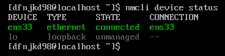
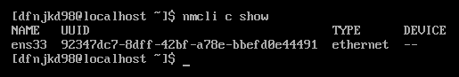
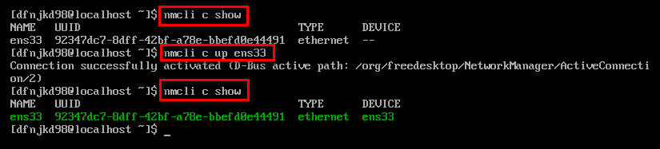

<h1 align="center" id="index">OpenEuler 实验记录</h1>

## 安装OpenEuler

### 虚拟机安装

- 镜像版本：openEuler-21.09-x86_64-dvd.iso


### 连接网络

> *Red Hat Enterprise Linux 7 与 CentOS 7 中默认的网络服务由 NetworkManager 提供，这是动态控制及配置网络的守护进程，它用于保持当前网络设备及连接处于工作状态，同时也支持传统的 ifcfg 类型的配置文件。*
>
> *NetworkManager 可以用于以下类型的连接：Ethernet，VLANS，Bridges，Bonds，Teams，Wi-Fi，mobile boradband（如移动3G）以及 IP-over-InfiniBand。针对与这些网络类型，NetworkManager 可以配置他们的网络别名，IP 地址，静态路由，DNS，VPN连接以及很多其它的特殊参数。*
>
> *可以用命令行工具 nmcli 来控制 NetworkManager。*
>
> *device叫网络接口，是物理设备*
>
> *connection是连接，偏重于逻辑设置*
>
> *多个connection可以应用到同一个device，但同一时间只能启用其中一个connection。这样的好处是针对一个网络接口，我们可以设置多个网络连接，比如静态IP和动态IP，再根据需要up相应connection*

- 查看可用设备

  ```shell
  nmcli device status
  ```

  

  | 参数       | 释义                                                         |
  | ---------- | ------------------------------------------------------------ |
  | DEVICE     | 表示网卡的名称（操作系统内核获取到的标识）                   |
  | TYPE       | 表示网卡的类型                                               |
  | STATE      | 表示网卡与配置文件的连接状态（unmanaged表示不使用NetworkManager管理) |
  | CONNECTION | 网卡对应的配置文件名称                                       |

- 查看已有连接

  ```shell
  nmcli connection show
  ```

  

- 启用连接

  ```shell
  nmcli connection up ens33
  # nmcli conn up ens33
  # nmcli c up ens33
  ```

  

- 断开连接

  ```shell
  nmcli c down ens33
  ```

### [配置静态IP](https://www.cnblogs.com/pipci/p/12570592.html)

- 修改为手动获取IP

  ```shell
  nmcli connection modify ens33 ipv4.method manual
  ```

- 修改ipv4地址

  ```shell
  nmcli connection modify ens33 ipv4.addresses 192.168.223.130/24
  ```

- 修改ipv4网关

  ```shell
  nmcli connection modify ens33 ipv4.gateway 192.168.223.2
  ```

- 修改ipv4 DNS

  ```shell
  nmcli connection modify ens33 ipv4.dns 192.168.223.2
  # DNS设定成网关的意思就是，凡是需要用到DNS解析的情况下，都交给路由器处理。
  # 路由器会交给下一个具有DNS功能的设备或交给DNS服务器。
  ```

- 开机自动连接网络

  ```shell
  nmcli connection modify ens33 connection.autoconnect on
  ```

### [配置Xshell](https://www.cnblogs.com/shireenlee4testing/p/9469650.html)

- 保证主机和虚拟机处于同一子网
- 虚拟机静态获取IP
- 需要注意虚拟机的掩码、网关、DNS

### 更换软件源

- 执行以下命令，获取仓库配置文件

  ```shell
  wget -O /etc/yum.repos.d/openEulerOS.repo https://repo.huaweicloud.com/repository/conf/openeuler_x86_64.repo
  ```

- 执行**yum clean all**清除原有yum缓存。

- 执行**yum makecache**生成新的缓存。

## [编译内核源码](https://blog.csdn.net/m0_56602092/article/details/118604262)

### 下载内核源码并解压

```shell
wget https://gitee.com/openeuler/kernel/repository/archive/5.10.0-4.25.0?format=tar.gz
```

### 生成内核配置文件.config

```shell
cp -v /boot/config-$(uname -r) .config
```

### [安装一些依赖](https://blog.csdn.net/qq_52688128/article/details/114905052)

```shell
yum install ncurses-devel
yum install bison
yum install openssl-devel
yum install ncurses-devel
yum install elfutils-libelf-devel
yum install bc
```

### 编译，安装模块，安装内核

```shell
make
make modules_install
make install
```

### 更新引导

```shell
grub2-mkconfig -o /boot/grub2/grub.cfg
```

### 修改默认启动内核

#### 查看所有可用内核

```shell
cat /boot/grub2/grub.cfg |grep "menuentry "
```

#### 查看当前默认启动内核

```shell
grub2-editenv list
```

#### 修改默认启动内核

```shell
grub2-set-default 5.10.0
```

### /boot目录

- vmlinuz是在启动过程中最重要的一个文件，因为这个文件就是实际系统所使用的kernel。
- System.map文件时系统Kernel中的变量对应表
- > 在2.6版本的linux内核中，都包含一个压缩过的cpio格式的打包文件。当内核启动时，会从这个打包文件中导出文件到内核的rootfs文件系统，然后内核检查rootfs中是否包含有init文件，如果有则执行它，**作为PID为1的第一个进程**。这个init进程负责启动系统后续的工作，包括定位、挂载“真正的”根文件系统设备（如果有的话）。如果内核没有在 rootfs中找到init文件，则内核会按以前版本的方式定位、挂载根分区，然后执行/sbin/init程序完成系统的后续初始化工作。
  >
  > **这个压缩过的cpio格式的打包文件就是initramfs**。编译2.6版本的linux内核时，编译系统总会创建initramfs，然后把它与编译好的内核连接在一起。内核源代码树中的usr目录就是专门用于构建内核中的initramfs的，其中的initramfs_data.cpio.gz文件就是initramfs。缺省情况下，initramfs是空的，X86架构下的文件大小是134个字节。

