<h1 align="center" id="index">OpenEuler 实验记录</h1>

## 一、操作系统安装与内核编译

### 安装OpenEuler

- 镜像版本：openEuler-21.09-x86_64-dvd.iso


- 安装中。。。


#### 连接网络

> *Red Hat Enterprise Linux 7 与 CentOS 7 中默认的网络服务由 NetworkManager 提供，这是动态控制及配置网络的守护进程，它用于保持当前网络设备及连接处于工作状态，同时也支持传统的 ifcfg 类型的配置文件。*
>
> *NetworkManager 可以用于以下类型的连接：Ethernet，VLANS，Bridges，Bonds，Teams，Wi-Fi，mobile boradband（如移动3G）以及 IP-over-InfiniBand。针对与这些网络类型，NetworkManager 可以配置他们的网络别名，IP 地址，静态路由，DNS，VPN连接以及很多其它的特殊参数。*
>
> *可以用命令行工具 nmcli 来控制 NetworkManager。*
>
> *device叫网络接口，是物理设备*
>
> *connection是连接，偏重于逻辑设置*
>
> *多个connection可以应用到同一个device，但同一时间只能启用其中一个connection。这样的好处是针对一个网络接口，我们可以设置多个网络连接，比如静态IP和动态IP，再根据需要up相应connection*

- 查看可用设备

  ```shell
  nmcli device status
  ```

  

  | 参数       | 释义                                                         |
  | ---------- | ------------------------------------------------------------ |
  | DEVICE     | 表示网卡的名称（操作系统内核获取到的标识）                   |
  | TYPE       | 表示网卡的类型                                               |
  | STATE      | 表示网卡与配置文件的连接状态（unmanaged表示不使用NetworkManager管理) |
  | CONNECTION | 网卡对应的配置文件名称                                       |

- 查看已有连接

  ```shell
  nmcli connection show
  ```

  

- 启用连接

  ```shell
  nmcli connection up ens33
  # nmcli conn up ens33
  # nmcli c up ens33
  ```

  

- 断开连接

  ```shell
  nmcli c down ens33
  ```

#### [配置静态IP](https://www.cnblogs.com/pipci/p/12570592.html)

- 修改为手动获取IP

  ```shell
  # 需要先设置ip地址
  nmcli connection modify ens33 ipv4.method manual
  ```

- 修改ipv4地址

  ```shell
  nmcli connection modify ens33 ipv4.addresses 192.168.223.130/24
  ```

- 修改ipv4网关

  ```shell
  nmcli connection modify ens33 ipv4.gateway 192.168.223.2
  ```

- 修改ipv4 DNS

  ```shell
  nmcli connection modify ens33 ipv4.dns 192.168.223.2
  # DNS设定成网关的意思就是，凡是需要用到DNS解析的情况下，都交给路由器处理。
  # 路由器会交给下一个具有DNS功能的设备或交给DNS服务器。
  ```

- 开机自动连接网络

  ```shell
  nmcli connection modify ens33 connection.autoconnect on
  ```
  
  

#### [配置Xshell](https://www.cnblogs.com/shireenlee4testing/p/9469650.html)

- 保证主机和虚拟机处于同一子网
- 虚拟机静态获取IP
- 需要注意虚拟机的掩码、网关、DNS

#### 更换软件源

- 执行以下命令，获取仓库配置文件

  ```shell
  wget -O /etc/yum.repos.d/openEulerOS.repo https://repo.huaweicloud.com/repository/conf/openeuler_x86_64.repo
  ```

- 执行**yum clean all**清除原有yum缓存。

- 执行**yum makecache**生成新的缓存。

### [编译内核源码](https://blog.csdn.net/m0_56602092/article/details/118604262)

#### 下载内核源码并解压

```shell
wget https://gitee.com/openeuler/kernel/repository/archive/5.10.0-4.25.0?format=tar.gz
```


#### 生成内核配置文件.config

```shell
cp -v /boot/config-$(uname -r) .config
```

#### 更改编译配置

```shell
make menuconfig
# 先Load载入原始.config配置
# 添加KVM支持 - http://blog.chinaunix.net/uid-31410005-id-5776786.html
```

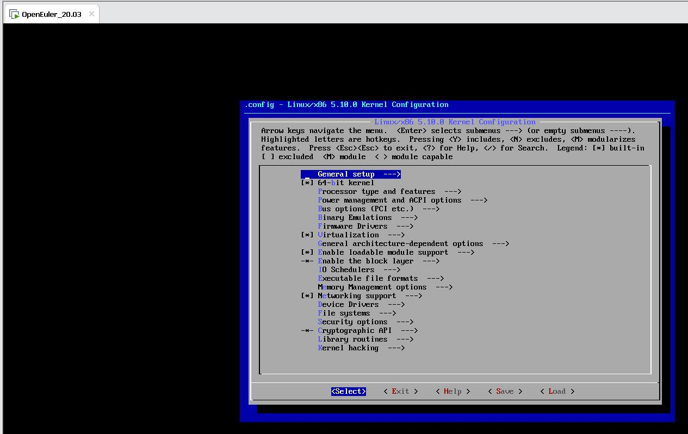

#### [安装一些依赖](https://blog.csdn.net/qq_52688128/article/details/114905052)

```shell
yum install ncurses-devel
yum install bison
yum install openssl-devel
yum install ncurses-devel
yum install elfutils-libelf-devel
yum install bc
```


#### 编译，安装模块，安装内核

```shell
make -j4
make modules_install
make install
```


- 执行`make modules_install`


- 执行`make install`


#### 更新引导

```shell
grub2-mkconfig -o /boot/grub2/grub.cfg
```


#### 查看所有可用内核

```shell
cat /boot/grub2/grub.cfg |grep "menuentry "
```

#### 查看当前默认启动内核

```shell
grub2-editenv list
```

#### 修改默认启动内核

```shell
grub2-set-default 5.10.0
```

#### /boot目录

- vmlinuz是在启动过程中最重要的一个文件，因为这个文件就是实际系统所使用的kernel。
- System.map文件是系统Kernel中的变量对应表

在2.6版本的linux内核中，都包含一个压缩过的cpio格式的打包文件。当内核启动时，会从这个打包文件中导出文件到内核的rootfs文件系统，然后内核检查rootfs中是否包含有init文件，如果有则执行它，**作为PID为1的第一个进程**。这个init进程负责启动系统后续的工作，包括定位、挂载“真正的”根文件系统设备（如果有的话）。如果内核没有在 rootfs中找到init文件，则内核会按以前版本的方式定位、挂载根分区，然后执行/sbin/init程序完成系统的后续初始化工作。

**这个压缩过的cpio格式的打包文件就是initramfs**。编译2.6版本的linux内核时，编译系统总会创建initramfs，然后把它与编译好的内核连接在一起。内核源代码树中的usr目录就是专门用于构建内核中的initramfs的，其中的initramfs_data.cpio.gz文件就是initramfs。缺省情况下，initramfs是空的，X86架构下的文件大小是134个字节。

### 内核模块编程

#### 编写helloworld模块


#### 编写Makefile文件


#### 编译模块


#### 加载与卸载模块


## 二、内存管理

### kmalloc

#### 编写源文件


#### 编写Makefile文件

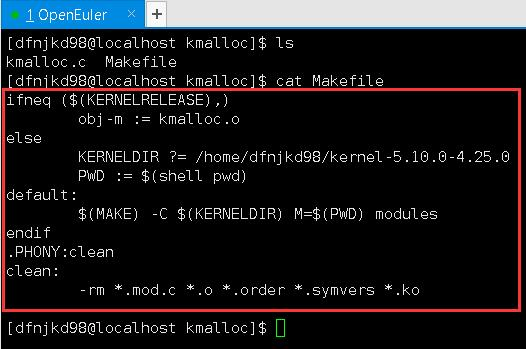

#### 加载模块与卸载模块


### vmalloc

#### 编写源文件


#### 编写Makefile文件

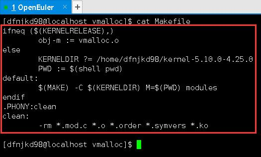

#### 加载模块与卸载模块


### 研讨

#### 内存泄漏

>  程序中己动态分配的内存未释放或无法释放，就产生了内存泄露

- 危害
  -  可用的内存越来越少，堆积后的后果就导致内存溢出
  - 导致其他应用程序无法使用内存
  - 应用程序访问内存时，不停地产生缺页错误
  - 使得CPU不停地从磁盘上的swap空间读取页面数据，导致应用程序性能下降，cpu无法进行其他工作。
- 检查和预防
  - 使用带有自动垃圾回收机制的程序语言编写程序
  - 使用内存泄露检测器，在编写代码过程中对代码进行检测

#### 内存溢出

> 程序在申请内存时，没有足够的内存空间供其使用

- 危害
  - 程序无法运行，有时候会自动关闭软件
  - 易遭受缓冲区溢出攻击/黑客攻击
- 检查和预防
  - 防止内存泄露

#### 内存越界

> 程序向系统申请一块内存后，使用时超出申请范围

- 危害
  - 导致内存越界错误，程序向内存块中写入数据，超过内存块的边界，写到了其他内存对象中，导致覆盖了其他内存对象中的数据
- 检查和预防
  - 使用安全的语言
  - 使用安全的函数库
  - 边界检测，防止越界的发生

## 三、进程管理

### 内核线程

#### 运行结果


### 打印输出CPU负载情况

#### /proc目录

**Linux系统上的/proc目录是一种文件系统，即proc文件系统。**与其它常见的文件系统不同的是，/proc是一种伪文件系统（也即虚拟文件系统），**存储的是当前内核运行状态的一系列特殊文件**，用户可以通过这些文件查看有关系统硬件及当前正在运行进程的信息，甚至可以通过更改其中某些文件来改变内核的运行状态。

基于 /proc文件系统如上所述的特殊性，其内的文件也常被称作虚拟文件，并具有一些独特的特点。例如，其中有些文件虽然使用查看命令查看时会返回大量信息，但文件本身的大小却会显示为0字节。此外，这些特殊文件中大多数文件的时间及日期属性通常为当前系统时间和日期，这跟它们随时会被刷新（存储于RAM中）有关。

为了查看及使用上的方便，这些文件通常会按照相关性进行分类存储于不同的目录甚至子目录中，**如/proc/scsi目录中存储的就是当前系统上所有SCSI设备的相关信息，/proc/N中存储的则是系统当前正在运行的进程的相关信息，其中N为正在运行的进程PID（在某进程结束后其相关目录则会消失）。**

大多数虚拟文件可以使用文件查看命令如cat、more或者less进行查看，有些文件信息表述的内容可以一目了然，但也有文件的信息却不怎么具有可读性。不过，这些可读性较差的文件在使用一些命令如apm、free、lspci或top查看时却可以有着不错的表现。

| 目录名            | 说明                                       |
| ----------------- | ------------------------------------------ |
| /proc/cpuinfo     | CPU 的信息 (型号, 家族, 缓存大小等)        |
| /proc/meminfo     | 物理内存、交换空间等的信息                 |
| /proc/loadavg     | 查看系统1分钟、5分钟、15分钟的平均负载情况 |
| /proc/mounts      | 已加载的文件系统的列表                     |
| /proc/devices     | 可用设备的列表                             |
| /proc/filesystems | 被支持的文件系统                           |
| /proc/modules     | 已加载的模块                               |
| /proc/version     | 内核版本                                   |
| /proc/cmdline     | 系统启动时输入的内核命令行参数             |

#### 运行结果


### 打印输出运行进程的PID和名字

#### 运行结果


### cgroups

#### cgroups介绍

cgroups是control groups的缩写，是Linux内核提供的一种可以限制，记录，隔离进程组(process groups)所使用物理资源的机制cgroups是Linux内核提供的一种机制，这种机制可以根据特定的行为，把一系列系统任务及其子任务整合（或分隔）到按资源划分等级的不同组内，从而为系统资源管理提供一个统一的框架。通俗点说，cgroups可以限制、记录、隔离进程组所使用的物理资源（包括：CPU、memory、IO等）。

从本质上来说，cgroups是内核附加在程序上的一系列钩子，通过程序运行时对资源的调度触发相应的钩子以达到资源追踪和限制的目的

#### cgroups相关概念

>  cgroups主要由task,cgroup,subsystem及hierarchy构成

- task：在Cgroups中，task就是系统的一个进程

- cgroup
  - cgroups中的资源控制都以cgroup为单位实现的。
  - cgroup表示按照某种资源控制标准划分而成的任务组，包含一个或多个子系统。
  - 一个任务可以加入某个cgroup，也可以从某个cgroup迁移到另外一个cgroup

- subsystem
  - cgroups中的subsystem就是一个资源调度控制器(Resource Controller)。
  - 比如CPU子系统可以控制CPU时间分配，内存子系统可以限制cgroup内存使用量

- hierarchy
  - hierarchy由一系列cgroup以一个树状结构排列而成，每个hierarchy通过绑定对应的subsystem进行资源调度。
  - hierarchy中的cgroup节点可以包含零或多个子节点，子节点继承父节点的属性。整个系统可以有多个hierarchy

#### 组件之间的关系

- 同一个hierarchy能够附加一个或多个subsystem。例如cpu和memory subsystems(或者任意多个subsystems)附加到同一个hierarchy

  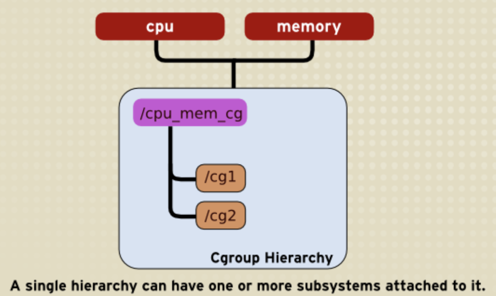

- cpu subsystem已经附加到了hierarchy A，并且memory subsystem已经附加到了hierarchy B，此时cpu subsystem不能在附加到hierarchy B

  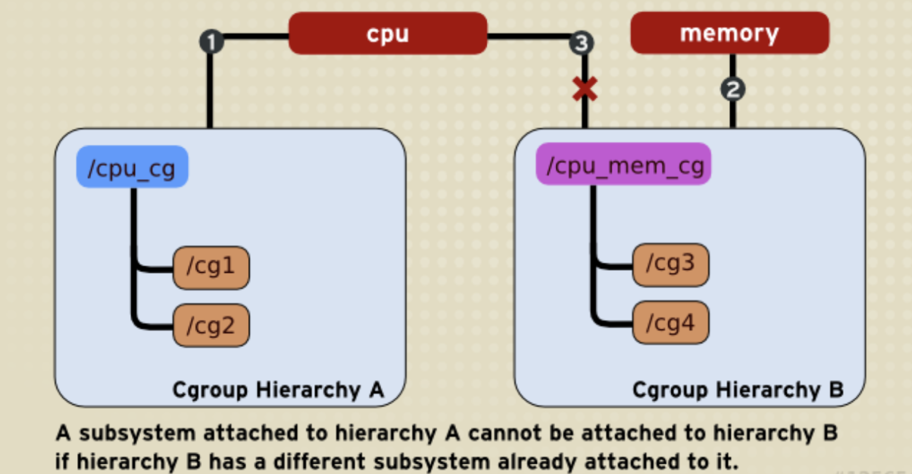

- 一个task不能存在于同一个hierarchy的不同cgroup，但可以存在在不同hierarchy中的多个cgroup

  系统每次新建一个hierarchy时，该系统上的所有task默认构成了这个新建的hierarchy的初始化cgroup，这个cgroup也称为root cgroup。

- 系统中的任何一个task(Linux中的进程)fork自己创建一个子task(子进程)时，子task会自动的继承父task cgroup的关系，在同一个cgroup中，但是子task可以根据需要移到其它不同的cgroup中。父子task之间是相互独立不依赖的。

#### tmpfs文件系统

**tmpfs即临时文件系统，是一种基于内存的文件系统，也称之为虚拟内存文档系统。**它不同于传统的用块设备形式来实现的ramdisk，也不同于针对物理内存的ramfs。tmpfs能够使用物理内存，也能够使用交换分区。

在Linux内核中，虚拟内存资源由物理内存（RAM）和交换分区swap组成，这些资源是由内核中的虚拟内存子系统来负责分配和管理。tmpfs就是和虚拟内存子系统来"打交道"的，他向虚拟内存子系统请求页来存储文档，他同Linux的其他请求页的部分相同，不知道分配给自己的页是在内存中还是在交换分区中。tmpfs同ramfs相同，其大小也不是固定的，而是随着所需要的空间而动态的增减。

**所有在 tmpfs 上储存的资料在理论上都是临时存放的，也就是说，档案不会建立在硬盘上面。一旦重新开机，所有在 tmpfs 里面的资料都会消失不见。**理论上，内存使用量会随着 tmpfs 的使用而时有增长或消减。tmpfs将所有内容放入内核内部高速缓存中，并进行扩展和收缩以容纳其中包含的文件，并且能够将不需要的页面交换出来以交换空间。它具有最大大小限制，可以通过“ mount -o remount ...”即时调整。

**由于tmpfs完全存在于页面缓存和交换中，因此所有tmpfs页面将在 /proc/meminfo中显示为 “Shmem”**，在free命令后中显示为“Shared”。

```shell
              total        used        free      shared  buff/cache   available
Mem:          433Mi       228Mi        23Mi       3.0Mi       181Mi       194Mi
Swap:         1.6Gi        44Mi       1.6Gi
```

### cgroup限制cpu核数

#### 安装libcgroup


#### 挂载tmpfs格式的cgroup文件夹


#### 挂载cpuset管理子系统

- 如上图

#### 限制使用cpu的核数


#### 编译运行while_long


#### 查看while_long的运行情况


### cgroup禁止访问U盘

#### 查看U盘盘符


#### 获取设备号


#### 挂载U盘到当前系统


#### 挂载设备管理devices子系统


#### 创建cgroup前后对比


#### 测试访问U盘


## 四、终端和异常管理

### tasklet输出helloworld


### 周期性打印helloworld


#### 捕获信号


## 五、内核时间管理

### 打印当前时间


### 定时打印helloworld


### 累加计算代码的运行时间

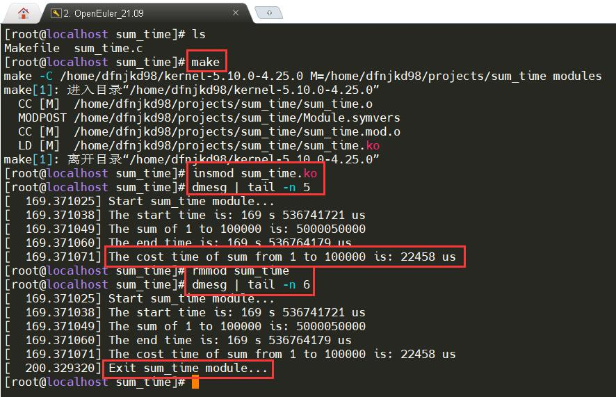

## 六、设备管理

### 编写USB设备驱动程序

#### 安装usbutils


#### 查看usb的设备号和厂商号


#### 安装usb检测模块


#### 插入U盘查看模块输出


#### 拔出U盘查看模块输出


#### 卸载模块


### 测试硬盘读写速率

#### 测试硬盘写速率


#### 测试硬盘读速率


#### iozone测试读写速率

- 编译iozone

  ```shell
  wget http://www.iozone.org/src/current/iozone3_489.tar
  tar -xvf iozone3_489.tar 
  cd iozone3_489
  cd src/
  cd current/
  make linux-AMD64
  # 查看具体用法
  # ./fileop -h
  # ./pit_server -h
  # ./iozone -h
  ```

  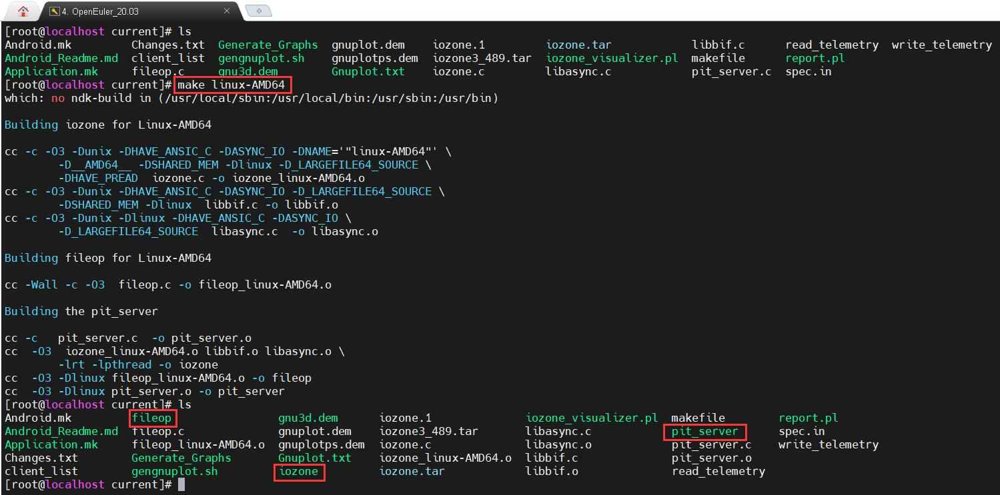

- 测试读写速率

  ```shell
  ./iozone -Raz -n 512m -g 8g -r 1k -i 0 -i 1 -b /home/iozone.xls
  ```
  
  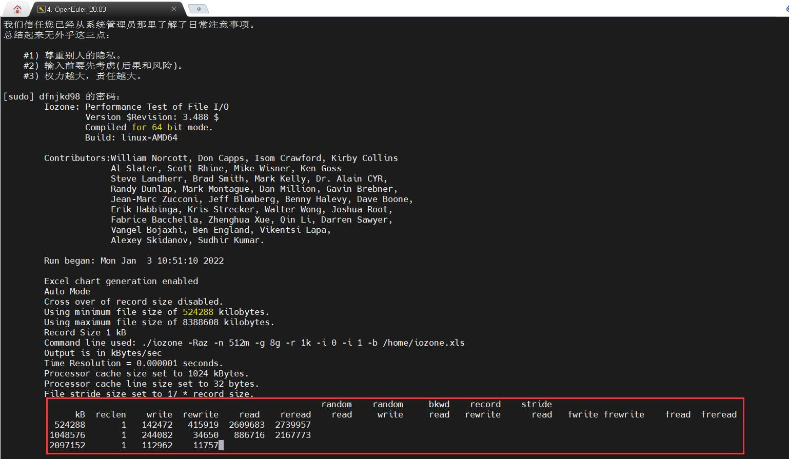
  
  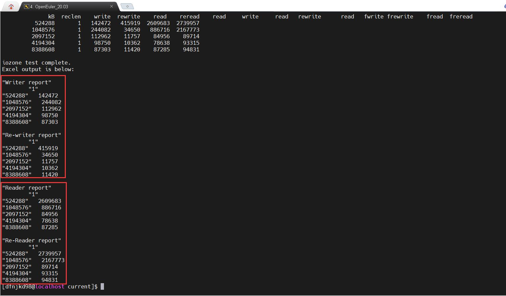

## 七、文件系统

### 为Ext4文件系统添加扩展属性

#### 查看是否支持扩展属性


#### 设置文本属性值


#### 设置十六进制属性值和base64编码


#### text编码设置


#### hex编码和base64编码


### 注册自定义文件系统类型


### 在/proc下创建目录


### 使用sysfs文件系统传递内核模块参数

#### /sys - sysfs文件系统

##### 基本概念

内核子系统或设备驱动可以直接编译到内核，也可以编译成模块。如果编译到内核，可以通过内核启动参数来向它们传递参数；如果编译成模块，则可以通过命令行在插入模块时传递参数，或者在运行时，**通过sysfs来设置或读取模块数据。**

**sysfs是一个基于内存的虚拟文件系统**，可以看成与proc、devfs和devpty同类别的文件系统；**它的作用是将内核信息以文件的方式提供给用户程序使用。**sysfs 文件系统要求总是被挂载在 /sys 挂载点上，这个文件系统不仅可以把设备（devices）和驱动程序（drivers）的信息从内核输出到用户空间，也可以用来对设备和驱动程序做设置。

sysfs提供一种机制，使得可以显式地描述内核对象、对象属性及对象间关系。sysfs有两组接口，一组针对内核，用于将设备映射到文件系统中；另一组针对用户程序，用于读取或操作这些设备。下表述了内核中的sysfs要素及其在用户空间的表现：

| sysfs在内核中的组成要素  |   在用户空间的显示    |
| :----------------------: | :-------------------: |
|   内核对象（kobject）    |         目录          |
|  对象属性（attribute）   |         文件          |
| 对象关系（relationship） | 链接（Symbolic Link） |

##### sysfs 与 sysctl区别

- sysctl：是内核的一些控制参数，其目的是方便用户对内核的行为进行控制；
- sysfs：仅仅是把内核的 kobject 对象的层次关系与属性开放给用户查看，因此 sysfs 的绝大部分是只读的，模块作为一个 kobject 也被出口到 sysfs，模块参数则是作为模块属性出口的，内核实现者为模块的使用提供了更灵活的方式，允许用户设置模块参数在 sysfs 的可见性并允许用户在编写模块时设置这些参数在 sysfs 下的访问权限，然后用户就可以通过sysfs 来查看和设置模块参数，从而使得用户能在模块运行时控制模块行为。

#### 编译与装载sysfs_exam模块


#### 修改模块参数和卸载模块


## 八、网络管理

### 基于socket的udp发送接收程序

#### 编译udp_socket并发送数据


#### 启动服务端并接收数据


### tshark抓包

#### 安装WireShark


#### client发送数据


#### server接收数据


#### tshark抓取数据


### 使用 setsockopt 发送记录路由选项

#### 发送三次数据


#### 接收到三次数据


#### 输出记录到xml文件


#### 查看记录


## 九、内核虚拟化

### 搭建OpenEuler系统的虚拟机

#### 安装qemu


#### 安装libvirt


#### 查看内核是否支持虚拟化


#### 查看qemu是否安装成功


#### 查看libvirt是否安装成功


#### 启动libvirtd服务


#### 查看网络配置


#### 安装引导固件

> 因为实验指导书中只给了aarch64架构的安装方法，而VMware中的cpu是x86_64架构的
>
> 查看官方文档可以找到解决办法，运行下面的命令即可

```shell
yum install -y edk2-ovmf
```


#### 准备虚拟机镜像

> 之前按照官方文档创建的镜像，直接给了4G
>
> 后续安装操作系统进行分区时，要求不少于5.xxG(具体记不得了)，所以这里**最少得6G**


#### 创建虚拟机


#### 运行虚拟机


#### 安装tigervnc


#### 查看网络信息


#### 填写VNC-Server地址


#### 输入密码

> 官方文档给的配置中没有配置密码，需要添加下面的passwd属性

```xml
<graphics type='vnc' port='-1' autoport='yes' listen='0.0.0.0' passwd='123456'>
    <listen type='address' address='0.0.0.0'/>
</graphics>
```


#### 连接报错

> 这里报错是因为，前面的虚拟机配置文件是直接复制的官方文档的配置，而官方文档给的配置中没有可以引导的disk
>
> 所以还需要添加下面的配置

```xml
<disk type='file' device='cdrom'>
    <driver name='qemu' type='raw'/>
    <source file='/root/vm_openEuler/openEuler-20.03-LTS-aarch64-dvd.iso'/>
    <readonly/>
    <target dev='sdb' bus='scsi'/>
    <boot order='2'/>
</disk>
```


#### 安装虚拟机


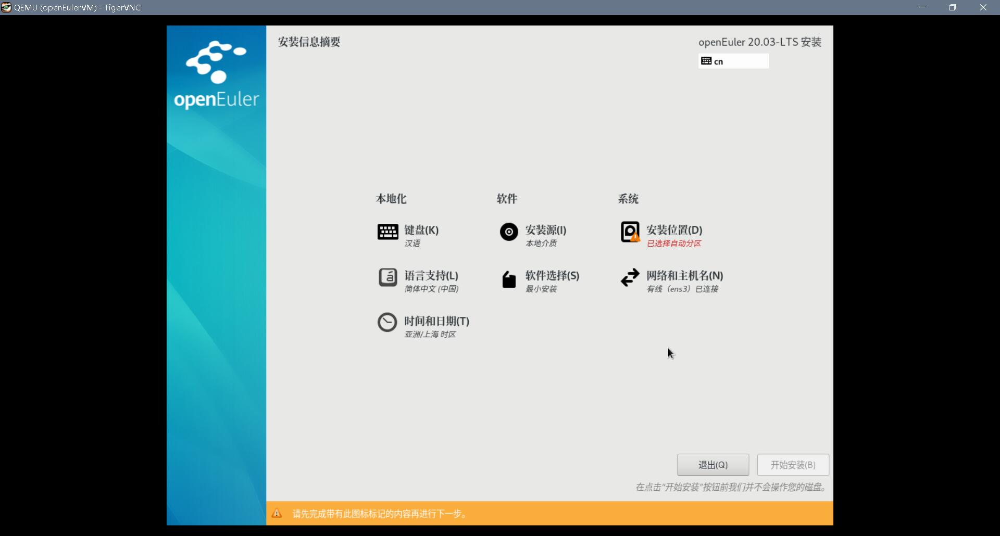


#### 登录虚拟机


#### 关闭虚拟机


### Docker

#### 安装docker


#### 拉取镜像


#### 新建容器并启动


#### 创建容器并后台运行


#### 容器的终止与删除


#### 创建镜像并验证可用性


## iSula容器引擎

> iSula通用容器引擎相比Docker，是一种新的容器解决方案，提供统一的架构设计来满足CT和IT领域的不同需求。相比Golang编写的Docker，轻量级容器使用C/C++实现，具有轻、灵、巧、快的特点，不受硬件规格和架构的限制，底噪开销更小，可应用领域更为广泛。
>
> 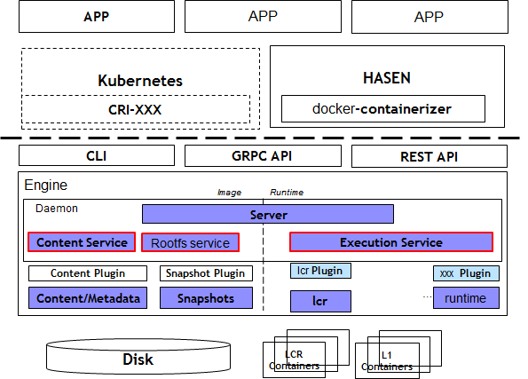

### [安装与配置](https://docs.openeuler.org/zh/docs/20.03_LTS/docs/Container/%E5%AE%89%E8%A3%85%E4%B8%8E%E9%85%8D%E7%BD%AE.html)

#### 安装

```shell
sudo yum install -y iSulad
```


#### 配置

- 配置镜像仓库地址

  ```shel
  isulad --registry-mirrors "https://nwxzkbs8.mirror.aliyuncs.com"
  isulad --insecure-registry "https://nwxzkbs8.mirror.aliyuncs.com"
  ```

#### 升级

- 若为相同大版本之间的升级，例如从2.x.x版本升级到2.x.x版本，请执行如下命令：

  ```shell
  sudo yum update -y iSulad
  ```

- 若为不同大版本之间的升级，例如从1.x.x版本升级到2.x.x版本，请先保存当前的配置文件`/etc/isulad/daemon.json`，并卸载已安装的iSulad软件包，然后安装待升级的iSulad软件包，随后恢复配置文件。

#### 卸载

- 卸载iSulad及其依赖软件包

  ```shell
  sudo yum remove iSulad
  ```

- 镜像、容器、volumes以及相关配置文件不会自动删除，需要手动删除。

  ```shell
  rm -rf /var/lib/iSulad
  ```

### [镜像管理](https://docs.openeuler.org/zh/docs/20.03_LTS/docs/Container/%E9%95%9C%E5%83%8F%E7%AE%A1%E7%90%86.html)

#### 拉取镜像

```shell
isula pull ubuntu:14.04
```

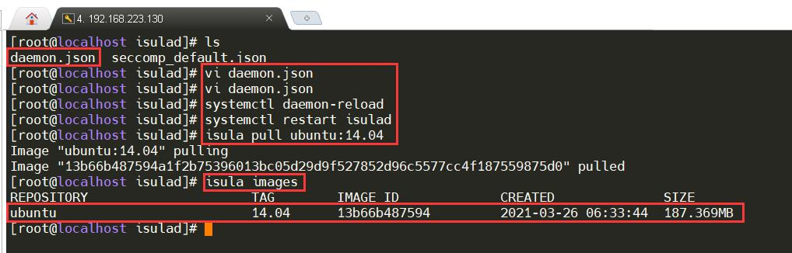

#### 查看镜像

```shell
isula images
```

### [容器管理](https://docs.openeuler.org/zh/docs/20.03_LTS/docs/Container/%E5%AE%B9%E5%99%A8%E7%AE%A1%E7%90%86.html)

#### 创建容器

```shell
isula create ubuntu:14.04
```

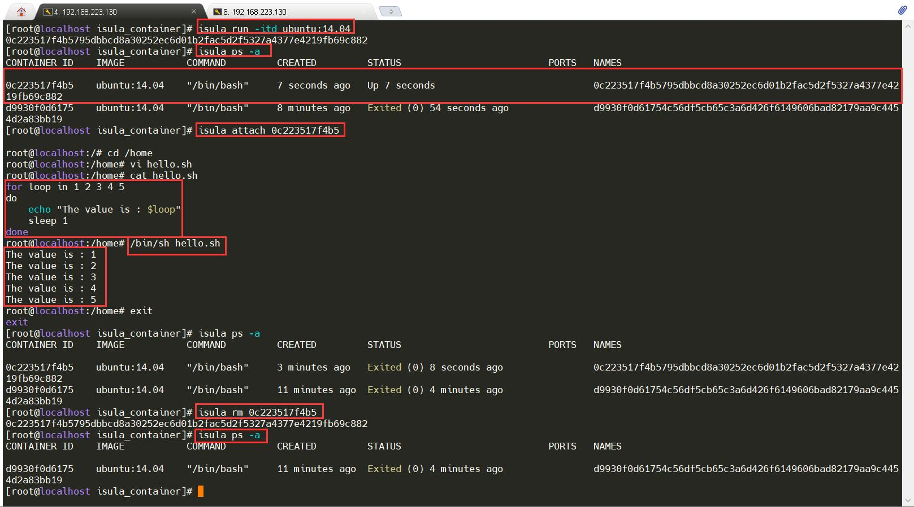

### CNI网络

> 参考链接：
>
> [【kubernetes/k8s概念】CNI详解](https://blog.csdn.net/zhonglinzhang/article/details/82697524)
> [kubernetes cni网络详解](https://blog.csdn.net/liukuan73/article/details/78883847)

#### 为什么CNI
CNI是Container Network Interface的是一个标准的，通用的接口。现在容器平台：docker，kubernetes，mesos，容器网络解决方案：flannel，calico，weave。**只要提供一个标准的接口，就能为同样满足该协议的所有容器平台提供网络功能，而CNI正是这样的一个标准接口协议。**

一直以来，kubernetes 并没有专门的网络模块负责网络配置，它需要用户在主机上已经配置好网络。
kubernetes 对网络的要求是：

- 容器之间（包括同一台主机上的容器，和不同主机的容器）可以互相通信
- 容器和集群中所有的节点也能直接通信

kubernetes 网络的发展方向是希望通过插件的方式来集成不同的网络方案， CNI 就是这一努力的结果。CNI只专注解决容器网络连接和容器销毁时的资源释放，提供一套框架，所以CNI可以支持大量不同的网络模式，并且容易实现。

#### 什么CNI
   **CNI用于连接容器管理系统和网络插件**。提供一个容器所在的network namespace，将network interface插入该network namespace中（比如veth的一端），并且在宿主机做一些必要的配置（例如将veth的另一端加入bridge中），最后对namespace中的interface进行IP和路由的配置。

  CNI的工作是从容器管理系统处获取运行时信息，包括**network namespace的路径，容器ID以及network interface** name，再从容器网络的配置文件中加载网络配置信息，再将这些信息传递给对应的插件，由插件进行具体的网络配置工作，并将配置的结果再返回到容器管理系统中。

