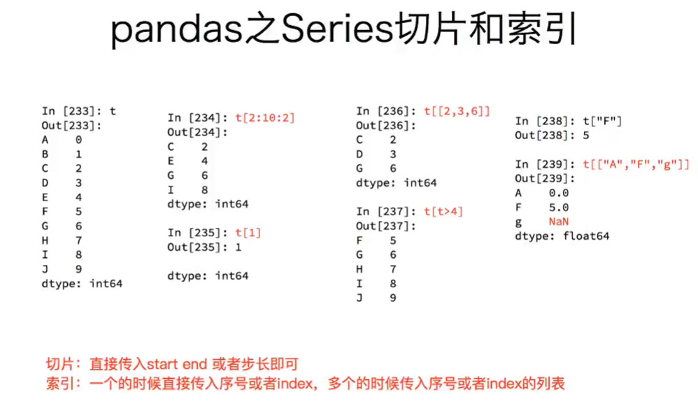
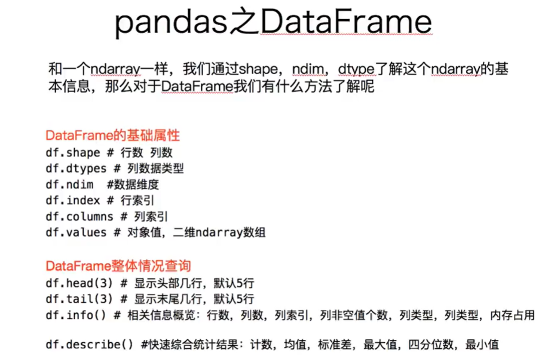

<h1 align="center">Python数据分析基础学习</h1>


### 一、matplotlib

#### 1.1 matplotlib的基础绘图

```python
# 导入pyplot
from matplotlib import pyplot as plt
# 通过实例化一个figure并且传递参数，能够在后台自动使用该figure实例
# 在图形模糊的时候可以传入dpi参数，让图片更加清晰
fig = plt.figure(figsize=(20,8), dpi=80)
# 数据在x轴的位置，是一个可迭代的对象
x = range(2, 26, 2)
# 数据在y轴的位置，是一个可迭代的对象
y = [15,13,14,5,17,20,25,26,26,24,22,18,15]
# x轴和y轴的数据一起组成了所有要绘制出的坐标
# 传入x和y，通过plot绘制出折线图
plt.plot(x,y)
# 保存图片,可以保存为svg矢量图格式，放大不会有锯齿
plt.savefig("./sig_size.png")
# 展示图形
plt.show()
```

#### 1.2 X轴和Y轴的绘制

```python
# 设置x轴的刻度
xList = [i/2 for i in range(2,49)]
plt.xticks(range(2,25,0.5))
# 传入列表控制x轴的稀疏程度
plt.xticks(xList)
# 列表设置步长取数字
plt.xticks(xList[::3])
# 传入什么数字就显示什么，没有传入的数字，x轴刻度上不会显示
plt.yticks(range(min(y), max(y)+1))
```

#### 1.3 中文的显示

```python
# 使用字符串作为刻度
x = range(0,120)
_x = list(x)[::10]
_xtick_labels = ["hello,{}".format(i) for i in _x]
plt.xticks(_x, _xtick_labels)
# 使用中文作为刻度
_x = list(x)[::3]
_xtick_lavels = ["10点{}分".format(i) for i in range(60)]
_xtick_lavels += ["11点{}分".format(i) for i in range(60)]
# 要保证_x和_xtick_lavels的个数相等
# rotation旋转的度数，对刻度进行旋转展示
plt.xticks(_x, _xtick_labels[::3], rotation=45)

# matplotlib默认不支持中文字符，通过matplotlib下的font_manager或者matplotlib.rc解决
import matplotlib
font1 = {'family': 'monospace', 'weight': 'bold', 'size': 'larger'}
font2 = {'family': 'MicroSoft YaHei', 'weight': 'bold', 'size': 'larger'}
matplotlib.rc('font', **font2)
from matplotlib import font_manager
my_font = font_manager.FontProperties(fname="字体文件位置")
plt.xticks(_x, _xtick_labels[::3], rotation=45,fontproperties=my_font)
```

#### 1.4 单位和网格线的绘制

```python
plt.xlabel("时间", fontproperties=my_font)
plt.ylabel("温度 单位(℃)", fontproperties=my_font)
plt.title("10点到12点每分钟的气温变化情况", fontproperties=my_font)

# 绘制网格
# 参数alpha可以设置网格线的透明度
plt.grid(alpha=0.4)
```

#### 1.5 多组数据的同时显示

```python
# 多次绘制点即可在同一张表中绘制不同曲线
plt.plot(x, y, label="自己", color="orange", linestyle=":", linewidth=3)
plt.plot(a, b, label="同桌", color="cyan", linestyle="--")

# 图例的绘制--->不同曲线绘制时，要加上label
# 这里不再是fontproperties而是prop
# 参数loc可是设置图例在图片中的位置
plt.legend(prop=my_font, loc="upper left")

# 还可以做到在图片中添加文本注释、添加水印
```

#### 1.6 绘制散点图

#### 1.7 绘制条形图

#### 1.8 绘制多次条形图

#### 1.9 绘制直方图

#### 1.10 更多绘图工具的了解

### 二、numpy

#### 1.1 numpy数组

##### 1.1.1 numpy数组的创建

```python
import numpy as np
a = np.array([1,2,3,4,5])
b = np.array(range(1,6))
c = np.arange(1,6)
# 上面a,b,c内容相同，注意arange和range的区别
# np.arange的用法：arange([start,] stop[, step,], dtype=None)
# 数组的类名--也就是a的类型：
In [1]: a = np.array([1,2,3,4,5])
In [2]: type(a)
Out[2]: numpy.ndarray
# 数据的类型--也就是a中数据的类型：
In [3]: a.dtype
Out[3]: dtype('int64')
```


```python
# 指定创建的数组的数据类型
a = np.array([1,0,1,0], dtype = np.bool)  # dtype = "float32"
print(a)
array([True, False, True, False], dtype = bool)
# 修改数组的数据类型
a.astype("i1") # 或者使用a.astype(np.int8)
print(a)
array([1, 0, 1, 0], dtype = int8)
# 修改浮点型的小数位数
np.round(b, 2)
print(b)
array([0.05, 0.26, 0.7, 0.72, 0.36])
```

##### 1.1.2 矩阵的计算

- 矩阵的形状----几行几列

  ```python
  a = np.array([[3,4,5,6,7,8], [4,5,6,7,8,9]])
  print(a.shape)
  Out: (2, 6)
  # 修改数组的形状
  # 并不会对数组进行更改，需要变量来进行接受
  a.reshape((3,4))			      |
  print(a)						  |
  Out:array([[3,4,5,6],			  |
  	      [7,8,4,5],			  |
  	      [6,7,8,9]])			  |
  print(a.shape)     <---------------
  Out: (2, 6)
  # 展开成一维数组
  t5.flatten()
  ```

- 加、减、乘、除一个常数----对矩阵中的每个数字都会进行操作

  ```python
  t1 = np.array([[1,2,3,4], [5,6,7,8]])
  print(t1 + 2)
  array([[3,4,5,6], [7,8,9,10]])
  ```

- nan 和 inf

  - nan是 0 除以 0 的结果，表示不是一个数字
  - inf是 非0数字 除以 0 的结果，表示无尽、无穷

- 行与列都相同的矩阵的加减乘除法，就是对两个矩阵中对应的数字进行加减乘除，**和平常的矩阵运算有所区别**

- 行与列有一个相同的矩阵的加减乘除法，就是沿维度相同的方向逐一计算，遵守的是**广播原则**

- 行与列都不相同的矩阵无法直接进行计算

#### 1.2 numpy读取本地数据和索引

##### 1.2.1 读取CSV文件

```python
np.loadtxt(frame, dtype=np.float, delimiter=",", skiprows=0, usecols=None, unpack=False)
```

| 参数        | 解释                                                         |
| ----------- | ------------------------------------------------------------ |
| `frame`     | 文件、字符串或产生器，可以是.gz或bz2压缩文件                 |
| `dtype`     | 数据类型，可选，CSV的字符串以什么数据类型读入数组中，默认 np.float |
| `delimiter` | 分隔字符串，默认是任何空格，改为逗号                         |
| `skiprows`  | 跳过前x行，一般跳过第一行表头                                |
| `usecols`   | 读取指定的列，索引，元组类型                                 |
| `unpack`    | 如果True，每一列的数据会组成一行，原始数据有多少列，加载出来的数据就有多少行，相当于转置的效果，默认为False |

##### 1.2.2 转置的三种方法

- **t.transpose()**
- **t.swapaxes(1, 0)**----通过交换轴来进行转置
- **t.T**

##### 1.2.3 索引和切片

- **取矩阵中的行数据**

  ```python
  # 取第三行的数据
  print(t2[2])
  # 取连续的多行
  print(t2[2:])
  # 取不连续的多行--取第2、4、6行
  print(t2[[2,4,6]])
  ```

- **取矩阵中的列数据**

  ```python
  # 取第一列
  print(t2[:, 0])
  # 取连续的多列
  print(t2[:, 2:])
  # 取不连续的多列--取第1、3、5列
  print(t2[:, [0,2,4]])
  ```

- **取矩阵中任意的数据**

  ```python
  # 取第三行第四列的值
  data = t2[2,3]
  print(type(data))	# <class 'numpy.int64'>
  # 取第三行到第五行，第二列到第四列的结果
  data2 = t2[2:5, 1:4]
  # 取多个不相邻的点
  # 不同于上面取的是交叉点，这里取的是第1行第1列，第3行第2列的点
  data3 = t2[[0,2],[0,1]]
  ```

##### 1.2.4 更多的索引方式

- **布尔索引**----修改矩阵中小于10的数字为3

  ```python
  t2[t2<10] = 3
  ```

- **三元运算符**----小于的数字修改为0，大于10的数字修改为10

  ```python
  np.where(t<10,0,10)
  ```

- **clip(剪裁)**----小于10的替换为10，大于20的替换为20

  ```python
  t.clip(10,20)
  ```

  **但是值为nan的数据不会被替换！！！**

- **修改数据为nan**

  ```python
  t2[3,3] = np.nan
  ```

#### 1.3 numpy中的nan和常用方法

##### 1.3.1 矩阵的拼接

- **竖直拼接**----vertically

  ```python
  np.vstack((t1,t2))
  ```

- **水平拼接**----horizontally

  ```python
  np.hstack((t1,t2))
  ```

- **竖直分割和水平分割**

##### 1.3.2 矩阵的行列交换

- **行交换**

  ```python
  t[[1,2],:] = t[[2,1],:]
  ```

- **列交换**

  ```
  t[:,[0,2]] = t[:,[2,0]]
  ```

##### 1.3.3 更多方法

- **获取最大值，最小值的位置**
  - np.argmax(t, axis=0)----取得每一行最大值的位置
  - np.argmin(t,  axis=1)----取得每一列最小值的位置
- **创建一个对角线为1，其余为0的正方形矩阵**----np.eye(size)
- **创建一个全为0的矩阵**----np.zeros((rows, cols))
- **创建一个全为1的矩阵**----np.ones((rows, cols))
- **获取矩阵的和**----np.sum(t2, axis=0)----计算每行的和
- **生成随机数**
  - `rand(d0, d1, d2, ..dn)`，均匀分布的随机数函数
  - `randn(d0, d1, d2,..dn)`，标准正态分布随机数函数
  - `randint(low, high, (shape))`，从给定上下限范围选取随机数整数
  - `uniform(low, high, (size))`，产生具有均匀分布的矩阵，size即形状shape
  - `.seed(s)`，随机数种子
- **copy 和 view**
  - a = b 完全不复制，a 和 b相互影响
  - a = b[ : ]，**视图**的操作，一种切片，会**创建新的对象a，但是a的数据完全由b保管**，他们两个的数据变化是一致的
  - a = b.copy()，复制，a和b互不影响

##### 1.3.4 numpy中的nan 和 inf

- **出现情况**
  - 当我们在读取本地的文件为float的时候，如果数据有缺失，就会出现nan
  - 当做了一个不合适的计算的时候（比如无穷大（inf）减去无穷大）
  - 一个数字除以0就会出现inf，inf表示正无穷，-inf表示负无穷
- **注意：**
  - **np.inf 和 np.nan 的type类型是float！！！**
  - **np.nan == np.nan 的结果是false！！！**
  - 判断矩阵中nan的个数：`np.count_nonzero(t2 != t2)` ; `np.count_nonzero(np.isnan(t))`
  - **nan和任意值计算都为nan**
  - 一般将缺失的数值替换为**均值（中值）**或者是直接**删除有缺失值的一行**
- **numpy中常用的统计函数**
  - 求和：t.sum(axis=None)
  - 均值：t.mean(axis=None)
  - 中值：np.median(t, axis=None)
  - 最大值：t.max(axis=None)
  - 最小值：t.min(axis=None)
  - 极值：np.ptp(t, axis=None)----最大值和最小值之差
  - 标准差：t.std(axis=None)

### 三、pandas

#### 1.1 series 一维

##### 1.1.1 series的创建

```python
t2 = pd.Series([1,23,2,4,5], index=list("abcde"))
print(t2)
Out:
a 1
b 23
c 2
d 4
e 5
# 当传入字典时，键会成为索引，值会成为对应的内容
t3 = pd.Series(temp_dict)
```

##### 1.1.2 series切片和索引



##### 1.1.3 获取索引和值

- 获取索引——`t.index` ——索引可遍历、可转换为列表
- 获取值——`t.values`

##### 1.1.4 读取外部数据

- 读取mysql

  ```python
  pd.read_sql(sql_sentence, connection)
  ```

- 读取mongodb

  ```python
  from pymongo import MongoClient
  import pandas as pd
  client = MongoClient()
  collection = client["douban"]["tv1"]
  data = list(collection.find())
  t1 = data[0]
  t1 = pd.Series(t1)
  print(t1)
  ```

#### 1.2 DataFrame 二维

##### 1.2.1 DataFrame对象

- 行索引，表明不同行，横向索引，叫做index，0轴，axis=0
- 列索引，表明不同列，纵向索引，叫做columns，1轴，axis=1

##### 1.2.2 DataFrame对象的创建

```python
t1 = pd.DataFrame(np.arange(12).reshape(3,4), index=list("abc"), columns=list("WXYZ"))

# DataFrame对象的创建也可以传入字典、列表
d2 = {"name": "xiaoming", "age": 20, "tel": "10086"}
t2 = pd.DataFrame(d1)
```

##### 1.2.3 DataFrame常用操作方法



- **排序方法**——`df.sort_values(by="age", ascending=False)`

- **取行和取列**——方括号写数字，表示取行；方括号写字符串，表示取列

- **df.loc 通过标签索引获取行数据**——冒号在loc里面是闭合的，即会选择到冒号后面的数据
- **df.iloc 通过位置获取行数据**——`t3.iloc[[0,2],[2,1]]`

##### 1.2.4 DataFrame缺失数据的处理

- **判断是否为NaN**

  - `pd.isnull(df)`
  - `pd.notnull(df)`

- **处理方式一**  ——>  删除NaN所在的行列

  ```python
  # inplace参数表示原地进行修改，即改变t的内容
  t.dropna(axis=0, how="any", inplace=False)
  ```

- **处理方式二**  ——> 填充数据

  ```python
  t.fillna(t.mean())
  t.fillna(t.median())
  t.fillna(0)
  ```

- **处理为0的数据：** `t[t==0] = np.nan`