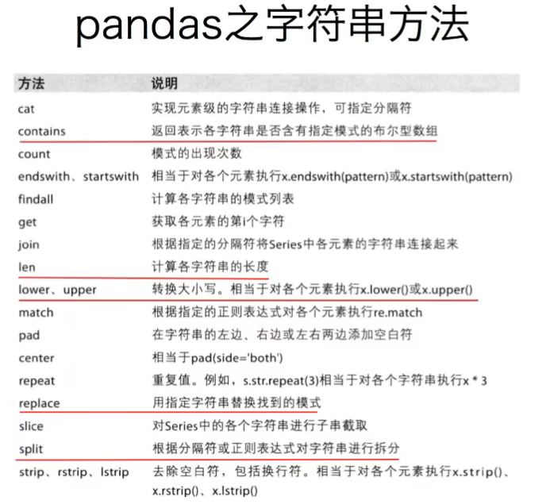
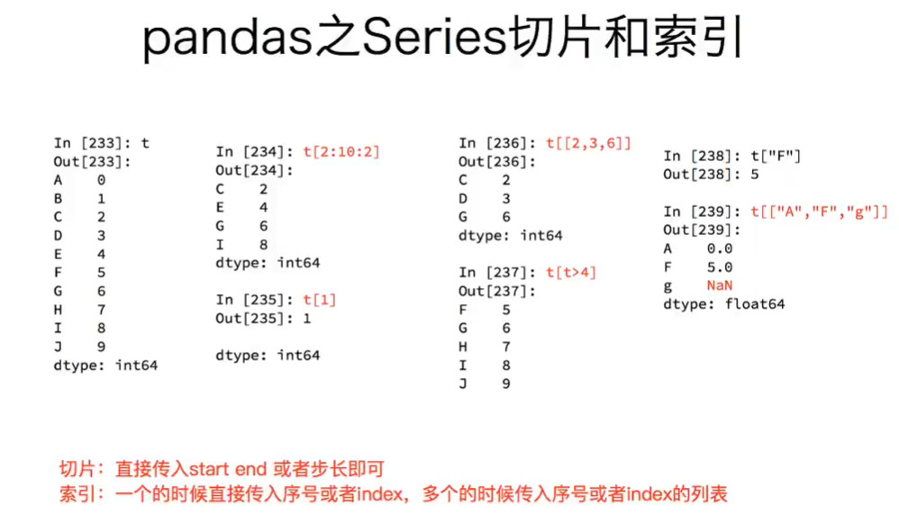
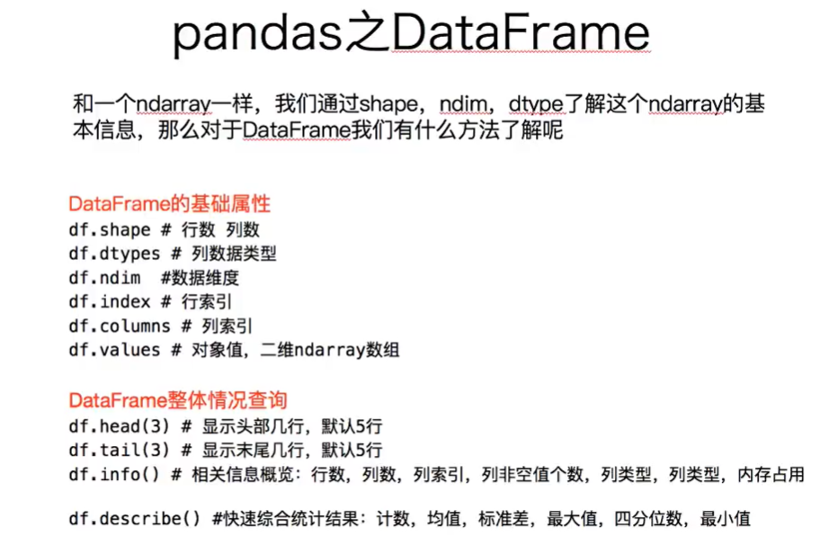
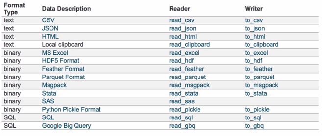
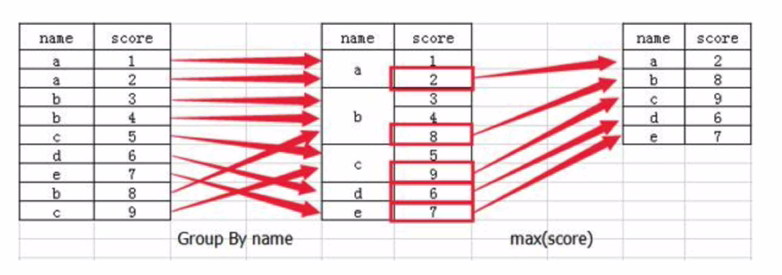

<h1 align="center">Python数据分析基础学习</h1>

## 一、matplotlib

### 1.1 matplotlib的基础绘图

```python
# 导入pyplot
from matplotlib import pyplot as plt
# 通过实例化一个figure并且传递参数，能够在后台自动使用该figure实例
# 在图形模糊的时候可以传入dpi参数，让图片更加清晰
fig = plt.figure(figsize=(20,8), dpi=80)
# 数据在x轴的位置，是一个可迭代的对象
x = range(2, 26, 2)
# 数据在y轴的位置，是一个可迭代的对象
y = [15,13,14,5,17,20,25,26,26,24,22,18,15]
# x轴和y轴的数据一起组成了所有要绘制出的坐标
# 传入x和y，通过plot绘制出折线图
plt.plot(x,y)
# 保存图片,可以保存为svg矢量图格式，放大不会有锯齿
plt.savefig("./sig_size.png")
# 展示图形，必须防止在保存图片后面，因为show会释放图片内存，在show之后保存会得到空的图片
plt.show()
```

### 1.2 X轴和Y轴的绘制

```python
# 设置x轴的刻度
xList = [i/2 for i in range(2,49)]
plt.xticks(range(2,25,0.5))
# 传入列表控制x轴的稀疏程度
plt.xticks(xList)
# 列表设置步长取数字
plt.xticks(xList[::3])
# 传入什么数字就显示什么，没有传入的数字，x轴刻度上不会显示
plt.yticks(range(min(y), max(y)+1))
```

### 1.3 中文的显示

```python
# 使用字符串作为刻度
x = range(0,120)
_x = list(x)[::10]
_xtick_labels = ["hello,{}".format(i) for i in _x]
plt.xticks(_x, _xtick_labels)
# 使用中文作为刻度
_x = list(x)[::3]
_xtick_lavels = ["10点{}分".format(i) for i in range(60)]
_xtick_lavels += ["11点{}分".format(i) for i in range(60)]
# 要保证_x和_xtick_lavels的个数相等
# rotation旋转的度数，对刻度进行旋转展示
plt.xticks(_x, _xtick_labels[::3], rotation=45)

# matplotlib默认不支持中文字符，通过matplotlib下的font_manager或者matplotlib.rc解决
import matplotlib
font1 = {'family': 'monospace', 'weight': 'bold', 'size': 'larger'}
font2 = {'family': 'MicroSoft YaHei', 'weight': 'bold', 'size': 'larger'}
matplotlib.rc('font', **font2)
from matplotlib import font_manager
my_font = font_manager.FontProperties(fname="字体文件位置")
plt.xticks(_x, _xtick_labels[::3], rotation=45,fontproperties=my_font)
```

### 1.4 单位和网格线的绘制

```python
plt.xlabel("时间", fontproperties=my_font)
plt.ylabel("温度 单位(℃)", fontproperties=my_font)
plt.title("10点到12点每分钟的气温变化情况", fontproperties=my_font, fontszie=20)

# 绘制网格
# 参数alpha可以设置网格线的透明度
plt.grid(True, linestyle='--', alpha=0.4)
```

### 1.5 同一坐标系中多组数据的同时显示

```python
# 多次绘制点即可在同一张表中绘制不同曲线
plt.plot(x, y, label="自己", color="orange", linestyle=":", linewidth=3)
plt.plot(a, b, label="同桌", color="cyan", linestyle="--")

# 图例的绘制--->不同曲线绘制时，要加上label
# 这里不再是fontproperties而是prop
# 参数loc可是设置图例在图片中的位置
plt.legend(prop=my_font, loc="upper left")

# 还可以做到在图片中添加文本注释、添加水印
```

| 线条风格 | 含义       |
| -------- | ---------- |
| -        | 实线       |
| --       | 虚线       |
| -.       | 点划线     |
| ：       | 点虚线     |
| ‘’       | 留空、空格 |

### 1.6 多个坐标系中多组数据的同时显示

```python
# 1.准备数据
x = range(60)
y_shanghai = [random.uniform(15,18) for i in x]
y_beijing = [random.uniform(1,5) for i in x]

# 2.创建画布
fig, axes = plt.subplots(nrows=1,ncols=2,figsize=(20,8), dip=100)

# 3.绘制图像
axes[0].plot(x,y_shanghai,label='上海')
axes[1].plot(x,y_beijing,color='r',linestyle='--',label="北京")

# 4.添加x,y轴刻度
x_ticks_label = ['11点{}分'.format(i) for i in x]
y_ticks = range(40)
axes[0].set_xticks(x[::5])
axes[0].set_yticks(y_ticks[::5])
axes[0].set_xticklabels(x_ticks_label[::5])
axes[1].set_xticks(x[::5])
axes[1].set_yticks(y_ticks[::5])
axes[1].set_xticklabels(x_ticks_label[::5])

# 5.显示网格背景
axes[0].grid(True,linestyle='--',alpha=1)
axes[1].grid(True,linestyle='--',alpha=1)

# 6.添加x轴，y轴信息；添加标题
axes[0].set_xlabel("时间")
axes[0].set_ylabel("温度")
axes[0].set_title("中午11点-12点某城市温度变化图",fontsize=20)
axes[1].set_xlabel("时间")
axes[1].set_ylabel("温度")
axes[1].set_title("中午11点-12点某城市温度变化图",fontsize=20)

# 7.添加图例
axes[0].legend(loc=0)
axes[1].legend(loc=0)

# 8.保存图片
plt.savefig("./temp.png")

# 9.显示图片
plt.show()
```

### 1.6 绘制折线图

```python
import numpy as np

x = np.linspace(-10,10,1000)
y = np.sin(x)

plt.figure(figsize=(20,8), dpi=100)

plt.plot(x,y)
plt.grid()

plt.show()
```

### 1.7 绘制散点图

```python
plt.scatter(x,y)
```

### 1.8 绘制柱状图

```python
# x: 需要传递得数据
# width: 柱状图得宽度
# align: 每个柱状图的对其方式
# **kwargs: color：选择柱状图的颜色
plt.bar(x,width,align='center',**kwargs)
```

### 1.9 绘制直方图

```python
# x: 需要传递得数据
# bins: 组距
matplotlib.pyplot.hist(x,bins=None)
```

### 1.10 绘制饼图

```python
# x: 数量，自动算百分比
# labels: 每部分名称
# autopct: 占比显示指定%1.2f%%
# colors: 每部分颜色
plt.pie(x,labels=,autopct=,colors)
```

### 1.11 更多内容

https://matplotlib.org/index.html

## 二、numpy

> *Numpy(Numerical Python)是一个开源的Python科学计算库，**用于快速处理任意维度的数组**。*
>
> *Numpy**支持常见的数组和矩阵操作**。对于同样的数值计算任务，使用Numpy比直接使用Python要简洁的多。*
>
> *Numpy**使用ndarray对象来处理多维数组**，该对象是一个快速而灵活的大数据容器。*

### 2.1 ndarry

| 属性名字         | 属性解释                   |
| ---------------- | -------------------------- |
| ndarray.shape    | 数组的维度（返回元组）     |
| ndarray.ndim     | 数组维数                   |
| ndarray.size     | 数组中的元素数量           |
| ndarray.itemsize | 一个数组元素的长度（字节） |
| ndarray.dtype    | 数组元素的类型             |

#### 2.1.1 基本认识

```python
import numpy as np

a = np.array([1,2,3,4,5])
b = np.array(range(1,6))
c = np.arange(1,6)
# 上面a,b,c内容相同，注意arange和range的区别
# np.arange的用法：arange([start,] stop[, step,], dtype=None)
# 数组的类名--也就是a的类型：
a = np.array([1,2,3,4,5])
print(type(a))
Out: numpy.ndarray
# 数据的类型--也就是a中数据的类型：
print(a.dtype)
Out: dtype('int64')
```

#### 2.1.2 形状的修改

```python
a = np.array([[3,4,5,6,7,8], [4,5,6,7,8,9]])
print(a.shape)
Out: (2, 6)

# 修改数组的形状
# 并不会对数组进行更改，需要变量来进行接受
a.reshape((3,4))			      |
print(a)						  |
Out:array([[3,4,5,6],			  |
	      [7,8,4,5],			  |
	      [6,7,8,9]])			  |
print(a.shape)     <---------------
Out: (2, 6)
a.reshape([-1,10]) # -1表示不关心行数，要求列数为10列
# 会对数组本身进行修改
a.resize([5,4]) # ndarray.resize(new_shape)

# 展开成一维数组
t5.flatten()
```

#### 2.1.3 数据类型的修改

```python
# 指定创建的数组的数据类型
a = np.array([1,0,1,0], dtype = np.bool)  # dtype = "float32"
print(a)
Out: array([True, False, True, False], dtype = bool)
# 修改数组的数据类型
a.astype("i1") # 或者使用a.astype(np.int8)
print(a)
Out: array([1, 0, 1, 0], dtype = int8)
# 修改为字符串
ndarray.tostring([order])
# 修改为字节类型
ndarray.tobytes([order])
# 修改浮点型的小数位数
np.round(b, 2)
print(b)
Out: array([0.05, 0.26, 0.7, 0.72, 0.36])
```

#### 2.1.4 数据去重

```python
a = array([[1,2,3,4],[3,4,5,6]])
np.unique(a)
print(a)
```

### 2.2 矩阵的生成

#### 2.2.1 生成全0和全1的矩阵

- np.ones(shape, dtype)

  ```python
  ones = np.ones([4,8])
  print(ones)
  
  array ([[1., 1., 1., 1., 1., 1.，1.，1.],
  		[1.，1.，1.，1.，1.，1.，1.，1.],
          [1.，1., 1.,1., 1.，1.，1.，1.],
          [1.，1., 1., 1., 1., 1.，1.,1.]])
  ```

- np.ones_like(a, dtype)

- np.zeros(shape, dtype)

- np.zeros_like(a, dtype)

  ```python
  zeros = np.zeros_like(ones)
  print(zeros)
  ```

#### 2.2.1 根据一个矩阵生成另一个矩阵

- np.array(ndarray, dtype)

  ```python
  # 深拷贝
  a0 = np.array([[1,2,3], [4,5,6]])
  a1 = np.array(a0)
  a0[0,0] = 1000
  print(a0)
  Out: array([[1000,2,3], [4,5,6]])
  print(a1)
  Out: array([[1,2,3], [4,5,6]]) # 没有因为a0的变化而变化
  ```

- np.asarray(a, dtype)

  ```python
  # 浅拷贝
  a0 = np.array([[1,2,3], [4,5,6]])
  a1 = np.array(a0)
  a0[0,0] = 1000
  print(a0)
  Out: array([[1000,2,3], [4,5,6]])
  print(a1)
  Out: array([[1000,2,3], [4,5,6]]) # 跟随着a0发生了改变
  ```

#### 2.2.3 生成等差或等比的矩阵

- np.linspace(start, stop, num, endpoint) => 创建等差数组 - 指定数量

  - start: 序列的起始值
  - stop: 序列的终止值
  - num: 要生成的等间隔样例数量
  - endpoint: 序列中是否包含stop值，默认为true

  ```python
  a = np.linspace(0,100,11)
  print(a)
  Out: array([0,10,20,30,40,50,60,70,80,90,100])
  ```

- np.arange(start, stop, step, dtype) => 创建等差数组 - 指定步长

  - step: 步长，默认值为1

  ```python
  a = np.arange(10,50,2)
  ```

- np.logspace(start, stop, num) => 创建等比数列

  - num: 要生成的等比数列的length

  ```python
  # 生成10^x
  a = np.logspace(0, 2, 3)
  print(a)
  Out: array([1,10,100])
  ```

#### 2.2.4 生成正态分布矩阵

- np.random.randn(d0, d1, ..., dn)
  - 从标准正态分布中返回一个或多个样本值
- np.random.normal(loc=0.0, scale=1.0, size=None)
  - loc: 此概率分布的均值
  - scale: 此概率分布的标准差
  - size: 输出的shape
- np.random.standard.normal(size=None)
  - 返回指定形状的标准正态分布的数据

```python
# 获取正态分布数据
x = np.random.normal(1.75, 1, 100000000)
# 创建画布
fig = plt.figure(size=(20,8), dpi=100)
# 绘制图像
plt.hist(x, 1000)
# 显示图像
plt.show()
```

#### 2.2.5 生成均匀分布矩阵

- np.random.rand(d0, d1, ..., dn)
  - 返回`[0.0, 1.0)`内的一组均匀分布的数据
- np.random.uniform(low=0.0, high=1.0, size=None)
  - 从一个均匀分布`[low, high)`中随机采样
    - low: 采样下界，float类型，默认为0
    - high: 采样上界，float类型，默认为1
    - size: 输出样本数目，为int或tuple类型
- np.random.randint(low, high=None, size=None, dtype=‘l’)
  - 从一个均匀分布中随机采样，生成一个整数或N为整数数组

```python
# 获取均匀分布数据
x = np.random.uniform(-1, 1, 1000000)
# 创建画布
fig = plt.figure(size=(20,8), dpi=100)
# 绘制图像
plt.hist(x, 1000)
# 显示图像
plt.show()
```

### 2.3 矩阵的计算

#### 2.3.1 逻辑运算

```python
# 生成10名同学，5门功课的数据
score = np.random.randint(40,100,(10,5)) # 10行5列，取值40-100
# 取出最后4名同学的成绩，用于逻辑判断
test_score = score[6:, 0:5]
# 如果成绩大于60就标记为True，否则为False
test_score > 60
Out: array([[True, True, True, False, True],
            [True, True, True, False, True],
           	[True, True, False,False, True],
           	[False,True, True, True,  True]])
test_score[test_score > 60] = 1
test_score
Out: array([[1, 1, 1, 52, 1],
           	[1, 1, 1, 59, 1],
           	[1, 1, 44,44, 1],
           	[59, 1, 1, 1, 1]])
```

#### 2.3.2 通用判断函数

- np.all()

  ```python
  # 判断前两名同学的成绩是否全及格
  np.all(score[0:2, :] > 60)
  False
  ```

- np.any()

  ```python
  # 判断前两名同学的成绩，是否有大于90分的
  np.any(score[0:2, :] > 80)
  True
  ```

#### 2.3.3 三元运算和复合运算

- np.where()

  ```python
  # 判断前四名学生中，前四门课程中，成绩中大于60的置为1，否则为0
  temp = score[:4, :4]
  np.where(temp>60, 1, 0)
  ```

- 复合逻辑需要结合np.logical_and 和 np.logical_or 使用

  ```python
  # 判断前四名学生的前四门课程中，成绩中大于60且小于90的，置为1，否则为0
  np.where(np.logical_and(temp > 60, temp < 90), 1, 0)
  # 判断前四名学生的前四门课程中，成绩中大于90或小于60的，置为1，否则为0
  np.where(np.logical_or(temp > 90, temp < 60), 1, 0)
  ```

#### 2.3.4 统计运算

- min(a, axis) 最小值(a为矩阵；axis为0或1，表示行或列，不传该值时，求取整个矩阵的最小值)
- max(a, axis) 最大值
- median(a, axis)
- mean(a, axis, dtype)
- std(a, axis, dtype) 标准差
- var(a, axis, dtype)
- np.argmax(a, axis) 最大值的索引
- np.argmin(a, axis) 最小值的索引

#### 2.3.5 矩阵与数的运算

```python
# 加、减、乘、除一个常数----对矩阵中的每个数字都会进行操作
t1 = np.array([[1,2,3,4], [5,6,7,8]])
print(t1 + 2)
array([[3,4,5,6], [7,8,9,10]])
```

#### 2.3.6 矩阵与矩阵的运算

- 行与列都相同的矩阵的加减乘除法，就是对两个矩阵中对应的数字进行加减乘除，**和平常的矩阵运算有所区别**
- 行与列有一个相同的矩阵的加减乘除法，就是沿维度相同的方向逐一计算，遵守的是**广播原则**
- 行与列都不相同的矩阵无法直接进行计算
- nan 和 inf

  - nan是 0 除以 0 的结果，表示不是一个数字
  - inf是非0数字除以 0 的结果，表示无尽、无穷

### 2.4 numpy读取本地数据和索引

#### 2.4.1 读取CSV文件

```python
np.loadtxt(frame, dtype=np.float, delimiter=",", skiprows=0, usecols=None, unpack=False)
```

| 参数        | 解释                                                         |
| ----------- | ------------------------------------------------------------ |
| `frame`     | 文件、字符串或产生器，可以是.gz或bz2压缩文件                 |
| `dtype`     | 数据类型，可选，CSV的字符串以什么数据类型读入数组中，默认 np.float |
| `delimiter` | 分隔字符串，默认是任何空格，改为逗号                         |
| `skiprows`  | 跳过前x行，一般跳过第一行表头                                |
| `usecols`   | 读取指定的列，索引，元组类型                                 |
| `unpack`    | 如果True，每一列的数据会组成一行，原始数据有多少列，加载出来的数据就有多少行，相当于转置的效果，默认为False |

#### 2.4.2 转置的三种方法

- **t.transpose()**
- **t.swapaxes(1, 0)**----通过交换轴来进行转置
- **t.T**

#### 2.4.3 索引和切片

- **取矩阵中的行数据**

  ```python
  # 取第三行的数据
  print(t2[2])
  # 取连续的多行
  print(t2[2:])
  # 取不连续的多行--取第2、4、6行
  print(t2[[2,4,6]])
  ```

- **取矩阵中的列数据**

  ```python
  # 取第一列
  print(t2[:, 0])
  # 取连续的多列
  print(t2[:, 2:])
  # 取不连续的多列--取第1、3、5列
  print(t2[:, [0,2,4]])
  ```

- **取矩阵中任意的数据**

  ```python
  # 取第三行第四列的值
  data = t2[2,3]
  print(type(data))	# <class 'numpy.int64'>
  # 取第三行到第五行，第二列到第四列的结果
  data2 = t2[2:5, 1:4]
  # 取多个不相邻的点
  # 不同于上面取的是交叉点，这里取的是第1行第1列，第3行第2列的点
  data3 = t2[[0,2],[0,1]]
  ```

#### 2.4.4 更多的索引方式

- **布尔索引**----修改矩阵中小于10的数字为3

  ```python
  t2[t2<10] = 3
  ```

- **三元运算符**----小于的数字修改为0，大于10的数字修改为10

  ```python
  np.where(t<10,0,10)
  ```

- **clip(剪裁)**----小于10的替换为10，大于20的替换为20

  ```python
  t.clip(10,20)
  ```

  **但是值为nan的数据不会被替换！！！**

- **修改数据为nan**

  ```python
  t2[3,3] = np.nan
  ```

### 2.5 numpy中的nan和常用方法

#### 1.5.1 矩阵的拼接

- **竖直拼接**----vertically

  ```python
  np.vstack((t1,t2))
  ```

- **水平拼接**----horizontally

  ```python
  np.hstack((t1,t2))
  ```

- **竖直分割和水平分割**

#### 2.5.2 矩阵的行列交换

- **行交换**

  ```python
  t[[1,2],:] = t[[2,1],:]
  ```

- **列交换**

  ```
  t[:,[0,2]] = t[:,[2,0]]
  ```

#### 2.5.3 更多方法

- **获取最大值，最小值的位置**
  - np.argmax(t, axis=0)----取得每一行最大值的位置
  - np.argmin(t,  axis=1)----取得每一列最小值的位置
- **创建一个对角线为1，其余为0的正方形矩阵**----np.eye(size)
- **创建一个全为0的矩阵**----np.zeros((rows, cols))
- **创建一个全为1的矩阵**----np.ones((rows, cols))
- **获取矩阵的和**----np.sum(t2, axis=0)----计算每行的和
- **生成随机数**
  - `rand(d0, d1, d2, ..dn)`，均匀分布的随机数函数
  - `randn(d0, d1, d2,..dn)`，标准正态分布随机数函数
  - `randint(low, high, (shape))`，从给定上下限范围选取随机数整数
  - `uniform(low, high, (size))`，产生具有均匀分布的矩阵，size即形状shape
  - `.seed(s)`，随机数种子
- **copy 和 view**
  - a = b 完全不复制，a 和 b相互影响
  - a = b[ : ]，**视图**的操作，一种切片，会**创建新的对象a，但是a的数据完全由b保管**，他们两个的数据变化是一致的
  - a = b.copy()，复制，a和b互不影响

#### 2.5.4 numpy中的nan 和 inf

- **出现情况**
  - 当我们在读取本地的文件为float的时候，如果数据有缺失，就会出现nan
  - 当做了一个不合适的计算的时候（比如无穷大（inf）减去无穷大）
  - 一个数字除以0就会出现inf，inf表示正无穷，-inf表示负无穷
- **注意：**
  - **np.inf 和 np.nan 的type类型是float！！！**
  - **np.nan == np.nan 的结果是false！！！**
  - 判断矩阵中nan的个数：`np.count_nonzero(t2 != t2)` ; `np.count_nonzero(np.isnan(t))`
  - **nan和任意值计算都为nan**
  - 一般将缺失的数值替换为**均值（中值）**或者是直接**删除有缺失值的一行**
- **numpy中常用的统计函数**
  - 求和：t.sum(axis=None)
  - 均值：t.mean(axis=None)
  - 中值：np.median(t, axis=None)
  - 最大值：t.max(axis=None)
  - 最小值：t.min(axis=None)
  - 极值：np.ptp(t, axis=None)----最大值和最小值之差
  - 标准差：t.std(axis=None)

## 三、pandas

> *2008 年WesMcKinney开发出的库*
>
> *专门用于数据挖掘的开源python库*
>
> *以Numpy为基础，借力Numpy模块在计算方面性能高的优势*
>
> *基于matplotlib，能够简便画图*
>
> *独特的数据结构*



### 3.1 Series 一维

#### 3.1.1 Series的创建

```python
t2 = pd.Series([1,23,2,4,5], index=list("abcde"))
print(t2)
Out:
a 1
b 23
c 2
d 4
e 5
# 当传入字典时，键会成为索引，值会成为对应的内容
t3 = pd.Series(temp_dict)
```

#### 3.1.2 Series切片和索引



#### 3.1.3 获取索引和值

- 获取索引——`t.index` ——索引可遍历、可转换为列表
- 获取值——`t.values`

#### 3.1.4 读取外部数据

- 读取mysql

  ```python
  pd.read_sql(sql_sentence, connection)
  ```

- 读取mongodb

  ```python
  from pymongo import MongoClient
  import pandas as pd
  client = MongoClient()
  collection = client["douban"]["tv1"]
  data = list(collection.find())
  t1 = data[0]
  t1 = pd.Series(t1)
  print(t1)
  ```

### 3.2 DataFrame 二维

#### 3.2.1 DataFrame对象

- 行索引，表明不同行，横向索引，叫做index，0轴，axis=0
- 列索引，表明不同列，纵向索引，叫做columns，1轴，axis=1

#### 3.2.2 DataFrame对象的创建

```python
t1 = pd.DataFrame(np.arange(12).reshape(3,4), index=list("abc"), columns=list("WXYZ"))

# DataFrame对象的创建也可以传入字典、列表
d2 = {"name": "xiaoming", "age": 20, "tel": "10086"}
t2 = pd.DataFrame(d1)
```

#### 3.2.3 DataFrame常用操作方法



- **排序方法**——`df.sort_values(by="age", ascending=False)`

- **取行和取列**——方括号写数字，表示取行；方括号写字符串，表示取列

- **df.loc 通过标签索引获取行数据**——冒号在loc里面是闭合的，即会选择到冒号后面的数据

- **df.iloc 通过位置获取行数据**——`t3.iloc[[0,2],[2,1]]`

- **重置索引**——`df.reset_index(drop=false)`，drop是否删除原来的索引

- **以某列的值作为索引**——`df.set_index(keys, drop=True)`

  ```python
  # 设置单个索引
  df.set_index("year")
  # 可以设置多个索引
  df.set_index(["year", "month"])
  ```

#### 3.2.4 DataFrame缺失数据的处理

- **判断是否为NaN**

  - `pd.isnull(df)`
  - `pd.notnull(df)`
  - `np.all(np.notnull(df))`
  - `np.any(np.isnull(df))`

- **处理方式一**  ——>  删除NaN所在的行列

  ```python
  # inplace参数表示原地进行修改，即改变t的内容
  # any表示每一行只要有nan，就删除该行
  # all表示每一行都是nan，才会删除
  t.dropna(axis=0, how="any", inplace=False)
  ```

- **处理方式二**  ——> 填充数据

  ```python
  # DataFrame.fillna(value, inplace=True)
  t.fillna(t.mean()) # 以均值填充
  t.fillna(t.median()) # 以
  t.fillna(0)
  ```

- **处理为0的数据：** `t[t==0] = np.nan`

- 处理为`？`的数据：`t.replace(to_replace=‘?’,  value=np.nan)`

### 3.3 MultiIndex 三维

#### 3.3.1 MultiIndex的介绍

- **MultiIndex就是有多级索引的数据结构**。可以在Series、DataFrame对象上拥有2个以及2个以上的索引

- `df.index`

  ```python
  # levels 就是 索引列 的 域
  # names 就是 索引列 的 字段名
  # labels 就是 域 到 实际索引 的映射顺序
  MultiIndex(levels=[[2012, 2013, 2014], [1, 4, 7, 10]],
             labels=[[0, 2, 1, 2], [0, 1, 2, 3]],
             names=['year', 'month'])
  
  # year month sale
  # 2012   1    55
  # 2014   4    40
  # 2013   7    84
  # 2014   10   31
  df.index.names
  # FrozenList(['year', 'month'])
  df.index.levels
  # FrozenList([[1, 2], [1, 4, 7, 10]])
  ```

#### 3.3.2 MultiIndex的创建

```python
arrays = [[1, 1, 2, 2], ['red', 'blue', 'red', 'blue']]
pd.MultiIndex.from_arrays(arrays, names=('number', 'color'))

# 结果
MultiIndex(levels=[[1, 2], ['blue', 'red']],
           codes=[[0, 0, 1, 1], [1, 0, 1, 0]],
           names=['number', 'color'])
```

### 3.4 基本数据操作

#### 3.4.1 索引操作

- **直接索引时，只能先去列，然后再取行**

- 先行后列，拿取数据

  - `data.loc[“a”: “d”, “x” : “y”]` —— 使用字段名索引

    ```python
    data.loc[data.index[0:5], "x" : "y"]
    ```

  - `data.iloc[:5, :3]` —— 使用数字索引

    ```python
    data.iloc[0:5, data.columns.get_indexer(["open", "close"])]
    ```

  - `data.ix[“a”: “d”, :3]` —— 使用数字和字段名索引

#### 3.4.2 排序操作

- `df.sort_values(by=, ascending=)` —— 值排序

  - 单个键或者多个键进行排序
  - by：指定排序参考的键
  - ascending：默认升序
    - ascending=False： 降序
    - ascendig=True： 升序

  ```python
  df.sort_values(by=['column1','column2']).head()
  ```

- `df.sort_index()` —— 索引排序

#### 3.4.3 算法运算

- add(other)

  ```python
  data['column1'].add(1)
  ```

- sub(other)

#### 3.4.4 逻辑运算

- 运算符号

  ```python
  data[(data["open"] > 23) & (data["open"] < 24)].head()
  ```

- 运算函数

  ```python
  data.query('open<24 & open>23').head()
  data[data["open"]].isin([23.53, 23.85])
  ```

#### 3.4.5 统计函数/聚合函数

- data.describe()
- data.sum()
- data.mean()
- data.median() 中位数
- data.min()
- data.max()
- data.mode()
- data.abs()
- data.prod()
- data.std() 标准差
- data.var() 方差
- data.idxmax() 最大值索引
- data.idxmin() 最小值索引
- data[‘column1’].cumsum() 计算前1/2/3.../n个数的和
- data[‘column1’].cummax() 计算前1/2/3.../n个数的最大值
- data[‘column1’].cummin() 计算前1/2/3.../n个数的最小值
- data[‘column1’].cumprod() 计算前1/2/3.../n个数的积

#### 3.4.6 自定义运算

- apply(func, axis=0)

  - func: 自定义函数
  - axis=0: 默认是列， axis=1为行进行运算

- 定义一个对列，最大值-最小值的函数

  ```python
  data[['open', 'close']].apply(lambda x: x.max() - x.min(), axis=0)
  
  open 22.74
  close 22.85
  dtype: float64
  ```

### 3.5 文件读取和存储



#### 3.5.1 CSV文件

- `read_csv(filepath_or_buffer, sep=‘,’)`

  - filepath_or_buffer: 文件路径
  - usecols: 指定读取的列名，列表形式

  ```python
  data = pd.read_csv("./data/xxx.csv", usecols=['open','close'])
  ```

- `DataFrame.to_csv(path_or_buf=None, sep=‘,’, columns=None, header=True, index=True, mode=‘w’, encoding=None)`

  - path_or_buf: 文件路径
  - sep: 分隔符，默认为逗号
  - columns： 选择需要的列
  - header: boolean or list of string, default True, 是否写列索引名
  - index: 是否写行索引名
  - mode: ‘w' 重写， ’a'追加

  ```python
  data[:10].to_csv("./data/xxx.csv", columns=['open'])
  ```


### 3.6 数据离散化

- pd.qcut(df, count)

  ```python
  # 自动分成差不多数量的类别
  qcut = pd.qcut(p_change, 10)
  qcut.value_counts()
  ```

- pd.cut(df, bins)

  ```python
  # 指定分组区间
  bins = [-100, -7, -5, -3, 0, 3, 5, 7, 100]
  p_count = pd.cut(p_change, bins)
  p_count.value_counts()
  ```

- ont-hot 编码

  - pandas.get_dummies(data, prefix=None)

    - data: array-like, Series, or DataFrame
    - prefix: 分组名字

    ```python
    # 得出one-hot编码矩阵
    dummies = pd.get_dummies(p_counts, prefix="rise")
    ```

### 3.7 数据合并

- pd.concat([data1, data2], axis=1)

  - 按照行或列进行合并，axis=0为列索引，axis=1为行索引

- pd.merge(left, right, how=‘inner’, on=None)

  - 可以指定按照两组数据的共同键值对合并或者左右各自

  - left: DataFrame

  - right: DataFrame

  - on: 指定共同的键

  - how: 按照什么方式连接

    | Merge method | SQL Join Name    | Description                               |
    | ------------ | ---------------- | ----------------------------------------- |
    | left         | LEFT OUTER JOIN  | Use keys from left frame only             |
    | right        | RIGHT OUTER JOIN | Use keys from right frame only            |
    | outer        | FULL OUTER JOIN  | Use union of keys from both frames        |
    | inner        | INNER JOIN       | Use intersection of keys from both frames |

  ```python
  # 默认内连接
  result = pd.merge(left, right, on=['key1', 'key2'])
  ```

### 3.8 交叉表和透视表

#### 3.8.1 交叉表

- 定义：交叉表用于计算一列数据对于另外一列数据的分组个数（用于统计分组频率的特殊透视表）
- pd.crosstab(value1, value2)
  - value1的值作为行索引，value2的值作为列索引

#### 3.8.2 透视表

- 定义：透视表是将原有的DataFrame的列分别作为行索引和列索引，然后对指定的列应用聚集函数
- data.pivot_table()
- DataFrame.pivot_table([], index=[])
  - index就是value1， []就是value2

### 3.9 分组聚合



- 分组

  - DataFrame.groupby(key, as_index=False)
    - key: 分组的列数据，可以多个

- 聚合：最大值，最小值····

- 案列：不同颜色的不同笔的价格数据

  ```python
  # col - DataFrame 二维
  col.groupby(["color"])["price1"].mean()
  # col["price1"] - Series 一维
  col["price1"].groupby(col["color"]).mean()
  ```

  