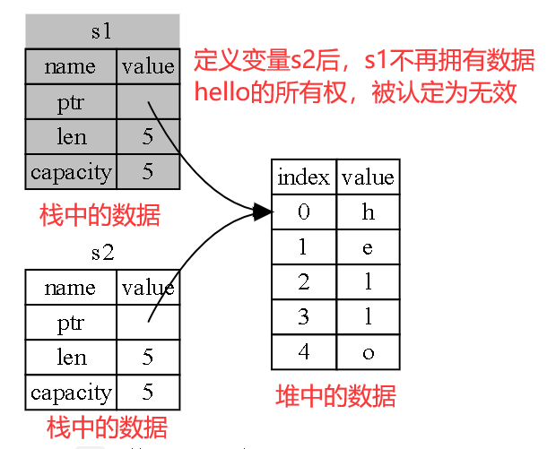
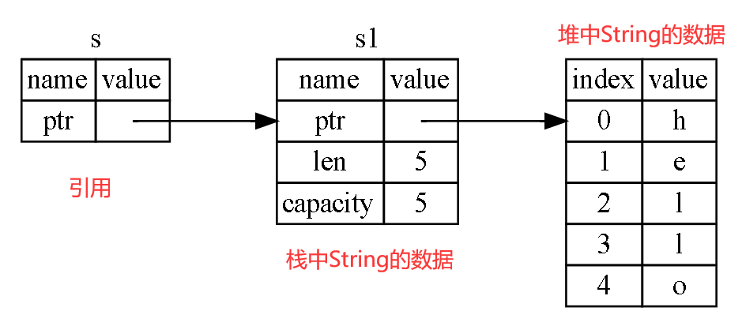
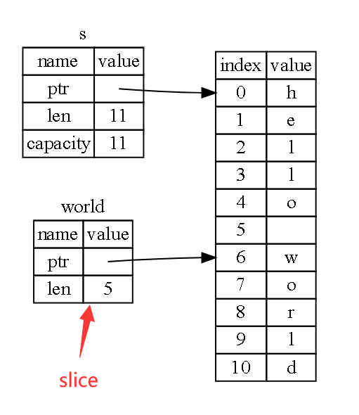

<h1 align='center' id="index">Rust学习记录</h1>

> Rust 代码中的函数和变量名使用 *snake case* 规范风格。
> 在 snake case 中，所有字母都是小写并使用下划线分隔单词。
>
> Rust 是一门基于表达式（expression-based）的语言

## 数据类型

### 标量

Rust 有四种基本的标量类型：整型、浮点型、布尔类型和字符类型。

### 复合

> **复合类型**（*Compound types*）可以将多个值组合成一个类型。
>
> Rust 有两个原生的复合类型：元组（tuple）和数组（array）

#### 元组

- 元组长度固定：一旦声明，其长度不会增大或缩小。

#### 数组

- 与元组不同，数组中的每个元素的类型必须相同。

- Rust 中的数组与一些其他语言中的数组不同，因为 Rust 中的数组是固定长度的：一旦声明，它们的长度不能增长或缩小。

- **vector 类型是标准库提供的一个允许增长和缩小长度的类似数组的集合类型。**当不确定是应该使用数组还是 vector 的时候，你可能应该使用 vector。

- 可以像这样编写数组的类型：在方括号中包含每个元素的类型，后跟分号，再后跟数组元素的数量。

  ```rust
  #![allow(unused_variables)]
  fn main() {
  	let a: [i32; 5] = [1, 2, 3, 4, 5]; // 5个类型为i32的数字组成的数组
  }
  ```

- 如果你希望创建一个每个元素都相同的数组，可以在中括号内指定其初始值，后跟分号，再后跟数组的长度

  ```rust
  #![allow(unused_variables)]
  fn main() {
  	let a = [3; 5]; // 相当于 let a = [3, 3, 3, 3, 3]
  }
  ```

### 函数

- 在函数签名中，**必须** 声明每个参数的类型。这是 Rust 设计中一个经过慎重考虑的决定：要求在函数定义中提供类型注解，意味着编译器不需要你在代码的其他地方注明类型来指出你的意图。
- 函数体由一系列的语句和一个可选的结尾表达式构成
  - **语句**（*Statements*）是执行一些操作但不返回值的指令
  - **表达式**（*Expressions*）计算并产生一个值
- 在参数声明之后用 **->** 来声明函数返回值的类型（不是 **:** ）。**如果没有明确声明函数返回值的类型，函数将被认为是"纯过程"，不允许产生返回值，return 后面不能有返回值表达式。**这样做的目的是为了让公开的函数能够形成可见的公报。

## 控制流

### if表达式

- 多重条件

  ```rust
  fn main() {
      let number = 6;
  
      if number % 4 == 0 {
          println!("number is divisible by 4");
      } else if number % 3 == 0 {
          println!("number is divisible by 3");
      } else if number % 2 == 0 {
          println!("number is divisible by 2");
      } else {
          println!("number is not divisible by 4, 3, or 2");
      }
  }
  ```

- 因为 `if` 是一个表达式，我们可以在 `let` 语句的右侧使用它

- `if` 的每个分支的可能的返回值都必须是相同类型

  ```rust
  // 记住，代码块的值是其最后一个表达式的值
  fn main() {
      let condition = true;
      let number = if condition {
          5
      } else {
          6
      };
      println!("The value of number is: {}", number);
  }
  ```

### loop

- **如果将返回值加入你用来停止循环的 `break` 表达式，它会被停止的循环返回**

  ```rust
  fn main() {
      let mut counter = 0;
  
      let result = loop {
          counter += 1;
  
          if counter == 10 {
              break counter * 2; // 加入返回值
          }
      };
  
      println!("The result is {}", result);
  }
  ```

### while

- 使用示例

  ```rust
  fn main() {
      let mut number = 3;
  
      while number != 0 {
          println!("{}!", number);
  
          number = number - 1;
      }
  
      println!("LIFTOFF!!!");
  }
  ```

### for

- 访问数组内的每个元素

  ```rust
  fn main() {
      let a = [10, 20, 30, 40, 50];
  
      for element in a.iter() {
          println!("the value is: {}", element);
      }
  }
  ```

- 迭代一个数字序列

  ```rust
  fn main() {
      for number in (1..4).rev() { // .rev()用来反转range
          println!("{}!", number);
      }
      println!("LIFTOFF!!!");
  }
  ```

## 所有权

> 跟踪哪部分代码正在使用堆上的哪些数据，最大限度的减少堆上的重复数据的数量，以及清理堆上不再使用的数据确保不会耗尽空间，这些问题正是**所有权系统**要处理的。
>
> 一旦理解了所有权，你就不需要经常考虑栈和堆了，不过明白了**所有权的存在就是为了管理堆数据**，能够帮助解释为什么所有权要以这种方式工作。
>
> **所有权规则**
>
> 1. Rust 中的每一个值都有一个被称为其 **所有者**（*owner*）的变量。
> 2. 值有且只有一个所有者。
> 3. 当所有者（变量）离开作用域，这个值将被丢弃。

### 移动

- 为了确保内存安全，这种场景下 Rust 的处理有另一个细节值得注意。与其尝试拷贝被分配的内存，Rust 则认为 `s1` 不再有效，因此 Rust 不需要在 `s1` 离开作用域后清理任何东西。

  ```rust
  #![allow(unused_variables)]
  fn main() {
      let s1 = String::from("hello");
      let s2 = s1; // 具体情况请看下方示意图
  }
  ```

- String 由三部分组成，如图左侧所示：一个指向存放字符串内容内存的指针，一个长度，和一个容量。这一组数据存储在栈上。右侧则是堆上存放内容的内存部分。

  

### 克隆

- 如果我们 **确实** 需要深度复制 `String` 中堆上的数据，而不仅仅是栈上的数据，可以使用一个叫做 `clone` 的通用函数
- Rust 有一个叫做 `Copy` trait 的特殊注解，可以**用在类似整型这样的存储在栈上的类型**上（第十章详细讲解 trait）。**如果一个类型拥有 `Copy` trait，一个旧的变量在将其赋值给其他变量后仍然可用**。
- Rust 不允许自身或其任何部分实现了 `Drop` trait 的类型使用 `Copy` trait。
- 那么什么类型是 `Copy` 的呢？任何简单标量值的组合可以是 `Copy` 的，不需要分配内存或某种形式资源的类型是 `Copy` 的如下是一些 `Copy` 的类型：
  - 所有整数类型，比如 `u32`。
  - 布尔类型，`bool`，它的值是 `true` 和 `false`。
  - 所有浮点数类型，比如 `f64`。
  - 字符类型，`char`。
  - **元组，当且仅当其包含的类型也都是 `Copy` 的时候**。比如，`(i32, i32)` 是 `Copy` 的，但 `(i32, String)` 就不是。

### 所有权与函数

- 将值传递给函数在语义上与给变量赋值相似。向函数传递值可能会移动或者复制，就像赋值语句一样。

  ```rust
  fn main() {
      let s = String::from("hello");  // s 进入作用域
  
      takes_ownership(s);             // s 的值移动到函数里 ...
                                      // ... 所以到这里不再有效
  
      let x = 5;                      // x 进入作用域
  
      makes_copy(x);                  // x 应该移动函数里，
                                      // 但 i32 是 Copy 的，所以在后面可继续使用 x
  
  } // 这里, x 先移出了作用域，然后是 s。但因为 s 的值已被移走，
    // 所以不会有特殊操作
  
  fn takes_ownership(some_string: String) { // some_string 进入作用域
      println!("{}", some_string);
  } // 这里，some_string 移出作用域并调用 `drop` 方法。占用的内存被释放
  
  fn makes_copy(some_integer: i32) { // some_integer 进入作用域
      println!("{}", some_integer);
  } // 这里，some_integer 移出作用域。不会有特殊操作
  ```

- 返回值也可以转移所有权

  ```rust
  fn main() {
      let s1 = gives_ownership();         // gives_ownership 将返回值
                                          // 移给 s1
  
      let s2 = String::from("hello");     // s2 进入作用域
  
      let s3 = takes_and_gives_back(s2);  // s2 被移动到
                                          // takes_and_gives_back 中, 
                                          // 它也将返回值移给 s3
  } // 这里, s3 移出作用域并被丢弃。s2 也移出作用域，但已被移走，
    // 所以什么也不会发生。s1 移出作用域并被丢弃
  
  fn gives_ownership() -> String {             // gives_ownership 将返回值移动给
                                               // 调用它的函数
  
      let some_string = String::from("hello"); // some_string 进入作用域.
  
      some_string                              // 返回 some_string 并移出给调用的函数
  }
  
  // takes_and_gives_back 将传入字符串并返回该值
  fn takes_and_gives_back(a_string: String) -> String { // a_string 进入作用域
  
      a_string  // 返回 a_string 并移出给调用的函数
  }
  ```

### 引用



- & 符号就是 **引用**，它们**允许你使用值但不获取其所有权**。避免像String类型的数据在函数传递时，所有权不停的发生转移

- 与使用 `&` 引用相反的操作是 **解引用**（*dereferencing*），它使用解引用运算符，`*`。

  ```rust
  fn main() {
      let s1 = String::from("hello");
  
      let len = calculate_length(&s1);
  
      println!("The length of '{}' is {}.", s1, len);
  }
  
  /// 注意此处参数类型是 &String
  /// 变量 s 有效的作用域与函数参数的作用域一样，不过当引用离开作用域后并不丢弃它指向的数据，因为我们没有所有权。
  /// 当函数使用引用而不是实际值作为参数，无需返回值来交还所有权，因为就不曾拥有所有权。
  fn calculate_length(s: &String) -> usize { // s 是对 String 的引用
      s.len()
  } // 这里，s 离开了作用域。但因为它并不拥有引用值的所有权，
    // 所以什么也不会发生
  
  ```

- 我们将获取引用作为函数参数称为 **借用**（*borrowing*）。

- **正如变量默认是不可变的，引用也一样。（默认）不允许修改引用的值**

### 可变引用

- **必须**将 `s` 改为 `mut`。然后**必须**创建一个可变引用 `&mut s` **和接受**一个可变引用 `some_string: &mut String`。

  ```rust
  fn main() {
      let mut s = String::from("hello");
  
      change(&mut s);
  }
  
  fn change(some_string: &mut String) {
      some_string.push_str(", world");
  }
  ```

- 不过可变引用有一个很大的限制：**在特定作用域中的特定数据有且只有一个可变引用，也不能在拥有不可变引用的同时拥有可变引用**。

- 注意**一个引用的作用域从声明的地方开始一直持续到最后一次使用为止**。例如，因为最后一次使用不可变引用在声明可变引用之前，所以如下代码是可以编译的：

  ```rust
  let mut s = String::from("hello");
  
  let r1 = &s; // 没问题
  let r2 = &s; // 没问题
  println!("{} and {}", r1, r2);
  // 此位置之后 r1 和 r2 不再使用
  
  let r3 = &mut s; // 没问题
  println!("{}", r3);
  ```

### Slices

#### 字符串Slice

- **字符串 slice**（*string slice*）是 `String` 中**一部分值**的引用

  ```rust
  
  #![allow(unused_variables)]
  fn main() {
      let s = String::from("hello world");
  
      let hello = &s[0..5];
      let world = &s[6..11];
  }
  ```

- 可以使用一个由中括号中的 `[starting_index..ending_index]` 指定的 range 创建一个 slice，其中 `starting_index` 是 slice 的第一个位置，`ending_index` 则是 slice 最后一个位置的后一个值。在其内部，slice 的数据结构存储了 slice 的开始位置和长度，长度对应于 `ending_index` 减去 `starting_index` 的值。

  
  
- ###### **字符串字面值就是 slice**

  ```rust
  // 通过将 s 参数的类型改为字符串 slice 来改进 first_word 函数
  fn first_word(s: &String) -> &str {
  fn first_word(s: &str) -> &str {
  ```

  如果有一个字符串 slice，可以直接传递它。如果有一个 `String`，则可以传递整个 `String` 的 slice。

  定义一个获取字符串 slice 而不是 `String` 引用的函数使得我们的 API 更加通用并且不会丢失任何功能

#### 其他类型的Slice

- 这个 slice 的类型是 `&[i32]`。它跟字符串 slice 的工作方式一样，通过存储第一个集合元素的引用和一个集合总长度。可以对其他所有集合使用这类 slice。

  ```rust
  #![allow(unused_variables)]
  fn main() {
      let a = [1, 2, 3, 4, 5];
  
      let slice = &a[1..3];
  }
  ```

## 结构体

- 要更改结构体中的值，如果结构体的实例是可变的，我们可以使用点号并为对应的字段赋值
- **注意**整个实例必须是可变的；Rust 并不允许只将某个字段标记为可变
- 可以使结构体存储被其他对象拥有的数据的引用，不过这么做的话需要用上 **生命周期**（*lifetimes*）。生命周期确保结构体引用的数据有效性跟结构体本身保持一致。如果你尝试在结构体中存储一个引用而不指定生命周期将是无效的。

### 元组结构体

> 当你想给整个元组取一个名字，并使元组成为与其他元组不同的类型时，元组结构体是很有用的，这时像常规结构体那样为每个字段命名就显得多余和形式化了。
>
> 元组结构体实例类似于元组：可以将其解构为单独的部分，也可以使用 `.` 后跟索引来访问单独的值

```rust
#![allow(unused_variables)]
fn main() {
    struct Color(i32, i32, i32);
    struct Point(i32, i32, i32);

    let black = Color(0, 0, 0);
    let origin = Point(0, 0, 0);
}
```

## 枚举

### 定义枚举

- 这些代码展示了可以将任意类型的数据放入枚举成员中：例如字符串、数字类型或者结构体。甚至可以包含另一个枚举！

  ```rust
  #![allow(unused_variables)]
  fn main() {
      enum Message {
          Quit,
          Move { x: i32, y: i32 },
          Write(String),
          ChangeColor(i32, i32, i32),
      }
  }
  ```

- 结构体和枚举有另一个相似点：就像可以使用 `impl` 来为结构体定义方法那样，也可以在枚举上定义方法

  ```rust
  #![allow(unused_variables)]
  fn main() {
      enum Message {
          Quit,
          Move { x: i32, y: i32 },
          Write(String),
          ChangeColor(i32, i32, i32),
      }
  
      impl Message {
          fn call(&self) {
              // 在这里定义方法体
          }
      }
  
      let m = Message::Write(String::from("hello"));
      m.call();
  }
  ```

## 模块系统

> - **包**（*Packages*）： Cargo 的一个功能，它允许你构建、测试和分享 crate。
> - **Crates** ：一个模块的树形结构，它形成了库或二进制项目。
> - **模块**（*Modules*）和 **use**： 允许你控制作用域和路径的私有性。
> - **路径**（*path*）：一个命名例如结构体、函数或模块等项的方式

### 包和crate

- **crate** 是一个二进制项或者库

- **crate root**一个源文件，Rust 编译器以它为起始点，并构成你的 crate 的根模块

- **包**（*package*） 是提供一系列功能的一个或者多个 crate。一个包会包含有一个 *Cargo.toml* 文件，阐述如何去构建这些 *crate*

  - 一个包中至多 **只能** 包含一个库 crate(library crate)；
  - 包中可以包含任意多个二进制 crate(binary crate)；
  - 包中至少包含一个 crate，无论是库的还是二进制的

- Cargo 遵循的一个约定：*src/main.rs* 就是一个与包同名的**二进制 crate** 的 crate 根

- Cargo 知道如果包目录中包含 *src/lib.rs*，则包带有与其同名的**库 crate**，且 *src/lib.rs* 是 crate 根

  > - 创建包/可执行工程：`cargo new package-name`
  > - 创建库工程：`cargo new --lib lib-name`
  > - 实际上，你去探索上述命令行生成的文件，发现它们的 Cargo.toml 完全一样，区别仅在于 src 目录下，可执行工程是一个 main.rs，而库工程是一个 lib.rs。
  > - 参考链接：https://blog.csdn.net/u012067469/article/details/104013445

- **crate 根文件**将由 Cargo 传递给 `rustc` 来实际构建**库**或者**二进制项目**

- 如果一个包**同时**含有 *src/main.rs* 和 *src/lib.rs*，则它有两个 crate：一个库和一个二进制项，且名字都与包相同。

- 通过将文件放在 *src/bin* 目录下，一个包可以拥有**多个二进制 crate**：每个 *src/bin* 下的文件都会被编译成一个独立的二进制 crate。

### 模块

- *模块* 让我们可以**将一个 crate 中的代码进行分组**，以提高可读性与重用性。

- 模块还可以控制项的 *私有性*，即项是可以被外部代码使用的（*public*），还是作为一个内部实现的内容，不能被外部代码使用（*private*）。

- 在前面我们提到了，`src/main.rs` 和 `src/lib.rs` 叫做 crate 根。之所以这样叫它们的原因是，这两个文件的内容都是一个从名为 `crate` 的模块作为根的 crate 模块结构，称为 *模块树*（*module tree*）。

  ```rust
  // src/lib.rs
  mod front_of_house {
      mod hosting {
          fn add_to_waitlist() {}
  
          fn seat_at_table() {}
      }
  
      mod serving {
          fn take_order() {}
  
          fn server_order() {}
  
          fn take_payment() {}
      }
  }
  // 模块树结构
  // 注意，整个模块树都植根于名为 crate 的隐式模块下。
  crate
   └── front_of_house
       ├── hosting
       │   ├── add_to_waitlist
       │   └── seat_at_table
       └── serving
           ├── take_order
           ├── serve_order
           └── take_payment
  ```

### 路径

- 在模块树中找到一个项的位置，我们使用路径的方式，路径有两种形式：
  - **绝对路径**（*absolute path*）从 crate 根开始，以 crate 名或者字面值 `crate` 开头。
  - **相对路径**（*relative path*）从当前模块开始，以 `self`、`super` 或当前模块的标识符开头。
- `mod mod-name;` - 声明模块，告诉 Rust 在另一个与模块同名的文件中加载模块的内容
- `pub use item-path` - *重导出*，将**项**引入**自己的作用域**并同时使**其**可供**其他代码**引入**其他作用域**

