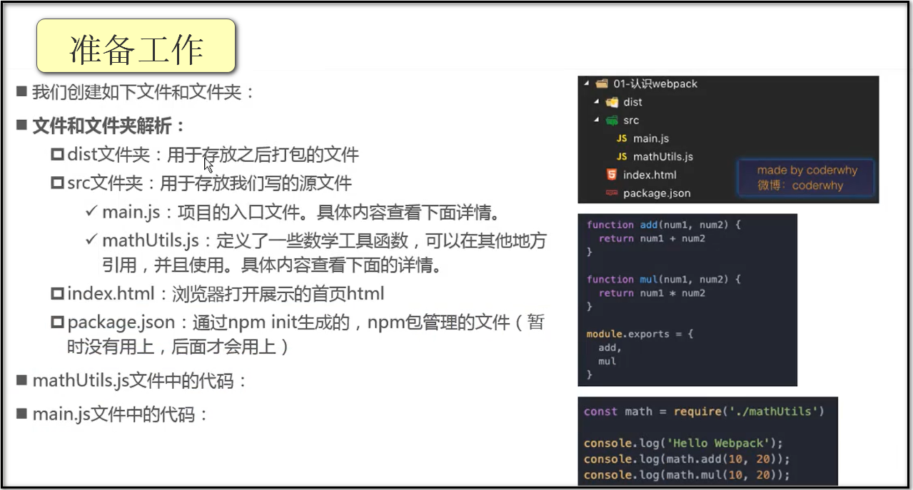
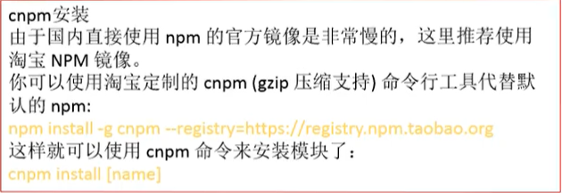

<h2 align="center">Vue学习记录</h2>

#### Vue.js安装

##### 1.1. 直接CDN引入

```html
<!-- 开发环境版本，包含了有帮助的命令行警告 -->
<script src="https://cdn.jsdelivr.net/npm/vue/dist/vue.js"></script>
<!-- 生成环境版本，优化了尺寸和速度 -->
<script src="https://cdn.jsdelivr.net/npm/vue"></script>
```

##### 1.2. 下载和引入

```
开发环境
	https://vuejs.org/js/vue.js
生成环境
	https://vuejs.org/js/vue.min.js
```

##### 1.3. NPM安装

- 后续通过 `webpack` 和 `CLI` 的使用，我们使用该方式

#### Vue基本使用方法

##### 1.1. v-bind

```html
<!--  v-bind 注意 message 要加上双引号 -->
<span :title="message">鼠标悬浮</span>

<!--  v-bind 动态绑定class 对象语法 -->
<div :class="{key1: value1, key2: value2}">{{message}}</div>
<div :class="{类名1: Boolean, 类名2: Boolean}">{{message}}</div>
<!--  boolean为true，则类名会添加到class中；Boolean为flase，则不会添加到class中 -->
<div class="baseClass" :class="{active: isActive, line: isLine}">{{message}}</div>
<!--  两个class都可以存在 -->

<!--  v-bind 动态绑定class 数组语法 -->
<div :class="[active, line, baseClass]"></div> // 这里面的是变量
<div :class="['active', 'line', 'baseClass']"></div> //这里面的是字符串
```

##### 1.2. v-if

```html
<!--  v-if 为假的时候，该元素直接不存在于DOM中了-->
<p v-if="seen">显示和隐藏</p>
```

##### 1.3. v-for

```html
<!--  v-for 使用例子 -->
<ol>
    <li v-for="todo in todos">
    	{{ todo.text }}
    </li>
</ol>
```

##### 1.4. v-on

```html
<!--  v-on 指令添加一个事件监听器  -->
<button v-on:click="reverseMessage">反转消息</button>
<button v-on:click="showMsg">显示消息</button>
```

##### 1.5. v-model

```html
<!--  v-model 指令实现表单输入和应用状态之间的双向绑定  -->
<input v-model="message">
```

#### Vue常用基本属性

##### 1.1. computed

```html
<div id="app">
    <h2>{{fullName}}</h2>
    <!-- 这里的 fullName 后面不用加括号-->
</div>
<script>
	const app = new Vue({
        el: '#app',
        data: {
            firstName: 'Lebron',
            lastName: 'James'
        },
        computed: {
            fullName: () => {
                return this.firstName + this.lastName
            }
        }
    })
</script>
```

#####  1.2. set 和 get

```html
<div id="app">
    <h2>{{fullName}}</h2>
    <!-- 这里的 fullName 后面不用加括号-->
</div>
<script>
	const app = new Vue({
        el: '#app',
        data: {
            firstName: 'Lebron',
            lastName: 'James'
        },
        computed: {
            fullName: {
                set: function(newValue){
                    console.log(newValue);
                },
                get: function(){
                    return this.firstName + this.lastName;
                }
            }
        }
    })
</script>
```


#### Vue生命周期函数

##### 1.1. created

> 组件或vue实例被创建时，进行回调

##### 1.2. mounted

> 组件或vue实例的template挂载到DOM上时，进行回调

##### 1.3. updated

> 页面进行刷新时，进行回调

##### 1.4. destroyed

·······································

#### Js高阶函数

##### 1.1. filter--过滤器

> filter中的回调函数有一个要求：必须返回boolean值
>
> 当返回true时，函数内部会自动将这次回调的n加入到新的数组中
>
> 当返回false时，函数内部会过滤掉这次的n
>
> **用一个变量去接收新的数组**

```js
let newNums = nums.filter(function (n) {
	return n<100
})
```

##### 1.2. map--**用一个变量接收新的数组**

```js
let new2Nums = newNums.map(function (n) {
	return n * 2
})
```

##### 1.3. reduce--对数组中所有的内容进行汇总

```js
let total = new2Nums.reduce(function (preValue, n) {
	return preValue + n
}, 0)
```

---

#### 表单绑定v-model

 **双向绑定----实现表单元素和数据之间的双向绑定**

##### 1.1. v-model的基本使用

```html
<div id="app">
	<input type="text" v-model="message">
	<h4>{{message}}</h4>
</div>
<script>
	const app = new Vue({
		el: '#app',
		data: {
			message: 'hello,world'
		}
	})
</script>
// 修改输入框中的内容，右边的文字也会改变
```

##### 1.2. v-model的原理

```html
<div id="app">
	<input type="text" v-bind:value="message" v-on:input="valueChange">
	// v-bind语法糖
	// <input type="text" :value="message">
	// v-on语法糖
	// <input type="text" @input="valueChange">
	// <input type="text" @input="message = $event.target.value">
	<h4>{{message}}</h4>
</div>
<script>
	const app = new Vue({
		el: '#app',
		data: {
			message: 'hello,world'
		},
		methods: {
			valueChange(event) {
				this.message = event.target.value;
			}
		}
	})
</script>
```

##### 1.3. v-model与radio(单选框)的结合使用

```html
// 选择哪个单选框，就将哪个性别绑定到sex的value中
<div id="app">
	<label for="male">
		<input type="radio" id="male" name="sex" value="男" v-model="sex">男
	</label>
	<label for="female">
		<input type="radio" id="female" name="sex" value="女" v-model="sex">女
	</label>
	<h2>您选择的性别是{{sex}}</h2>
	// name属性相同时，单选框只能选中一个
	// v-moedl绑定同一个变量时，也可以有互斥的效果。同时，赋予sex初始值，可以实现默认选中单选框的效果
</div>
<script>
	const app = new Vue({
		el: '#app',
		data: {
			message: 'hello,world'
			sex: ''
		}
	})
</script>
```

##### 1.4. v-model与checkbox(复选框)的结合使用

###### 1.4.1. 单选框

```html
<div id="app">
	<label for="agree">
		<input type="checkbox" id="agree" v-model="isAgree">同意协议
	</label>
	<h2>您选择的是:{{isAgree}}</h2>
	<button :disabled="!isAgree">下一步</button>
</div>
<script>
	const app = new Vue({
		el: '#app',
		data: {
			message: 'hello,world',
			isAgree: false
		}
	})
</script>
```

###### 1.4.2. 多选框

```html
<div id="app">
    <input type="checkbox" value="篮球" v-model="hobbies">篮球
    <input type="checkbox" value="足球" v-model="hobbies">足球
    <input type="checkbox" value="羽毛球" v-model="hobbies">羽毛球
	<h2>您的爱好是：{{hobbies}}</h2>
</div>
<script>
	const app = new Vue({
		el: '#app',
		data: {
			message: 'hello,world',
			hobbies: []
		}
	})
</script>
```

##### 1.5. v-model与select的结合使用

###### 1.5.1 选择一个

```html
<div id="app">
	// v-model要绑定到select标签上，注意不要绑定到option标签上
    <select name='abe' id='' v-model="fruit">
    	<option value="苹果">苹果</option>
    	<option value="香蕉">香蕉</option>
    	<option value="菠萝">菠萝</option>
    </select>
    <h2>您选择的水果是：{{fruit}}</h2>
</div>
<script>
	const app = new Vue({
		el: '#app',
		data: {
			message: 'hello,world',
			fruit: '香蕉'
		}
	})
</script>
```

###### 1.5.2 选择多个

```html
<div id="app">
	// 添加 multiple 可以实现选择多个水果
    <select name='abe' v-model="fruits" multiple>
    	<option value="苹果">苹果</option>
    	<option value="香蕉">香蕉</option>
    	<option value="菠萝">菠萝</option>
    </select>
    <h2>您选择的水果是：{{fruits}}</h2>
</div>
<script>
	const app = new Vue({
		el: '#app',
		data: {
			message: 'hello,world',
			fruits: []
		}
	})
</script>
```

##### 1.6. 值绑定

> 动态地加载爱好，而不是写死
>
> 通过v-bind：value动态的给value绑定值

```html
<div id="app">
	<label v-for:"item in orignHobbies" :for="item">
		<input type="checkbox" :value="item" id="item" v-model="hobbies">{{item}}
	</label>
	<h2>您的爱好是：{{hobbies}}</h2>
</div>
<script>
	const app = new Vue({
		el: '#app',
		data: {
			message: 'hello,world',
			hobbies: [],
			originHobbies: ['篮球','足球','羽毛球']
		}
	})
</script>
```

##### 1.7. 修饰符

###### 1.7.1 lazy修饰符

> lazy修饰符可以让输入框在失去焦点或者回车时才会更新数据

###### 1.7.2 number修饰符

> number修饰符可以让在输入框中输入的内容自动转成数字类型

###### 1.7.3 trim修饰符

> trim修饰符可以过滤内容左右两边的空格

```html
<div id="app">
	<input type="text" v-model.lazy="message">
	<h2>{{message}}</h2>
	
	<input type="number" v-model="age">
	<input type="number" v-moder.number="age">
	<h2>{{age}}---{{typeof age}}</h2>
	
	<input type="text" v-model.trim="name">
	<h2>{{name}}</h2>
</div>
<script>
	const app = new Vue({
		el: '#app',
		data: {
			message: 'hello,world',
			age: 0,
			name: ''
		}
	})
</script>
```

#### 组件化开发

##### 1.1. 组件的使用

- 创建组件构造器--------Vue.extend()
- 注册组件-----------------全局组件：Vue.component()
- 使用组件-----------------在Vue实例的作用范围内使用组件 

```html
<div id="app">
	// 3.使用组件
	<my-cpn></my-cpn>
</div>
<script>
	// 1.创建组件构造器对象
	// 传入一个对象，对象中有一个template属性，内容就是html代码
	// 最好使用一个div标签把内容给包起来，原因现在未知。。。
	const cpnC = Vue.extend({
		template: `
			<div>
				<h2>我是标题</h2>
				<p>我是内容，哈哈哈哈</p>
				<p>我是内容，呵呵呵呵</p>
			</div>
		`
	});
	// 2.注册组件(全局组件，意味着可以在多个vue的实例下面使用，开发中一般只创建一个实例)
	// 传递两个参数：注册组件的标签名 和 组件构造器
	Vue.component('my-cpn', cpnC);
	
	const app = new Vue({
		el: '#app',
		data: {
			message: 'hello,world',
		},
		// 局部组件的注册
		components: {
			// cpn是使用组件时的标签名
			// cpnC是组件构造器
			cpn: cpnC
		}
	})
</script>
```

##### 1.2. 父组件和子组件的区分

```html
<div id="app">
	<cpn2></cpn2>
</div>
<script>
	// 1.创建第一个组件的构造器（子组件）
	const cpnC1 = Vue.extend({
		template: `
			<div>
				<h2>我是标题1</h2>
				<p>我是内容，哈哈哈哈</p>
			</div>
		`
	});
	// 2.创建第二个组件的构造器（父组件）
	const cpnC2 = Vue.extend({
		template: `
			<div>
				<h2>我是标题2</h2>
				<p>我是内容，呵呵呵呵</p>
				<cpn1></cpn1>
			</div>
		`，
		// 在这里注册的组件，只能在该组件中使用。要想也使用cpnC1组件，在root组件中进行注册
		components: {
			cpn1: cpnC1
		}
	});
	// root组件
	const app = new Vue({
		el: '#app',
		data: {
			message: 'hello,world',
		},
		components: {
			cpn2: cpnC2
		}
	})
</script>
```

##### 1.3. 组件的语法糖注册方式

> 将创建构造器时传入的**对象**直接作为全局组件注册函数Vue.component的**第二个参数**传入即可
>
> 或者在局部组件注册时，作为标签名的key值即可

```html
<script>
	// 全局组件的注册
	Vue.component('cpn1', {
		template: `
			<div>
				<h2>我是标题1</h2>
				<p>我是内容，哈哈哈哈</p>
			</div>
		`
	})
	const app = new Vue({
		el: '#app',
		data: {
			message: 'hello,world',
		},
		// 局部组件的注册
		components: {
			cpn2: {
				template: `
                <div>
                    <h2>我是标题2</h2>
                    <p>我是内容，呵呵呵呵</p>
                </div>
            `
			}
		}
	})
</script>
```

##### 1.4. 组件模板抽离的写法

```html
// 1.script标签，注意：类型必须是text/x-template
<script type="text/x-template" id="cpn">
	<div>
        <h2>我是标题</h2>
        <p>我是内容，哈哈哈哈</p>
	</div>
</script>
// 2.template标签
<template id="cpn">
	<div>
        <h2>我是标题</h2>
        <p>我是内容，哈哈哈哈</p>
	</div>
</template>
<script>
	// 全局组件的注册
	Vue.component('cpn1', {
		template: '#cpn'
	});
	const app = new Vue({
		el: '#app',
		data: {
			message: 'hello,world',
		}
	})
</script>
```

##### 1.5. 组件中的数据存放问题-----动态加载变量

**组件中data必须是函数**

> 组件对象中也有一个data属性（也可以有methods等属性）

```html
<template id="cpn">
	<div>
        <h2>{{title}}</h2>
        <p>我是内容，哈哈哈哈</p>
	</div>
</template>
<script>
	// 全局组件的注册
	Vue.component('cpn1', {
		template: '#cpn',
		data() {
			return {
				title: 'abc'
			}
		}
	});
	const app = new Vue({
		el: '#app',
		data: {
			message: 'hello,world',
		}
	})
</script>
```

##### 1.6. 父子组件的通信

>通过props向子组件传递数据
>
>通过事件向父组件发送消息

###### 1.6.1. 父传子

```html
<div id="app">
	// 此处cmovies不可以使用驼峰命名法，因为不支持
	// 如果要使用，就用c-movies。在模板中可以继续使用cMovies，在v-bind中不可以这么使用
	<cpn :cmovies="movies" :cmessage="message"></cpn>
</div>
<template id="cpn">
	<div>
        <h2>{{cmessage}}</h2>
        <ul>
        	<li v-for="item in cmovies">{{item}}</li>
        </ul>
	</div>
</template>
<script>
	const cpn = {
		template: '#cpn',
		// props: ['cmovies','cmessage']
		props: {
			// 1.对数据进行一个验证
			// 要求必须是数组类型
			cmovies: Array,
			// 要求必须是字符串
			cmessage: String,
			
			// 2.提供一些默认值，以及必传值
			cmessage: {
				type: String,
				// 没有数据传入时，显示aaaaa
				default: 'aaaaa'
				// true表示必须传递这个数据，不传就会报错
				required: true
			},
			// 数组和对象在确认默认值时，要用函数
			cmovies: {
				type: Array,
				default() {
					return []
				}
			}
		}
	}
	const app = new Vue({
		el: '#app',
		data: {
			message: 'hello,world',
			movies: ['海贼王', '海尔兄弟', '海王']
		},
		components: {
			'cpn': cpn
			// 增强写法
			// cpn
		}
	})
</script>
```

###### 1.6.2. 子传父

> 在子组件中，通过$emit() 来触发事件
>
> 在父组件中，通过v-on来监听子组件事件

```html
<div id="app">
	// 这里也不要用驼峰命名
	<cpn @itemclick="cpnClick"></cpn>
</div>
<template id="cpn">
	<div>
        <button  v-for="item in categories" @click="btnClick(item)">{{item.name}}</button>
	</div>
</template>
<script>
	const cpn = {
		template: '#cpn',
		data() {
			return {
				categories: [
					{id: '01',name:"热门推荐"},
					{id: '02',name:"手机数码"},
					{id: '03',name:"电脑办公"},
				]
			}
		},
		methods: {
			btnClick(item) {
				// 发射事件,这里驼峰命名会出现问题
				// 事件名称，事件参数
				this.$emit('itemclick',item)
			}
		}
		
	}
	const app = new Vue({
		el: '#app',
		data: {
			message: 'hello,world',
		},
		components: {
			cpn
		},
		methods: {
			cpnClick(item) {
				console.log(item)
			}
		}
	})
</script>
```


- **Component template should contain exactly one root element.**

> 在书写组件模板时，必须用div标签包含起来是因为，不包含就会报如上错

###### 1.6.3. 父访问子

> 父组件访问子组件：使用$children或$refs
>
> this.$children是一个数组类型，包含所有子组件对象
>
> this.$refs是一个对象，默认是一个空的对象

```html
<div id="app">
	<cpn></cpn>
    <cpn ref="aaa"></cpn>
	<button @click="btnClick">按钮</button>
</div>
<template id="cpn">
	<div>我是子组件</div>
</template>
<script>
	const app = new Vue({
		el: '#app',
		data: {
			message: 'hello,world'
		},
		methods: {
			btnClick() {
				// 1.$children
				console.log(this.$children);
				console.log(this.$children[0].name);
				// 2.refs
				console.log(this.$refs.aaa.name)
			}
		},
		components: {
			cpn: {
				template: '#cpn',
				data() {
					return {
						name: '我是子组件的name'
					}
				},
				methods: {
					showMessage() {
						console.log('showMessage');
					}
				}
			}
		}
	})
</script>
```

###### 1.6.4. 子访问父

> 子组件访问父组件：使用$parent

```html
<div id="app">
	<cpn></cpn>
</div>
<template id="cpn">
	<div>
		<h2>我是子组件</h2>
		<button @click="btnClick">按钮</button>
	</div>
</template>
<script>
	const app = new Vue({
		el: '#app',
		data: {
			message: 'hello,world'
		},
		components: {
			cpn: {
				template: '#cpn',
				methods: {
					btnClick() {
						// 1.访问父组件$parent
						console.log(this.$parent.message);
						// 2.访问根组件$root（直接访问到Vue实例）
						console.log(this.$root.message);
					}
				}
			}
		}
	})
</script>
```

#### 组件化高级

##### 1.1. slot--插槽的基本使用

```html
<div id="app">
	// 在cpn标签内书写内容，即可替换插槽内的内容
	// 如果不书写内容，则使用默认值
	// 无论书写多少内容，都会替换插槽内的内容
	<cpn><button>按钮</button></cpn>
	<cpn><span>呵呵呵</span></cpn>
	<cpn><i>哈哈哈</i></cpn>
	<cpn></cpn>
</div>
<template id="cpn">
	<div>
		<h2>我是子组件</h2>
		// 此处提供默认值
		<slot><button>默认按钮</button></slot>
	</div>
</template>
<script>
	const app = new Vue({
		el: '#app',
		data: {
			message: 'hello,world'
		},
		components: {
			cpn: {
				template: '#cpn'
		}
	})
</script>
```

##### 1.2. 具名插槽的使用----使用多个插槽

```html
<div id="app">
	<cpn><span slot="center">标题</span></cpn>
	<cpn><button slot="right">搜索</button></cpn>
	// 不写slot时，替换模板中未命名的插槽
	<cpn><p>呵呵呵</p></cpn>
</div>
<template id="cpn">
	<div>
		<slot name="left"><span>左边</span></slot>
		<slot name="center"><span>中间</span></slot>
		<slot name="right"><span>右边</span></slot>
		// 未命名的插槽
		<slot><span>哈哈哈</span></slot>
	</div>
</template>
<script>
	const app = new Vue({
		el: '#app',
		data: {
			message: 'hello,world'
		},
		components: {
			cpn: {
				template: '#cpn'
		}
	})
</script>
```

##### 1.3. 编译作用域

> 父组件模板的所有东西都会在父级作用域内编译；
>
> 子组件模板的所有东西都会在子级作用域内编译；

##### 1.4. 作用域插槽的使用

> 父组件替换插槽的标签，但是内容由子组件来提供

```html
<div id="app">
	// 获取子组件中的pLanguages
	<cpn>
		// 低版本vue要求有template标签
		<template slot-scope="slot">
			<span v-for="item in slot.data">{{item}}</span>
			<span>{{slot.data.join(' - ')}}</span>
		</template>
	</cpn>
</div>
<template id="cpn">
	<div>
		// 此处data名字是任意的
        <slot :data="pLanguages">
            <ul>
                <li v-for="item in pLanguages">{{item}}</li>
            </ul>
        </slot>
	</div>
</template>
<script>
	const app = new Vue({
		el: '#app',
		data: {
			message: 'hello,world'
		},
		components: {
			cpn: {
				template: '#cpn',
			data() {
				return {
					pLanguages: ['JavaScript','Java','Python','Go','Swift','C#']
				}
			}
		}
	})
</script>
```

#### 模块化

##### 	1.1. 常见的模块化规范：CommonJS、AMD、CMD，ES6的Modules

##### 	1.2. ES6的模块化实现

```js
<script src="./aaa.js" type="module"></script>
<script src="./bbb.js" type="module"></script>
```

###### 		1.2.1. **模块导出**

```js
var flag = true;
function sum(num1, num2) {
	return num1 + num2;
}
// 1.导出方式一
export {
	flag, sum
}
// 2.导出方式二
export var num1 = 1000;
export var height = 1.88;
// 3.导出函数/类
export function mul(num1, num2) {
	return num1*num2;
}
export class Person {
	constructor(name, age) {
		this.name = name;
		this.age = age;
	}
	run() {
		console.log('hahah');
	}
}
// 4.export default
// 一个模块中只能有一个export default
const address = "北京市"；
export default address
export default function (argument) {
	console.log(argument)
}
```

> 在某些情况下，一个模块中包含某个的功能，我们并不希望给这个功能命名，而且让导入者可以自己来命名，
>
> 这个时候可以使用export default

###### 		1.2.2. **模块导入**

```js
// 导入部分内容
import {flag, sum} from "./aaa.js";
import {num1, height} from "./aaa.js";
import {mul, Person} from "./aaa.js";
const p = new Person();
p.run();
//导入export default-----abc==address
import abc from "./aaa.js";
// 导入所有内容
import * as aaa from "./aaa.js";
console.log(aaa.flag);
```

##### 1.3. CommonJs的模块化实现

```js
// a.js
function add(a, b){
    return a + b;
}
module.exports = {
    add
}
```

```js
// b.js
const {add} = require('./a.js');
console.log(add(3,4)); // 7
```


#### webpack的配置



  > 创建webpack.config.js文件并编辑

  > **npm init**----->package.json(项目中用到node就进行初始化)
  >
  > 如果package.json文件中依赖有其他东西，就用**npm install**安装依赖
>
  > **npm run build**

  ```js
  const path = require('path')
  
  module.exports = {
  	entry: './src/main.js',
  	output: {
  		// 将绝对路径和dist进行拼接
  		path: path.resolve(__dirname, 'dist'),
  		filename: 'bundle.js'
  	},
  }
  ```

  ```
  // 打开package.json文件在scripts属性中添加build属性
  "build": "webpack"
  // 因此在终端中只需执行npm run build
  ```

##### 	1.1. 本地安装webpack（在项目中进行安装webpack）

> **--save-dev**开发时的依赖
>
> 还有运行时的依赖

```
npm install webpack@3.6.0 --save-dev
```

##### 	1.2. loader

> 不同的文件处理用到不同的loader

###### 1.2.1 **处理CSS文件**

```
// 1.安装css-loader
npm install --save-dev css-loader
// 渲染效果必须的loader-->style-loader
npm install style-loader --save-dev

```

```js
// 2.配置module----详情见www.webpackjs.com中文文档
// 编辑webpack.config.js
module.exports = {
	entry: './src/main.js',
	output: {
		path: path.resolve(__dirname, 'dist'),
		filename: 'bundle.js'
	},
	module: {
		// rules这一内容复制自中文文档中
		rules: [
			{
				test: /\.css$/,
				// css-loader只负责将css文件进行加载
				// style-loader负责渲染效果
				// 使用多个loader时，是从右向左读的，所以要注意两个的顺序
				use: ['style-loader', 'css-loader']
			}
		]
	}
}
```

```js
// 3. 依赖css文件
// main.js中编辑
require('./css/normal.css')

```

###### 1.2.2. **处理图片**

```
// 1.安装url-loader
npm install --save-dev url-loader
```

```js
// 2.配置module----详情见www.webpackjs.com中文文档
// 编辑webpack.config.js
module.exports = {
	entry: './src/main.js',
	output: {
		path: path.resolve(__dirname, 'dist'),
		filename: 'bundle.js',
		publicPath: 'dist/'
	},
	module: {
		// rules这一内容复制自中文文档中
		rules: [
			{
				test: /\.(png|jpg|gif|jpeg)$/,
				use: [
					{
						loader: 'url-loader',
						options: {
							// 当加载的图片小于limit时，会将图片编译成base64字符串形式
							// 当加载的图片大于limit时，需要file-loader模块进行加载(直接安装就好了，但是图片路径会有所问题，需要在output属性中添加publicPath)
							limit: 8192,
							// 对dist文件中的图片进行命名规范
							name: 'img/[name].[hash:8].[ext]'
						}
					}
				]
			}
		]
	}
}
```

###### 1.2.3. **ES6转换为ES5**

```
// 将ES6转为ES5需要使用babel
npm install --save-dev babel-loader@7 babel-core babel-preset-es2015
```

```js
// 2.配置module----详情见www.webpackjs.com中文文档
// 编辑webpack.config.js
module.exports = {
	entry: './src/main.js',
	output: {
		path: path.resolve(__dirname, 'dist'),
		filename: 'bundle.js',
		publicPath: 'dist/'
	},
	module: {
		// rules这一内容复制自中文文档中
		rules: [
			{
				test: /\.js$/,
				exclude: /(node_modules|bower_components)/,
				use: {
					loader: 'babel-loader',
					options: {
						presets: ['es2015']
					}
				}
			}
		]
	}
}
```

##### 1.3. **使用Vue的配置过程**

```js
// 1.安装依赖
npm install vue --save
// 2.进行依赖
import Vue from 'vue'
// 3.解决Vue版本问题
module.exports = {
	entry: './src/main.js',
	output: {
		path: path.resolve(__dirname, 'dist'),
		filename: 'bundle.js',
		publicPath: 'dist/'
	},
	module: {
		// rules这一内容复制自中文文档中
		rules: [
			{
				test: /\.js$/,
				exclude: /(node_modules|bower_components)/,
				use: {
					loader: 'babel-loader',
					options: {
						presets: ['es2015']
					}
				}
			}
		]
	},
	resolve: {
		// alias别名
		alias: {
			'vue$': 'vue/dist/vue.esm.js'
		}
	}
}
```

##### 1.4. **.vue文件封装处理**

```
// 1.安装需要的loader
npm install vue-loader vue-template-compiler --save-dev
// 2.配置安装好的loader
{
	test: /\.vue$/,
	use: ['vue-loader']
}
// 3.修改webpack.config.js文件中的vue-loader的版本号
'vue-loader': '^13.0.0'
```


##### 1.5. **Vue的终极使用方案**

```
// 1.html文档编辑
<body>
	<div id="app">
	</div>
	<script src="./dist/bundle.js"></script>
<body>
```

```js
// 2.新建src/vue/app.js文件
// 或者新建App.vue文件
export default {
	template: `
		<div>
			<h2>{{message}}</h2>
			<h3>{{name}}</h3>
			<button @click="btnClick"></button>
		</div>
	`,
	data() {
		return {
			message: 'hello,world',
			name: 'bob'
		}
	},
	methods: {
		btnClick() {
			console.log('heheheh');
		}
	}
}
```

```js
// 3.main.js文件编辑
import Vue from 'vue'
import App from './vue/app.js'
new Vue({
	el: '#app',
	template: `<App/>`,
	components: {
		App
	}
})
```

##### 1.6. **webpack插件的配置**

###### 1.6.1. BannerPlugin--->为打包的文件添加版权声明

```
const webpack = require('webpack')
module.exports = {
	plugins: [
		new webpack.BannerPlugin('最终版权归xxx所有')
	]
}
```

###### 1.6.2. HtmlWebpackPlugin--->将index.html文件打包到dist文件夹中

> 自动生成一个index.html文件（可以指定模板来生成）
>
> 将打包的js文件，自动通过script标签插入到body中

```
// 1.安装插件
npm install html-webpack-plugin --save-dev
// 2.修改webpack.config.js
const HtmlWebpackPlugin = require('html-webpack-plugin')
new HtmlWebpackPlugin({
	template: 'index.html'
})
// 3.解决剩余问题
// - 把output中的publicPath注释掉
// - 自动生成<div id="app"></div>
```

###### 1.6.3. uglifyjs-webpack-plugin--->压缩js文件

```
// 1.安装插件
npm install uglifyjs-webpack-plugin@1.1.1 --save-dev
// 2.修改webpack.config.js文件
const uglifyjsWebpackPlugin = require('uglifyjsWebpackPlugin')
new uglifyjsWebpackPlugin()
```

###### 1.6.4. webpack-dev-server --->搭建本地服务器

```
// 1.安装插件
npm install --save-dev webpack-dev-server@2.9.1
// 2.修改webpack.config.js文件
module.exports = {
	devServer: {
		// 为哪一个文件夹提供本地服务，默认是根文件夹，这里填写./dist
		contentBase: './dist',
		// inline表示是否实时监听
		inline: true
		// port表示端口号
		// historyApiFallback在SPA(单页面富应用)页面中，依赖HTML5的history模式
	}
}
// 3.跑起来本地服务
module.exports = {
	"scripts": {
		//添加该属性
		// --open可以自动在浏览器中打开网页
		"dev": "webpack-dev-server --open"
	}
}
npm install dev
```

###### 1.6.5. webpack.config.js文件的分离

- base.config.js

- dev.config.js

- prod.config.js

```
// 1.安装插件
npm install webpack-merge --save-dev
// 2.修改dev.config.js和prod.config.js两个文件
const webpackMerge = require('webpack-merge')
const baseConfig = require('./base.config')
module.exports = webpackMerge(baseConfig, {
	plugins: [
		new uglifyjsWebpackPlugin()
	]
})
// 3.修改package.json文件
{
	"scripts": {
		"build": "webpack --config ./build/prod.config.js",
		"dev": "webpack-dev-server --open --config ./build/dev.config.js"
	}
}
// 4.修改base.config.js文件-->防止dist文件夹放在build文件夹内
module.exports = {
	output: {
		path: path.resolve(__dirname, '../dist'),
	}
}
```

#### Vue CLI脚手架

> CLI是Command-Line Interface，翻译为命令行界面，但是俗称脚手架



##### 1.1. 安装Vue脚手架

```
npm install -g @vue/cli
```

##### 1.2. 拉取 2.x模板

```
npm install @vue/cli-init -g
```

##### 1.3. Vue CLI2初始化项目

```
vue init webpack my-project
```

##### 1.4. Vue CLI3初始化项目

```
vue create my-project
```

##### 1.5. Vue CLI2创建项目

- Project name

- Project description

- Author

- Vue build---->Runtime-only

- Install vue-router---->n(暂时选择no)

- Use ESLint to lint your code---->y

- Pick an ESLint preset(选择代码规范标准)---->Standard

  > 关闭ESLint
  >
  > ./config/index.js文件中：useLint: false

- Set up unit tests---->n

- Setup e2e(端到端测试) tests with Nightwatch---->n

- Should we run npm install for····· ---->yes,use npm

##### 1.6. Vue CLI3创建项目

##### 1.7. Vue CLI3修改配置

> 建立vue.config.js文件，书写自己的配置

#### 箭头函数

##### 1.1. 箭头函数的基本使用

```js
// 函数使用方式
const a = (参数列表) => {}
// 函数有两个参数时
const sum = (num1, num2) => {
	return num1 + num2
}
// 一个参数的时候，参数外面的括号可以省略
const power = num => {
	return num*num
}
// 函数代码块中有多行代码时
const test = () => {
	console.log('hello,world');
	console.log('hello,Vuejs');
}
// 函数代码块中只有一行代码，不需要加return，因为会自动将值返回
const mul = (num1, num2) => num1 * num2
```

##### 1.2. 箭头函数中this的使用

> 箭头函数中的this是，向外层作用域中，一层层查找this，直到有this的定义

```
const obj = {
	aaa() {
		setTimeout(function() {
			console.log(this); // this是window
		})
	},
	bbb() {
		setTimeout(function() {
			console.log(this); // this是obj对象
		})
	}
}
```

#### Vue-Router

##### 1.1. 认识路由

> 路由就是通过互联的网络把信息从源地址传输到目的地址的活动

- 路由器

  > 路由器提供了两种机制：路由和转送

  - 路由是决定数据包从来源到目的地的路径
  - 转送将输入端的数据转移到合适的输出端

- 路由中有一个非常重要的概念叫路由表

  > 路由表本质上就是一个映射表，决定了数据包的指向

- location.hash()

- history.pushState({}, ' ', ' /home')

- history.back()

- history.replaceState({}, ' ', ' /about')

- history.go(-1) == history.back()    后退一步

  history.go( 1) == history.forward()  前行一步

  history.go( x) 前进或后退x步

##### 1.2. vue-router基本使用

###### 1.2.1. 安装vue-router

```
npm install vue-router --save
```

###### 1.2.2. 在模块化工程中使用

- 导入路由对象，并且调用```Vue.use```安装插件

  ```js
  import vuerouter from 'vur-router'
  import vue from 'vue'
  vue.use(vuerouter)
  ```

- 创建路由实例，并且传入路由映射配置

  ```js
  const routes = [
  
  ]
  const router = new vuerouter({
  	routes
  })
  ```

- 在Vue实例中挂载创建的路由实例

  ```js
  export default router
  ```

  ```js
  import router from './router/index.js'
  new vue({
  	el: '#app',
  	router: router,
  	render: h => h(App)
  })
  ```

- 创建路由组件

- 配置路由映射：组件和路径的映射关系

- 使用路由：通过```<router-link>```和```<router-view>```

- 路由懒加载的使用

  ```
  const Home = () => import('../components/User')
  component: Home
  ```

##### 1.3. vue-router嵌套路由

- 创建对应的子组件，并且在路由映射中配置对应的子路由
- 在组件内部使用```<router-view>```标签

```vue
const router = new VueRouter({
  routes: [
    { path: '/user/:id', component: User,
      children: [
        {
          // 当 /user/:id/profile 匹配成功，
          // UserProfile 会被渲染在 User 的 <router-view> 中
          path: 'profile',
          component: UserProfile
        },
        {
          // 当 /user/:id/posts 匹配成功
          // UserPosts 会被渲染在 User 的 <router-view> 中
          path: 'posts',
          component: UserPosts
        }
      ]
    }
  ]
})
```

##### 1.4. vue-router参数传递

- params的类型
  - 配置路由格式：```/router/:id```
  - 传递的方式：在path后面跟上对应的值
  - 传递后形成的路径： ```/router/123``` , ```router/abc```
- query的类型：
  - 配置路由格式：```/router``` , 也就是普通配置
  - 传递的方式：对象中使用query的key作为传递方式
  - 传递后形成的路径：```/router?id=123``` , ```/router?id=abc```

##### 1.5. vue-router导航守卫

> vue-router提供的导航守卫主要用来监听路由的进入和离开
>
> vue-router提供了beforeEach和afterEach的钩子函数，他们会在路由即将改变前和改变后触发

- **beforeEach导航钩子的三个参数解析**
  - to：即将要进入的目标的路由对象
  - from：当前导航即将要离开的路由对象
  - next：调用该方法后，才能进入下一个钩子
- **afterEach后置钩子**----to--from

##### 1.6. keep-alive

> keep-alive 是Vue内置的一个组件，可以使被包含的组件保留状态，或避免重新渲染
>
> router-view 也是一个组件，如果直接被包在keep-alive里面，所有路径匹配到的视图组件都会被缓存

###### 1.6.1. keep-alive 注意事项

- activated 和 deactivated 这两个函数只有在组件被保持了状态（即：使用了keep-alive时）才是有效的
- created 和 destroyed 这两个函数在使用了keep-alive时，是“没有效果的”

###### 1.6.2. keep-alive 属性

- include - 字符串或正则表达式，只有匹配的组件会被缓存

- exclude - 字符串或正则表达式，任何匹配的组件都不会被缓存

  ```html
  // 不要在逗号后面加空格！！！
  <keep-alive exclude="Profile,User">
  	<router-view></router-view>
  </keep-alive>
  ```

#### TabBar

##### 1.1. TabBar 基本结构的搭建

---

#### Vuex插件

##### 1.1. Vuex概念和作用解析

- **vue.prototype**可以传递变量，但是**不是响应式的**

- ```mermaid
  graph LR
    D(State) --> C(View)
    C --> E(Actions)
    E --> D
  ```

- ```mermaid
  graph TD
  VueComponents -->|Dispatch 异步操作| Actions
  VUeComponents -->|同步请求| Mutations
  Actions -->|Commit| Mutations
  Actions --> BackendAPI
  Mutations -->|Mutate|State
  State -->|Render| VueComponents
  ```

##### 1.2. Vuex单界面到多界面状态管理切换

- **Vuex插件的安装**

  ```
  npm install vuex --save
  ```
  
- **Vuex的使用**

  ```js
  import Vue from 'vue'
  import Vuex from 'vuex'
  
  // 1.安装插件
  Vue.use(Vuex);
  
  // 2.创建对象
  const store = new Vuex.Store({
      state: {
          // 定义变量
          counter: 0
      },
      mutations: {
          // 定义方法
          // 方法自动传入参数 state
          // this.$store.commit('方法名')
      },
      actions: {
          // 在这里书写异步操作
      },
      getters: {
          // 类似于组件中的计算属性
      },
      modules: {
      }
  })
  
  // 3.导出store对象
  export default store
  
  // 4.挂载store对象
  // main.js
  import store from './store'
  new Vue({
      el: '#app',
      store,
      render: h => h(app)
  })
  
  // 5.访问变量
  // App.vue
  <template>
  	<div>{{ $store.state.counter }}</div>
  </template>
  ```

##### 1.3. devtools和mutations

- devtools——Vue开发的一个浏览器插件

```js
// index.js
const store = new Vuex.Store({
    state: {
        counter: 0
    },
    mutations: {
        // 方法
        increment(state){
            state.counter++
        },
        decrement(state){
            state.counter--
        }
    }
})
```

```js
// xxx.vue
export default{
    methods: {
        addition(){
            this.$store.commit('increment')
        },
        subtration(){
            this.$store.commit('decrement')
        }
    }
}
```

##### 1.4. state单一状态树

- Single Source of Truth
- 单一数据源
- 单一状态树能够让我们以最直接的方式找到某个状态的片段，而且在之后的维护和调试过程中，也可以非常方便的管理和维护
- 不要建立多个store，将所有状态存储在同一个store

##### 1.5. getters使用详解

```js
// index.js
const store = new Vuex.Store({
    state: {
        counter: 0
    },
    getters: {
        powerCounter(state){
            return state.counter * state.counter
        },
        more20stu(state){
            return state.students.filter(s => s.age > 20)
        },
        // 使用第二个参数,第二个参数固定为getters
        more20stuLength(state, getters){
            return getters.more20stu.length
        },
        // 自定义传入参数
        moreAgeStu(state){
            return function(age){
                return state.students.filter(s => s.age > age)
            }
        }
    }
})
```

```js
// xxx.vue
<template>
    <h2>{{$store.getters.powerCounter}}</h2>
</template>
```

> 数据需要经过一些变化再拿取时，使用getters

##### 1.6. mutations使用详解

- **同步操作**

- Vuex的store状态的更新唯一方式：提交Mutation

- Mutation主要包括两部分：

  - 字符串的**事件类型（type）**
  - 一个**回调函数（handler）**，该回调函数的第一个参数就是state

- 在通过mutation更新数据的时候，有可能我们希望携带一些额外的参数

  参数被称为是mutation的载荷（Payload）

- 当有很多参数需要传递时，通常会以对象的形式传递，也就是Payload是一个对象

- **Vue.set(state.info, 'address', '洛杉矶')**，这种方法是响应式的

  **Vue.delete(state.info, 'age')**，这种方法也是响应式的

```js
// index.js
const store = new Vuex.Store({
    state: {
        counter: 0
    },
    mutations: {
        // 方法
        increment(state){
            state.counter++
        },
        decrement(state){
            state.counter--
        },
        // 第一个参数固定为state， 第二个参数需要传入
        incrementCount(state, count){
            // 普通提交处理
            state.counter += count;
            // 特殊提交处理
            state.counter += count.count;
        }
    }
})
```

```js
// xxx.vue
export default{
    methods: {
        addition(){
            this.$store.commit('increment')
        },
        subtration(){
            this.$store.commit('decrement')
        },
        addCount(count){
            // 普通的提交封装
            this.$store.commit('incrementCount', count)；
            // 特殊的提交封装
            this.$store.commit({
                type: 'incrementCount',
                count
            })
        }
    }
}
```

- **类型常量**

  ```js
  // mutations-types.js
  export const INCREMENT = 'increment'
  ```

  ```js
  // index.js
  export {INCREMENT} from '.store/mutations-types.js'
  const store = new Vuex.Store({
      state: {
        counter: 0  
      },
      mutations: {
          [INCREMENT](state){
              state.counter++
          }
      }
  })
  ```

  ```js
  // xxx.vue
  export {INCREMENT} from '.store/mutations-types.js'
  methods: {
      addition(){
          this.$store.commit(INCREMENT);
      }
  }
  ```

##### 1.7. actions使用详解

- **异步操作**

```js
// index.js
const store = new Vuex.Store({
    state: {
        counter: 0  
    },
    actions: {
        // context: 上下文，相当于store
        // 第一种方法
        aUpdateInfo(context, payload){
            setTimeout(() => {
                // 调用mutations中的方法
                context.commit('updateInfo');
                console.log(payload.message);
                payload.success();
            }, 1000)
        },
        // 第二种方法
        aUpdateInfo(context, payload){
            return new Promise((resolve, reject) => {
                setTimeout(() => {
                    context.commit('updateInfo');
                    console.log(payload);
                    // 调用resolve()会执行then()
                    resolve('里面完成了提交')
                }， 1000)
            })
        }
    }
})
```

```js
// xxx.vue
methods: {
    updateInfo(){
        // 第一种方法
        this.$store.dispatch('aUpdateInfo', {
            message: '我是携带的信息',
            success: () => {
                console.log('里面已经完成了');
            }
        })
        // 第二种方法
        this.$store.dispatch('aUpdateInfo', '我是携带的信息')
        .then(res => {
            console.log(res); //里面完成了提交
        })
    }
}
```

##### 1.8. modules使用详解

```js
// index.js
const moduleA = {
    state: {
      name: 'zhangsan'  
    },
    mutations: {
      UpdateName(state, payload){
          state.name = payload;
      }  
    },
    getters: {
        fullname(state) {
            return state.name + '1111';
        },
        fullname2(state, getters) {
            return getters.fullname + '2222';
        },
        fullname3(state, getters, rootState){
            return getters.fullname2 + rootState.counter;
        }
    },
    actions: {
        // 此处的context不再是store对象，而是module模块本身
        aUpdateName(context){
            setTimeout(() => {
                context.commit('UpdateName', 'wangwu')
            }, 1000)
        }
    }
}
const store = new Vuex.Store({
    state: {
        counter: 1000  
    },
    modules: {
        a: {
            state: {...}, 
            mutations: {...},
            actions: {...},
            getters: {...}
        },
        b: {
            state: {...}, 
            mutations: {...},
            actions: {...},
            getters: {...}
        },
        c: {
            state: {...}, 
            mutations: {...},
            actions: {...},
            getters: {...}
        }
    }
})
```

```js
// xxx.vue
<template>
    <h2>{{$store.state.a.name}}</h2>
</template>
```

##### 1.9. store文件夹目录组织

- index.js——我们组装模块并导出store的地方
- actions.js——根级别的action
- mutations.js——根级别的mutation
- mutations-types.js——mutation的常量
- modules
  - cart.js——购物车模块
  - products.js——产品模块

----

#### axios框架

##### 1.1. axios框架的基本使用

###### 1.1.1 支持多种请求方式

- axios(config)
- axios.request(config)
- axios.get(url[, config])
- axios.delete(url[, config])
- axios.head(url[, config])
- axios.post(url[, data[, config]])
- axios.put(url[, data[, config]])
- axios.patch(url[, data[, config]])

###### 1.1.2. 安装axios框架

```
npm install axios --save
```

###### 1.1.3. axios发送请求

```
axios({
	url: 'http://123.207.32.32:8000/home/data?type=sel&page=3',
	params: {
		type: 'pop',
		page: 1
	},
	method: 'get'
}).then(res => {
	console.log(res);
})
```

##### 1.2. axios发送并发请求

```
axios.all([axios({
	url: 'http://123.207.32.32:8000/home/multidata'
}),axios({
	url: 'http://123.207.32.32:8000/home/data',
	params: {
		type: 'sell',
		page: 4
	}
})]).then(results => {
	console.log(results);
	console.log(results[0]);
	console.log(results[1]);
})
****************************************************************
axios.all([axios({
	url: 'http://123.207.32.32:8000/home/multidata'
}),axios({
	url: 'http://123.207.32.32:8000/home/data',
	params: {
		type: 'sell',
		page: 4
	}
})]).then(axios.spread((res1, res2) => {
	console.log(res1);
	console.log(res2);
}))
```

##### 1.3. axios的配置信息相关

```
axios.defaults.baseURL = 'http://123.207.32.32:8000'
axios.defaults.timeout = 5000

axios.all([axios({
	url: '/home/multidata'
}),axios({
	url: '/home/data',
	params: {
		type: 'sell',
		page: 4
	}
})]).then(axios.spread((res1, res2) => {
	console.log(res1);
	console.log(res2);
}))
```

##### 1.4. axios的实例和模块封装

```js
import axios from 'axios'

export function request(config) {
  // 1.创建axios的实例
  const instance = axios.create({
    baseURL: 'http://123.207.32.32:8000',
    timeout: 5000
  })

  // 3.发送真正的网络请求
  return instance(config)
}
```

##### 1.5. axios的拦截器的使用

```js
import axios from 'axios'

export function request(config) {
  // 1.创建axios的实例
  const instance = axios.create({
    baseURL: 'http://123.207.32.32:8000',
    timeout: 5000
  })

  // 2.axios的拦截器
  // 2.1.请求拦截的作用
  instance.interceptors.request.use(config => {
    return config
  }, err => {
    // console.log(err);
  })

  // 2.2.响应拦截
  instance.interceptors.response.use(res => {
    return res.data
  }, err => {
    console.log(err);
  })

  // 3.发送真正的网络请求
  return instance(config)
}
```


---

#### Vue项目引入Jquery文件

- **装包**

  `npm install jquery --save`

- **在main.js中引入**

  ```vue
  import $ from 'jquery';
  Vue.prototype.$ = $;
  ```

- **更改vue.config.js**

  ```
  const webpack = require('webpack')
   
  configureWebpack: {
      plugins: [
          new webpack.ProvidePlugin({
          $: 'jquery',
          jQuery: 'jquery',
          'windows.jQuery': 'jquery'
          })
      ]
  }
  ```

- **组件中使用，直接引用即可**

  ```
  import $ from 'jquery';
  ```

- **访问链接** —— https://www.cnblogs.com/yejunm3/p/13232055.html

#### FAQ

##### vue-cli3 打包后本地无法查看

- vue.config.js

  ```js
  module.exports = {
      publicPath: './',
      outputDir: 'dist',
      assetsDir: 'static'
  }
  ```

- router -> index.js

  ```js
  export default new Router({
      // 修改模式为哈希模式
      mode: 'hash',
      routes
  })
  ```


