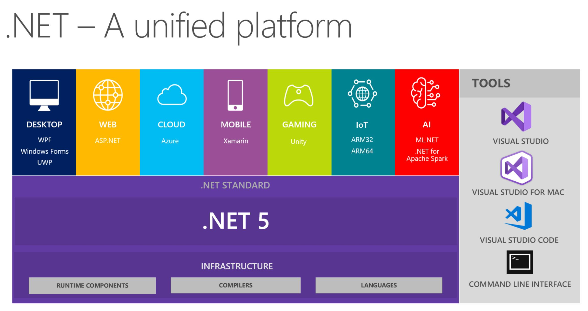
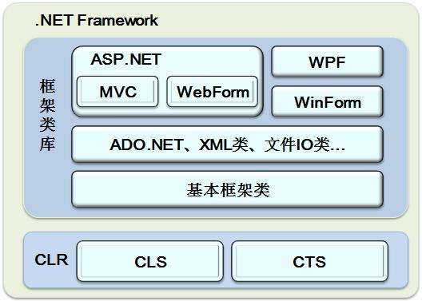

## .Net/.NetFramework/.NetCore

### .Net

.NET 是一个微软搭造的开发者平台，它主要包括：

- 支持(面向)该平台的编程语言(如 C#、Visual Basic、C++/CLI、F#、IronPython、IronRuby...)，

- 用于该平台下开发人员的技术框架体系(.NET Framework、.NET Core、Mono、UWP 等)，

- - 1.定义了通用类型系统，庞大的 CTS 体系
  - 2.用于支撑.NET 下的语言运行时的环境：CLR
  - 3..NET 体系技术的框架库 FCL

- 用于支持开发人员开发的软件工具(即 SDK，如 VS2017、VS Code 等)

  

### .NetFramework

它提供了创建、部署和运行.NET 应用的环境，主要包含三个关键的组成元素：

1.  CLR:公共语言运行时（Common Language Runtime）

2.  FCL:框架类库（.NET Framework Class Library）

3.  DLR：动态语言运行时（Dynamic Language Runtime）

### .NetCore

**.NET Core 是.NET Framework 的新一代版本，是微软开发的第一个官方版本，具有跨平台 (Windows、Mac OSX、Linux) 能力的应用程序开发框架 (Application Framework)**，未来也将会支持 FreeBSD 与 Alpine 平台，也是微软在一开始发展时就开源的软件平台，它经常也会拿来和现有的开源 .NET 平台 Mono 比较。

.NET Core 项目的主要目标有 ： 支持或可以移转 (port) 到更多的操作系统平台与芯片架构 (也就是未来项目会跨出 x86 平台)。 具有引人注目的性能与高可靠度。 开发人员能快速与直觉的获取 .NET Core 开发环境。 在直觉与具生产力的情况下建造应用程序，使用文件，示例与 NuGet 组件。

## CLS、CTS、CLI、CLR

### CLS

公共语言规范 - Common Language Specification

是一种最低的语言标准，它制定了一种以.NET 平台为目标的语言所必须支持的最小特征，以及该语言与其它.NET 语言之间实现互操作所需要的完整特性。

凡是遵守这个标准的语言在.NET 框架下都可以实现互相调用。简单说：就是把各种语言转换成统一的语法规范。

### CTS

CTS（Common Type System 公共类型系统）

解决不同语言数据类型不同的问题，如 C#中的整形是 int,而 VB.net 中的整形是 Integer，通过 CTS 我们把它们两个编译成通用的类型 Int32。

所有的.NET 语言共享这一类型系统，在它们之间实现对接，简单说：就是把各种语言中的不同数据类型，转换成统一的通用的数据类型。

### CLI

CLI（Common Language Infrastructure）公共语言基础结构

### CLR

公共语言运行时（Common Language Runtime）

## BCL、FCL

### BCL

基础类库

当你通过 VS 创建一个项目后，你这个项目就已经引用好了通过.NET 下的语言编写好的一些类库。比如控制台中你直接就可以用 ConSole 类来输出信息，或者 using System.IO 即可通过 File 类对文件进行读取或写入操作，这些类都是微软帮你写好的，不用你自己去编写，它帮你编写了一个面向.NET 的开发语言中使用的基本的功能，这部分类，我们称之为 BCL（Base Class Library）， 基础类库，它们大多都包含在 System 命名空间下。

基础类库 BCL 包含：基本数据类型，文件操作，集合，自定义属性，格式设置，安全属性，I/O 流，字符串操作，事件日志等的类型

### FCL

框架类库

从功能上来看，可以将 FCL 框架类库划分成以下几层。

- 最底层，由 BCL 的大部分组成，主要作用是对.NET 框架、.NET 运行时及 CIL 语言本身进行支持，例如基元类型、集合类型、线程处理、应用程序域、运行时、安全性、互操作等。
- 中间层，包含了对操作系统功能的封装，例如文件系统、网络连接、图形图像、XML 操作等。
- 最高层，包含各种类型的应用程序，例如 Windows Forms、Asp.NET、WPF、WCF、WF 等。

在 FCL 中，除了最基础的那部分 BCL 之外，还包含我们常见的如 ： 用于网站开发技术的 ASP.NET 类库，该子类包含 webform/webpage/mvc，用于桌面开发的 WPF 类库、WinForm 类库，用于通信交互的 WCF、asp.net web api、Web Service 类库等等

## Win32UI、WinForm、WPF、UWP、WinUI

> winform 是最老版本的，界面比较简单，如果你看生成的界面源代码的话，你会发现整个界面都是用代码编写的，偏向于基于事件的开发模式，现在用得少了
>
> WPF 是 winform 的强化升级版，特有的 xaml 实现了界面和逻辑的分离，特有的 mvvm 模式现在已经被前端玩出花来了，界面可定制性强，但是比较吃配置
>
> UWP 是 WPF 的阉割强化版，增加了部分 WPF 没有的控件，强化了整体性能，但是阉割了部分与系统直接交互的能力，比如没法读取修改注册表，无法使用 win32api，只能在 Win10 以上系统使用，只能发布到商城『虽然也有旁加载』，无法生成安装包
>
> WinUI 算是 WPF 的终极强化版，不过我估计后期会和 MAUI 合二为一，毕竟现在创建一个 MAUI 的项目都可以直接在 Windows 上跑起来

### Win32UI

依赖于一大批稳定的，兼容的 C 语言版本 Win32API，多使用 C/C++来开发。

界面上的元素都是由 Windows 操作系统提供的控件，比如编辑框，文本框，每一个控件都有自己的 HWND 形式的 HANDLE。整个应用的所有控件形成的树形列表，都是被 Windows 操作系统掌握的。

利用 Win32API 开发出来的程序，具备超级大的权限

### WinForm

因为 Win32API 的开发是 C/C++语言的，需要了解比较多的知识和内存管理，于是在 C#语言上封装了大部分 Win32API，特别是窗口部分的 API 形成了 WinForm 开发

界面控件也是由操作系统提供，开发出来的应用程序也具备很大的权限

### WPF

进程只剩下一个主窗口，主窗口内的所有元素形成的树状列表，对 Windows 操作系统来讲是不了解的，WPF 程序自己接管了每一个控件的绘制，和事件响应，意味着，WPF 程序对窗口消息循环仅仅依赖主窗口的消息，然后自己对主窗口的所有消息进行转发，不依赖 Windows 操作系统来转发，这样有一个好处是程序更安全，别人再也获取不到程序中的密码框控件，因为密码框不存在 HWND，无法被遍历到。还有一个好处得益于 GPU 的帮忙，界面更漂亮了。

### UWP

上面提到的几个程序，权限都可以很大，移动时代的沙盒机制需要一种方案，使得安装，卸载，权限控制明确。

原理和 API 都很相似 WPF，界面 API 主要是做了减少，使得程序能运行在较差的设备上，同时命名空间发生变化。

所开发出来的应用程序权限受到很大的限制，比如：默认最小化会暂停应用

### WinUI

WinUI2 依赖 UWP；WinUI3 不依赖 UWP

无论是 WinUI2 还是 WinUI3，无论是 WinUI3 的 Win32 程序还是 UWP 程序，绘制方式同 WPF：自绘 WinUI2 权限同 UWP

WinUI3 权限要看创建的是不是 Win32 程序，如果是 Win32 程序，最小化后不会暂停应用，如果是 UWP 程序，则同 UWP
